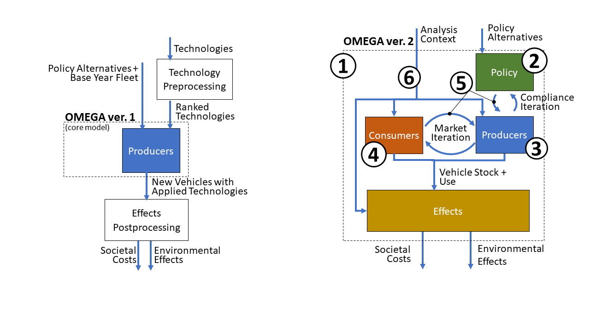

.. image:: _static/epa_logo_1.jpg

Revised: |today|

Model Overview
==============
The OMEGA model has been developed by EPA to evaluate policies for reducing greenhouse gas (GHG) emissions from light duty vehicles. Like the prior releases, this latest version is intended primarily to be used as a tool to support regulatory development by providing estimates of the effects of policy alternatives under consideration. These effects include the costs associated with emissions-reducing technologies and the monetized effects normally included in a societal benefit-cost analysis, as well as physical effects that include emissions quantities, fuel consumption, and vehicle stock and usage.  In developing this OMEGA version 2.0, our goal was to improve modularity, transparency, and flexibility so that stakeholders can more easily review the model, conduct independent analyses, and potentially adapt the model to meet their own needs.

What's New in This Version
^^^^^^^^^^^^^^^^^^^^^^^^^^
EPA created OMEGA version 1.0 to analyze new GHG standards for light-duty vehicles proposed in 2011. The 'core' model performed the function of identifying manufacturers' cost-minimizing compliance pathways to meet a footprint-based fleet emissions standard specified by the user. A preprocessing step involved ranking the technology packages to be considered by the model based on cost-effectiveness. Postprocessing of outputs was performed separately using a spreadsheet tool, and later a scripted process which generated table summaries of modeled effects. An overview of OMEGA version 1.0 is shown on the left of :numref:`mo_label_compare`.

In the period since the release of the initial version, there have been significant changes in the light duty vehicle market including technological advancements and the introduction of new mobility services. Advancements in battery electric vehicles (BEVs) with greater range, faster charging capability, and expanded model availability, as well as potential synergies between BEVs, ride-hailing services and autonomous driving are particularly relevant when considering pathways for greater levels of emissions reduction in the future. OMEGA version 2.0 has been developed with these trends in mind. The model’s interaction between consumer and producer decisions allows a user to represent consumer responses to these new vehicles and services. The model now also has been designed to have expanded capability to model a wider range of GHG program options, which is especially important for the assessment of policies that are designed to address future GHG reduction goals. In general, with the release of version 2.0, our goal is to improve usability and flexibility while retaining the primary functions of the original version of OMEGA. The right side of :numref:`mo_label_compare` shows the overall model flow for OMEGA version 2.0 and highlights the main areas that have been revised and updated.

.. _mo_label_compare:

    Comparison to prior version of OMEGA

**Update #1: Expanded model boundaries.** In defining the scope of this model version, we have attempted to simplify the process of conducting a run by incorporating into the model some of the pre- and post-processing steps that had previously been performed manually. At the same time, we recognize that an overly-expansive model boundary can result in requirements for inputs that are difficult to specify. To avoid this, we have set the input boundary only so large as to capture the elements of the system we assume are responsive to policy. This approach helps to ensure that model inputs such as technology costs and emissions rates can be quantified using data for observable, real-world characteristics and phenomena, and in that way enable transparency by allowing the user to maintain the connection to the underlying data. For the assumptions and algorithms within the model boundary, we aim for transparency through well-organized model code and complete documentation.

**Update #2: Independent Policy Module.** The previous version of OMEGA was designed to analyze a very specific GHG policy structure in which the vehicle attributes and regulatory classes used to determine emissions targets were incorporated into the code throughout the model. In order to make it easier to define and analyze other policy structures, the details regarding how GHG emissions targets are determined and how compliance credits are treated over time are now included in an independent Policy Module and associated policy inputs. This allows the user to incorporate new policy structures without requiring revisions to other code modules. Specifically, the producer decision module no longer contains any details specific to a GHG program structure, and instead functions only on very general program features such as fleet averaging of absolute GHG credits and required technology shares.

**Update #3: Modeling of multi-year strategic producer decisions.** As a policy analysis tool, OMEGA is intended to model the effect of policies that may extend well into the future, beyond the timeframe of individual product cycles. This version of OMEGA is structured to consider a producer objective function to be optimized over the entire analysis period. Year-by-year compliance decisions account for management of credits which can carry across years in the context of projections for technology cost and market conditions which change over time. The timeframe of a given analysis can be specified anywhere from near-term to long-term, with the length limited only by inputs and assumptions provided by the user.

**Update #4: Addition of a consumer response component.** The light-duty vehicle market has evolved significantly in the time since the initial release of OMEGA. In particular, as the range of available technologies and services has grown wider, so has the range of possible responses to policy alternatives. The model structure for this version includes a Consumer Module that can be used to project how the light-duty vehicle market would respond to policy-driven changes in new vehicle prices, fuel operating costs, trip fees for ride hailing services, and other consumer-facing elements. The Consumer Module outputs the estimated consumer responses, such as overall vehicle sales and sales shares, as well as vehicle re-registration and use, which together determine the stock of new and used vehicles and the associated allocation of total VMT.

**Update #5: Addition of feedback loops for producer decisions.** This version of OMEGA is structured around modeling the interactions between vehicle producers responding to a policy and consumers who own and use vehicles affected by the policy. These interactions are bi-directional, in that the producer's compliance planning and vehicle design decisions will both influence, and be influenced by, the sales and shares of vehicles demanded and the GHG credits assigned under the policy. Iterative feedback loops have now been incorporated; between the Producer and Consumer modules to ensure that modeled vehicles would be accepted by the market at the quantities and prices offered by the producer, and between the Producer and Policy modules to account for the compliance implications of each successive vehicle design and production option considered by the producer.

**Update #6: Use of absolute vehicle costs and emissions rates.** The previous version of OMEGA modeled the producer application of technologies to a fleet of vehicles that was otherwise held fixed across policy alternatives. With the addition of a consumer response component that models market share shifts, this version utilizes absolute costs and emissions rates to compare vehicle design and purchase decisions across vehicle types and market classes.

.. _inputs_and_outputs_label:

Inputs and Outputs
^^^^^^^^^^^^^^^^^^
Like other models, OMEGA relies on the user to specify appropriate inputs and assumptions. Some of these may be provided by direct empirical observations, for example the number of currently registered vehicles. Others might be generated by modeling tools outside of OMEGA, such as physics-based vehicle simulation results produced by EPA's ALPHA model, or transportation demand forecasts from DOE's NEMS model. OMEGA has adopted data elements and structures that are generic, wherever possible, so that inputs can be provided from whichever sources the user deems most appropriate.

The inputs and assumptions are categorized according to whether they define the policies under consideration, or define the context within which the analysis occurs.

* *Policy alternative* inputs describe the standards themselves, including the program elements and methodologies for determining compliance as would be defined for an EPA rule in the Federal Register and Code of Federal Regulations.

* *Analysis context* inputs and assumptions cover the range of factors that the user assumes are independent of the policy alternatives. The context inputs may include fuel costs, costs and emissions rates for a particular vehicle technology package, attributes of the existing vehicle stock, consumer demand parameters, existing GHG credit balances, producer decision parameters, and many more. The user may project changes in the context inputs over the analysis timeframe based on other sources, but for a given analysis year the context definition requires that these inputs are common across the policy alternatives being compared.

A full description of the input files can be found in :any:`Chapter 7<7_code_details>`.

The primary outputs are the environmental effects, societal costs and benefits, and producer compliance status for a set of policy alternatives within a given analysis context. These outputs are expressed in absolute values, so that incremental effects, costs, and benefits can be evaluated by comparing two policy alternatives for a given analysis context. For example, comparing a No Action scenario to an Action (or Policy) Alternative. Those same policy alternatives can also be compared using other analysis context inputs to evaluate the sensitivity of results to uncertainty in particular assumptions. For example, comparing the incremental effects of a new policy in high fuel price and low fuel price analysis contexts.

Model Structure and Key Modules
^^^^^^^^^^^^^^^^^^^^^^^^^^^^^^^
OMEGA has been set up so that primary components of the model are clearly delineated in such a way that changing one component of the model will not require code changes throughout the model. The four main modules --- Producer, Consumer, Policy, and Effects --- are each defined along the lines of their real-world analogs. Producers and consumers are represented as distinct decision-making agents, which each exist apart from the regulations defined in the Policy Module. Similarly, the effects, both environmental and societal, exist apart from producer and consumer decision-making agents and the policy. This structure allows a user to analyze policy alternatives with consistently defined producer and consumer behavior. It also provides users the option of interchanging any of OMEGA’s default modules with their own, while preserving the consistency and functionality of the larger model.

**Producer Module:** This module projects the decisions of the regulated entities (producers) in response to policy alternatives, while accounting for consumer demand. The regulated entities can be specified as individual companies, or considered in aggregate as a collection of companies, depending on the assumptions made by the user regarding how GHG credits are averaged or transferred between entities.

**Consumer Module:** This module projects demand for vehicle sales, ownership and use in response to changes in vehicle characteristics such as price, ownership cost, and other key attributes.

**Policy Module:** This module determines the compliance status for a producer’s possible fleet of new vehicles based on the characteristics of those vehicles and the policy defined by the user. Policies may be defined as performance-based standards using fleet averaging (for example, determining compliance status by the accounting of fungible GHG credits), as a fixed requirement without averaging (for example, a minimum required share of BEVs), or as a combination of performance-based standards and fixed requirements.

**Effects Module:** This module projects the physical and cost effects that result from the modeling of producers, consumers, and policy within a given analysis context. Examples of physical effects include the stock and use of registered vehicles, electricity and gasoline consumption, and the GHG and criteria pollutant emissions from tailpipe and upstream sources. Examples of cost effects include vehicle production costs, ownership and operation costs, societal costs associated with GHG and criteria pollutants, and other societal costs associated with vehicle use.

Iteration and Convergence
^^^^^^^^^^^^^^^^^^^^^^^^^
OMEGA is intended to find a solution which simultaneously satisfies producer, consumer, and policy requirements while minimizing the :any:`producer generalized costs<gl_label_producer_generalized_cost>`. OMEGA’s Producer and Consumer modules represent distinct decision-making entities, with behaviors defined separately by the user. Without some type of interaction between these modules, the model would likely not arrive at an equilibrium of vehicles supplied and demanded. For example, a compliance solution which only minimizes producer generalized costs without consideration of consumer demand may not satisfy the market requirements at the fleet mix and level of sales preferred by the consumer. Similarly, the interaction between Producer and Policy modules ensures that that with each subsequent iteration, the compliance status for the new vehicle fleet under consideration is correctly accounted for by the producer. Since there is no general analytical solution to this problem of alignment between producers, consumers, and policy which also allows model users to independently define producer and consumer behavior and the policy alternatives, OMEGA uses an iterative search approach.

Analysis Resolution
^^^^^^^^^^^^^^^^^^^
The policy response projections generated by OMEGA are centered around the modeled production, ownership, and use of light-duty vehicles. It would not be computationally feasible (nor would it be necessary) to distinguish between the nearly 20 million light-duty vehicles produced for sale each year in the US, and hundreds of millions of vehicles registered for use at any given time. Therefore, OMEGA is designed to operate using ‘vehicles’ which are actually aggregate representations of individual vehicles, while still retaining sufficient detail for modeling producer and consumer decisions, and the policy response. The resolution of vehicles can be set for a given analysis, and will depend on the user’s consideration of factors such as the availability of detailed inputs, the requirements of the analysis, and the priority of reducing model run time.

How to Navigate this Documentation
^^^^^^^^^^^^^^^^^^^^^^^^^^^^^^^^^^
This documentation is arranged in order of detail, beginning with a high-level description of the model, proceeding through discussions aimed at general users, and ending with a more in-depth description of the code aimed at developers. Following this Chapter 1 (‘Overview’), Chapter 2 (‘Getting Started’) provides instructions for how to prepare for a run by obtaining and setting up the executable version of the model. Chapter 3 (‘Running and Understanding the Demo Analysis’) is intended to help users understand the Graphical User Interface (GUI), run the built-in demo analysis, and access the model results. Chapter 4 (‘Model Architecture and Algorithms’) is a reference describing the architecture of the model, and the built-in algorithms that drive the various modules and interactions between models. Chapter 5 (‘User Guide’) is intended for users who would like to run the model using their own inputs and assumptions without modifying the model code or implementing user-definable submodules. Chapter 6 (‘Developer Guide’) is mainly a placeholder at this time. In the future, we plan to expand this section to give some guidance for how user-definable submodules can be implemented to extend the model capabilities. Chapter 7 (‘Code Details’) is a complete, indexed compilation of the in-line code documentation. It is a useful reference regarding the specific implementations of packages, classes, and methods in the Python code, along with detailed input file formats. Chapter 8 (‘Glossary’) contains the definitions for key terms used throughout the model and documentation. Finally, Chapter 9 describes the software distribution and support policy.