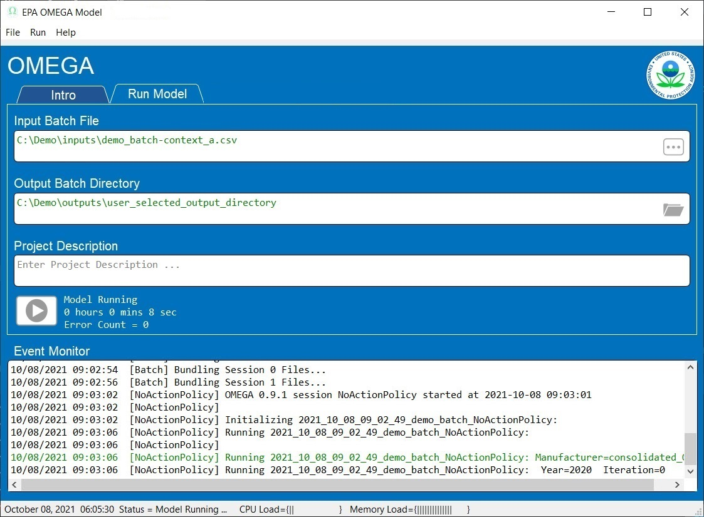
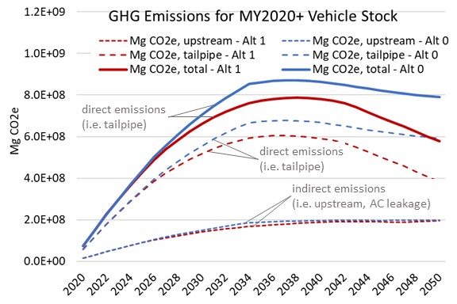
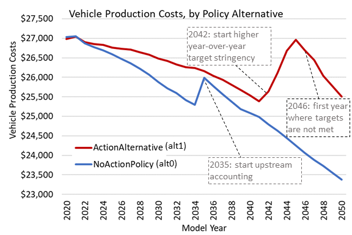
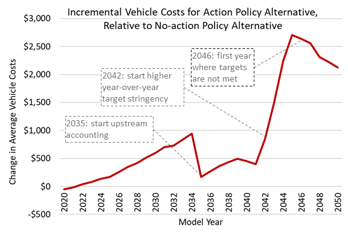
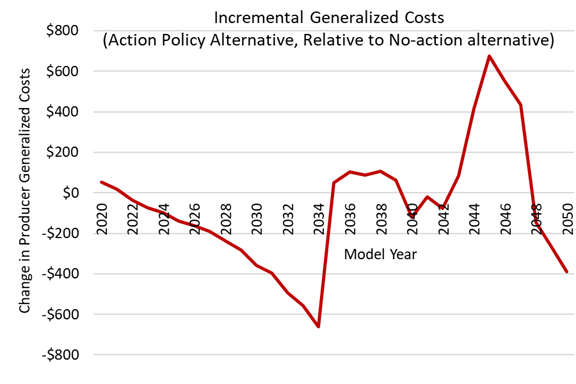

.. image:: _static/epa_logo_1.jpg

.. _running_and_understanding_the_demo_label:

Running the Demo Example using the Graphical User Interface (GUI)
=================================================================

.. _graphical_user_interface_label:

GUI Basics
^^^^^^^^^^
The EPA OMEGA Model is highly modular and can be run using several methods including but not limited to the command line, the Python environment, and the Graphical User Interface (GUI).  The GUI is the best option for new users of OMEGA to reproduce existing model runs and become familiar with the model's input and output structure.  This introduction will guide the user through running the demo example.

After launching the GUI, the 'Intro' tab will appear as shown in :numref:`ug_label1`.

.. _ug_label1:
.. figure:: _static/gui_figures/gui_intro_page.jpg
    :align: center

    GUI 'Intro' Tab

Selecting the 'Run Model' tab allows the user to set up an OMEGA model run. The elements of the 'Run Model' tab are shown in :numref:`ug_label2`.

.. _ug_label2:
.. figure:: _static/gui_figures/gui_run_model_page_elements.jpg
    :align: center

    GUI 'Run Model' Tab Elements

Description of the 'Run Model' tab elements:

.. highlight:: none

::

    Note: Context help is always available by hovering the cursor over an element.

*  Element 1 - Tab Selection
    Tabs to select areas of the GUI.

::

    Note: The 'Results' tab is not currently active.

*  Element 2 - Input Batch File
    Allows the user to select the Input Batch File.  The Input Batch File is a standard OMEGA input file that describes the complete parameters for a model run.  The Input Batch File may be selected from the file menu or the "..." button within the element field.  When the Input Batch File is selected, the complete path will be displayed.  Hovering the cursor over the complete path will display just the base file name.

*  Element 3 - Output Batch Directory
    Allows the user to select the Output Batch Directory.  The Output Batch Directory instructs OMEGA where to store the results of a model run.  The Output Batch Directory may be selected from the file menu or the folder button within the element field.  When the Output Batch Directory is selected, the complete path be displayed.  Hovering the cursor over the complete path will display just the base file name.

*  Element 4 - Project Description
    Allows the user to enter any useful text that will be saved in an optional Configuration File for future reference.  This element is free format text to allow standard functions (such as copy and paste) to be used.  The saved text will be displayed whenever the Configuration File is opened.

*  Element 5 - Event Monitor
    The Event Monitor prompts the user during model run setup (file selection, etc.) and keeps a running record of OMEGA model execution in real time.  This is a standard text field to allow simple copying of text as needed for further study or debugging purposes. Log files are also produced in the batch and session output folders as the model runs, in fact the Event Monitor echoes these files as the model runs.

*  Element 6 - Run Model
    When everything is properly configured, this button will be enabled for initiation of the OMEGA model run.

Running the Demo Example
^^^^^^^^^^^^^^^^^^^^^^^^
The elements required to run the model are loaded by creating a new model run, or by using an existing Configuration File.  As this is the first time the Demo Example will be run, a new model run will be created.

::

    Note: The Event Monitor will provide additional guidance through the model loading process.

Creating a New Model Run From The Demo Example
----------------------------------------------
* Select the 'Run Model' tab.
* Load an existing OMEGA Input Batch File using the file menu or button within the field.  (Required)
* Select a new or existing OMEGA Output Batch Directory using the file menu or button within the field.  (Required)
* Add a Project Description.  (Optional)
* Use the file menu to save the new Configuration File.  (Optional)

The 'Run Model' tab will look similar to :numref:`ug_label3` below.  The displayed values represent one of the supplied demonstration model configurations.

Existing Configuration File
---------------------------
If a model run configuration was previously saved, the configuration may be reloaded to simplify repeating runs.  From the file menu, select 'Open Configuration File' to launch a standard File Explorer window to load an existing Configuration File.  When properly loaded, the 'Run Model' tab will look similar to :numref:`ug_label3` below.  The displayed values represent one of the supplied demonstration model configurations.

.. _ug_label3:
.. figure:: _static/gui_figures/gui_model_loaded.jpg
    :align: center

    Configuration File Loaded

Set Model Run Options
+++++++++++++++++++++
Selecting the 'Options' tab will show a display similar to :numref:`ug_label11` below.

.. _ug_label11:
.. figure:: _static/gui_figures/gui_options_page.jpg
    :align: center

    GUI Options Tab Display

The OMEGA model can be optionally configured to utilize multiple system processors for true multitasking that significantly reduces model completion time. Checking the 'Enable Multiprocessor' box instructs OMEGA to use multiprocessor mode. The 'Multiprocessor Help' button provides additional information.

The Event Monitor will indicate multiprocessor availability during GUI launch as shown in :numref:`ug_label1` above.

To use the Multiprocessor mode, a batch file customized to the configuration
of this computer must be executed before the GUI is launched.

Example Multiprocessor Batch File:

::

    ECHO OFF

    REM set BASEPATH to the python install on your machine that has dispy installed
    set BASEPATH=C:\dev\GitHub\EPA_OMEGA_Model\venv\

    REM location of python.exe (in Scripts path for venvs, else in basepath for straight install):
    set PYTHONPATH=%BASEPATH%Scripts\

    REM location of dispy package:
    set DISPYPATH=%BASEPATH%Lib\site-packages\dispy\

    REM how many cpus to serve (e.g. number of cores minus one)
    set NUM_CPUS=7

    ECHO ON
    "%PYTHONPATH%python" "%DISPYPATH%dispynode.py" --clean --cpus=%NUM_CPUS% --client_shutdown --ping_interval=15 --daemon --zombie_interval=1

.. _ug_run_the_model:

Running the Model
-----------------
With all of the model requirements loaded, select the 'Run Model' tab and the 'Model Run' button will be enabled.  Press the 'Model Run' button to start the model run.

As the model is running, the 'Run Model' tab will look similar to :numref:`ug_label4` below.

.. _ug_label4:

    Model Running

The GUI provides real time information during the model run:

* The model starting information is detailed in the event monitor.  This includes the time and Input Batch File used.
* The model status, error count, and elapsed time from model start are continuously updated adjacent to the 'Run Model' button.
* The load on the system CPU and system Memory is monitored in the Windows Status Bar at the bottom of the GUI window.
* The Event Monitor provides a continuous stream of information gathered from the simultaneous OMEGA processes.

When the model run is completed, the 'Run Model' tab will look similar to :numref:`ug_label5` below.

.. _ug_label5:
.. figure:: _static/gui_figures/gui_model_complete.jpg
    :align: center

    Model Completed

Final GUI Data:

* The model ending information is detailed in the event monitor.  This includes the time and the Output Batch Directory used.
* The model status and final model run time are displayed adjacent to the 'Run Model' button.

Interpreting the Demo Example Results
^^^^^^^^^^^^^^^^^^^^^^^^^^^^^^^^^^^^^

Each session folder has an ``out`` folder which contains a number of default outputs.  The outputs fall into three categories described in this section: image file outputs, detailed outputs in csv-formatted text files, and a run log text file.

.. _gui_label_graphical_output:

Auto-generated image file outputs
---------------------------------

While the detailed modeling results are primarily recorded in csv-formatted text files (described in :numref:`gui_label_csv_output_files`), OMEGA also produces a number of standard graphical image outputs. This lets the user quickly and easily review the results, without requiring any further post-processing analyses. The various types of auto-generated images are listed in :numref:`gui_label_table_default_image_outputs`.

.. _gui_label_table_default_image_outputs:
.. csv-table:: Image File Outputs (``.png``)
    :widths: auto
    :header-rows: 1

    Abbreviated File Name, File Description
    ...Cert Mg v Year...png,"compliance including credit transfers, initial and final compliance state"
    ...Shares.png,"absolute market share by market category, market class, regulatory class and context size class"
    ...V Cert CO2e gpmi...png,"sales-weighted average vehicle certification CO2e g/mi by market category / class"
    ...V Tgt CO2e gpmi...png,"sales-weighted average vehicle target CO2e g/mi by market category / class"
    ...V kWh pmi...png,"sales-weighted average vehicle cert direct kWh/mi by market category / class"
    ...V GenCost...png,"sales-weighted average vehicle producer generalized cost by market category / class"
    ...V Mg...png,"sales-weighted average vehicle cert CO2e Mg by market category / class"
    ...Stock CO2 Mg.png,"vehicle stock CO2 emissions aggregated by calendar year"
    ...Stock Count.png,"vehicle stock registered count aggregated by calendar year"
    ...Stock Gas Gallons.png,"vehicle stock fuel consumed (gasoline gallons) aggregated by calendar year"
    ...Stock kWh.png,"vehicle stock fuel consumed (kWh) aggregated by calendar year"

Post-compliance-modeling image files and other outputs are generated by :any:`omega_model.postproc_session`, which runs effects calculations via :any:`omega_model.effects.omega_effects`. The producer-consumer iteration log and new vehicle price files as well as the log file are generated and/or saved during compliance modeling.

.. admonition:: Demo example: Reading the manufacturer compliance plot

    The manufacturer compliance plot provides several visual details on how the manufacturers are achieving compliance (or not) for each model year, and is a good starting point to inform the user of the model results.  An example run with the demo inputs is shown in :numref:`gui_label_figure_reading_compliance_plot`.

    .. _gui_label_figure_reading_compliance_plot:
    .. figure:: _static/gui_figures/comp_plot.png
        :align: center

        Typical manufacturer compliance plot

    The following describes the key features of this plot:

    * The Y-axis represents the total CO2 emissions, in metric tons (or Mg) for each model year.
    * The blue line and dots represent the required industry standard for each year, in metric tons (Mg).
    * The orange line represents the industry-achieved net standard after credits have been applied or carried to other model years. The orange dots represent the existence of credits banked prior to the analysis start year (they are placed on the chart to be visible, but the Mg level of the dots has no meaning.)
    * Green arrows indicate the source model year (arrow origin) and the model year in which credits have been applied (arrow end.)
    * Vertical down arrows, in red, indicate that some or all of the credits credits generated by that model year expired unused.
    * Red circle-x symbols indicate years that compliance was not achieved, after considering the carry-forward and carry-back of credits.

.. admonition:: Demo example: Using image files to compare policy alternative results for Context A

    In this demo example, the Action Alternative (Alt 1) is generally more stringent than the No-action Alternative (Alt 0), so we should expect to see this difference in policy reflected in the results. :numref:`gui_label_figure_context_a_mktclass_gpmi_targets_cert` highlights some of the main differences between these two alternatives. The upper panels show the GHG targets (grams CO2e per mile), which decrease in each model year through 2030 in Alt 0, while in Alt 1 the targets are decreasing through 2050 with an accelerated rate after 2041. While the GHG targets are determined at the vehicle level, the plots shown here are weighted average values for each market class. The underlying individual vehicle targets are available in the '...vehicles.csv' output file (see :numref:`gui_label_csv_output_files`) and are a function of the respective policy definitions and the attributes of the vehicles that are used in the assignment of targets. See :numref:`Policy Module` and :numref:`al_label_table_policy_alternative_inputs` for more detail on the policy definitions. For both policy alternatives, the targets are lower for vehicles in the non-hauling market category compared to hauling. Note that there is no difference in the targets between BEV and ICE vehicles within the hauling and non-hauling market categories.

    The lower panels show the :any:`certification emissions<gl_label_certification_co2e>`, which like the targets, are also expressed here in grams CO2e per mile. These values are the result of producer, consumer, and policy elements in the model run. For the less stringent Alt 0, the ICE market classes show some modest reduction in certification emissions in the earlier years, which then level off and begin increasing after 2035. For BEVs, certification levels actually begin with negative values due to the policy application of off-cycle credits; specifically, 'ac leakage' technology, as defined in the 'offcycle_credits...csv' input files. In Alt 0, upstream emissions are applied to BEV certification values beginning in 2035. The No-action policy emissions rates (defined in 'policy_fuels-alt0.csv') decline from 2035 to 2040, as reflected in the declining BEV certification emissions over that timeframe. For the more stringent Alt 1, ICE certification values decrease nearly through 2050. In 2045, the available ICE technologies have been exhausted, and certification values level off at the minimum possible levels. BEV certification levels remain constant throughout for Alt 1, and reflect only off-cycle credits since there is no accounting for upstream emissions in this policy alternative.

    .. |fig_gui_mktclass_targetco2_a| image:: _static/gui_figures/demo_results_mktclass_targetco2_context-a_alt-0.png
        :scale: 50%
    .. |fig_gui_mktclass_targetco2_b| image:: _static/gui_figures/demo_results_mktclass_targetco2_context-a_alt-1.png
        :scale: 50%
    .. |fig_gui_mktclass_certco2_c| image:: _static/gui_figures/demo_results_mktclass_certco2_context-a_alt-0.png
        :scale: 50%
    .. |fig_gui_mktclass_certco2_d| image:: _static/gui_figures/demo_results_mktclass_certco2_context-a_alt-1.png
        :scale: 50%

    .. csv-table::
        :widths: auto

        |fig_gui_mktclass_targetco2_a|,|fig_gui_mktclass_targetco2_b|
        |fig_gui_mktclass_certco2_c|,|fig_gui_mktclass_certco2_d|

    .. _gui_label_figure_context_a_mktclass_gpmi_targets_cert:
    .. figure:: _static/1x1.png
        :align: center

        Target CO2 (upper) and certification CO2 (lower) for no-action (left, Alt 0) and action (right, Alt 1) policy alternatives

    :numref:`gui_label_figure_context_a_compliance` shows the compliance results for the two policy alternatives used in this demo example. The year-to-year changes in targets (blue points) reflect the grams CO2e per mile targets shown in :numref:`gui_label_figure_context_a_mktclass_gpmi_targets_cert`, as well as changes in sales and other policy elements used to calculate and scale the absolute Mg CO2 values, such as multipliers and VMT. Certification emissions (red points) generally overlay the targets in each year. Similarly, :any:`compliance emissions <gl_label_compliance_co2e>` (orange line) are aligned with certification emissions, since the strategic use of existing credits has not been implemented in the model for this demo. Minor corrections for year-over-year credit transfers are shown with the green arrows, although the magnitude of transfers is small for this demo; larger transfers would be discernible as a difference between the red points and orange line. For Alt 1, the certification emissions begin to depart from the targets in 2045. With insufficient credits to carry-forward to 2045 and 2046, those two years are non-compliant (red circle-x symbols.) The remaining years, 2047-2050, have an indeterminate compliance status since the demo example was only run out to 2050, and there is still a possible opportunity to carry-back credits from future years.

    .. |fig_gui_compliance_a| image:: _static/gui_figures/demo_results_compliance_context-a_alt-0.png
        :scale: 50%
    .. |fig_gui_compliance_b| image:: _static/gui_figures/demo_results_compliance_context-a_alt-1.png
        :scale: 50%

    .. csv-table::
        :widths: auto

        |fig_gui_compliance_a|,|fig_gui_compliance_b|

    .. _gui_label_figure_context_a_compliance:
    .. figure:: _static/1x1.png
        :align: center

        Compliance results for no-action (left, Alt 0) and action (right, Alt 1) policy alternatives

    .. |fig_gui_shares_a| image:: _static/gui_figures/demo_results_mktclass_share_context-a_alt-0.png
        :scale: 50%
    .. |fig_gui_shares_b| image:: _static/gui_figures/demo_results_mktclass_share_context-a_alt-1.png
        :scale: 50%

    .. csv-table::
        :widths: auto

        |fig_gui_shares_a|,|fig_gui_shares_b|

    .. _gui_label_figure_context_a_shares:
    .. figure:: _static/1x1.png
        :align: center

        Market class shares for no-action (left, Alt 0) and action (right, Alt 1) policy alternatives

    .. |fig_gui_vehcost_a| image:: _static/gui_figures/demo_results_mktclass_vehcost_context-a_alt-0.png
        :scale: 50%
    .. |fig_gui_vehcost_b| image:: _static/gui_figures/demo_results_mktclass_vehcost_context-a_alt-1.png
        :scale: 50%
    .. |fig_gui_vehcost_c| image:: _static/gui_figures/demo_results_mktclass_generalizedvehcost_context-a_alt-0.png
        :scale: 50%
    .. |fig_gui_vehcost_d| image:: _static/gui_figures/demo_results_mktclass_generalizedvehcost_context-a_alt-1.png
        :scale: 50%

    .. csv-table::
        :widths: auto

        |fig_gui_vehcost_a|,|fig_gui_vehcost_b|
        |fig_gui_vehcost_c|,|fig_gui_vehcost_d|

    .. _gui_label_figure_context_a_vehcost:
    .. figure:: _static/1x1.png
        :align: center

        Vehicle Production Cost (upper) and Generalized Cost (lower) for no-action (left, Alt 0) and action (right, Alt 1) policy alternatives

    .. |fig_gui_sales_a| image:: _static/gui_figures/demo_results_sales_context-a_alt-0.png
        :scale: 50%
    .. |fig_gui_sales_b| image:: _static/gui_figures/demo_results_sales_context-a_alt-1.png
        :scale: 50%

    .. csv-table::
        :widths: auto

        |fig_gui_sales_a|,|fig_gui_sales_b|

    .. _gui_label_figure_context_a_sales:
    .. figure:: _static/1x1.png
        :align: center

        Total new vehicle sales for no-action (left) and action (right) policy alternatives

.. admonition:: Demo example: Comparing analysis context assumptions

.. _gui_label_csv_output_files:

Detailed csv-formatted text output files
----------------------------------------

.. csv-table:: Text File Outputs (``.csv``)
    :widths: auto
    :header-rows: 1

    Abbreviated File Name, File Description
    ...summary_results.csv,"contains the data from the image files"
    ...GHG_credit_balances.csv,"beginning and ending model year GHG credit balances by calendar year"
    ...GHG_credit_transactions.csv,"model year GHG credit transactions by calendar year"
    ...manufacturer_annual_data.csv,"manufacturer compliance and cost data by model year"
    ...vehicle_annual_data.csv,"registered count and VMT data by model year and age"
    ...vehicles.csv,"detailed base year and compliance (produced) vehicle data"
    ...new_vehicle_prices.csv,"new vehicle sales-weighted average manufacturer generalized cost data by model year"
    ...producer_consumer_iteration_log.csv,"detailed producer-consumer cross-subsidy iteration data by model year"
    ...cost_effects.csv,"vehicle-level cost effects data by model year and age"
    ...physical_effects.csv,"vehicle-level physical effects data by model year and age"
    ...tech_tracking.csv,"vehicle-level technology tracking data by model year and age"

.. |fig_gui_co2_effects_b| image:: _static/gui_figures/demo_results_co2_effects_delta_context-a_alt-1_minus_alt-0.png
    :scale: 50%

.. csv-table::
    :widths: auto

    |fig_gui_co2_effects_a|,|fig_gui_co2_effects_b|

.. _gui_label_figure_context_a_co2_effects:
.. figure:: _static/1x1.png
    :align: center

    GHG emissions, total (left), and change in emissions due to the action alternative policy (right)

.. csv-table::
    :widths: auto

    |fig_gui_avgcost_a|,|fig_gui_avgcost_b|

.. _gui_label_figure_context_a_costs:
.. figure:: _static/1x1.png
    :align: center

    Average per vehicle cost: absolute costs (left), and change in costs due to the action alternative policy (right)

.. csv-table::
    :widths: auto

    |fig_gui_generalizedcost_a|,|fig_gui_generalizedcost_b|

.. _gui_label_figure_context_a_generalized_costs:
.. figure:: _static/1x1.png
    :align: center

    Vehicle generalized cost: absolute costs (left), and change in costs due to the action alternative policy (right)

.. |fig_gui_co2_effects_b| image:: _static/gui_figures/demo_results_co2_effects_delta_context-a_alt-1_minus_alt-0.png
    :scale: 50%

.. csv-table::
    :widths: auto

    |fig_gui_co2_effects_a|,|fig_gui_co2_effects_b|

.. _gui_label_figure_context_a_co2_effects:
.. figure:: _static/1x1.png
    :align: center

    GHG emissions, total (left), and change in emissions due to the action alternative policy (right)

.. _gui_label_runllog_output_files:

Run log output file
----------------------------------------

.. csv-table:: Text File Outputs (``.txt``)
    :widths: auto
    :header-rows: 1

    Abbreviated File Name, File Description
    o2_log...txt,"session console output"

Other plots that may be of interest to the user include:

* sales shares, based on context size class, market category, market class, reg class
* total industry sales
* average vehicle certification CO2 g/mi, by market category and market class
* average vehicle certification energy consumption (kWh/mi), by market category and market class
* average vehicle cost, by market category and market class

There are also 3 primary output files associated with the effects module. Those files are:

* physical_effects.csv
* cost_effects.csv
* tech_tracking.csv

These files are saved to the output folder along with the other session output files. The tech_tracking file is always generated by the model, regardless of runtime inputs. However, the physical effects and cost effects are generated only if the user has requested them. There are 3 choices associated with what effects are generated: "None", "Physical" and "Physical and Costs". If "None" is entered as the input value, only the tech tracking file will be generated. If "Physical" is entered, then physical effects will be calculated in addition to the tech tracking file. Cost effects cannot be generated if physical effects are not calculated first. Therefore, there is no choice for "Costs" alone.

The tech_tracking.csv file provides volumes and vehicles projected to be equipped with the technologies included in the simulated_costs.csv input file. The data are presented at the vehicle level for all model years and ages included in the model run. The user can use this file in a spreadsheet program (such as Microsoft Excel) to explore technology usage by vehicle ID, model year, age, calendar year, manufacturer, base year reg class, reg class, in-use fuel, or non-responsive market group. Note that the curb weight and weight reduction data in this file represent the given vehicle's curb weight inclusive of any weight reduction applied to reduce weight, and the level of weight reduction applied to that given vehicle where a weight reduction of 5 percent would be shown as 0.05.

The physical effects file provides all physical effects such as emission inventories, fuel consumption and vehicle miles traveled. Again, these data are presented at the vehicle level for all model years and ages included in the model run. The units of each data field in the file
is included in the header (i.e., the field name) for each column of data. The user can use this file to explore physical effects by vehicle ID, model year, age, calendar year, manufacturer, base year reg class, reg class, in-use fuel, or non-responsive market group.

The cost effects file provides all of the monetized effects associated with the physical effects described above. Importantly, each of the physical and cost effects are calculated on an absolute basis. In other words, an inventory of CO2 tons multiplied by "costs" of CO2 per ton provides the "cost" of CO2 emissions. However, the calculation of criteria and GHG emission impacts is done using the $/ton estimates included in the cost_factors-criteria.csv and cost_factors-scc.csv input files. The $/ton estimates provided in those files are best understood to be the marginal costs associated with the reduction of the individual pollutants as opposed to the absolute costs associated with a ton of each pollutant. As such, the criteria and climate "costs" calculated by the model should not be seen as true costs associated with pollution, but rather the first step in estimating the benefits associated with reductions of those pollutants. For that reason, the user must be careful not to consider those as absolute costs, but once compared to the "costs" of another scenario (presumably via calculation of a difference in "costs" between two scenarios) the result can be interpreted as a benefit.

Additionally, OMEGA also outputs the following CSVs from the Producer Module:

* a year-by-year list of credit balances
* a ledger of credit transactions between model years to achieve compliance

