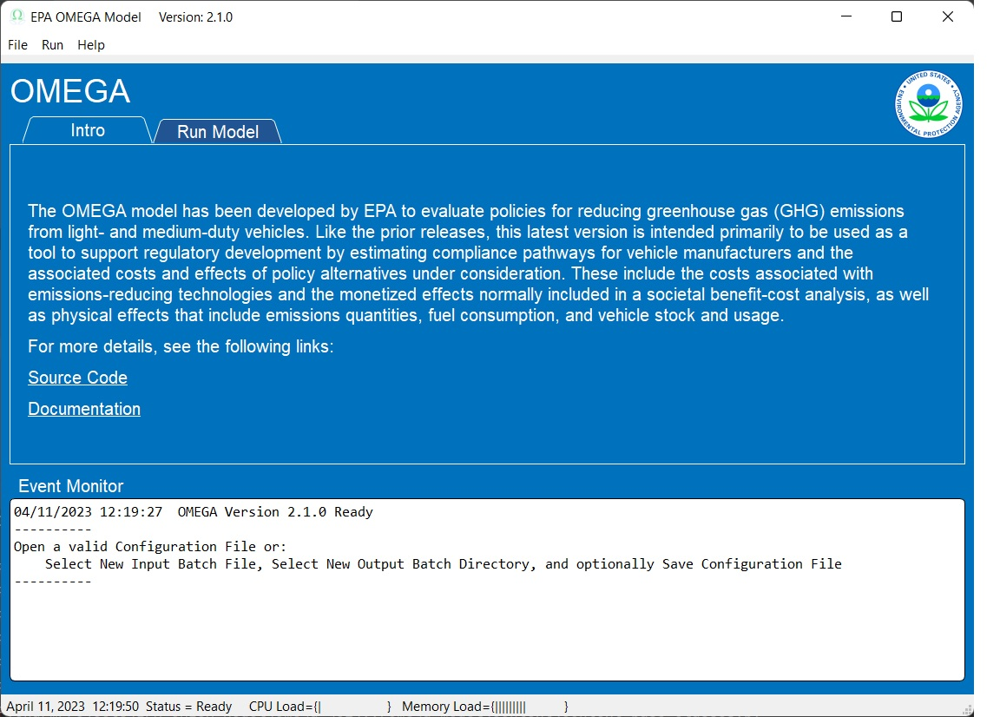
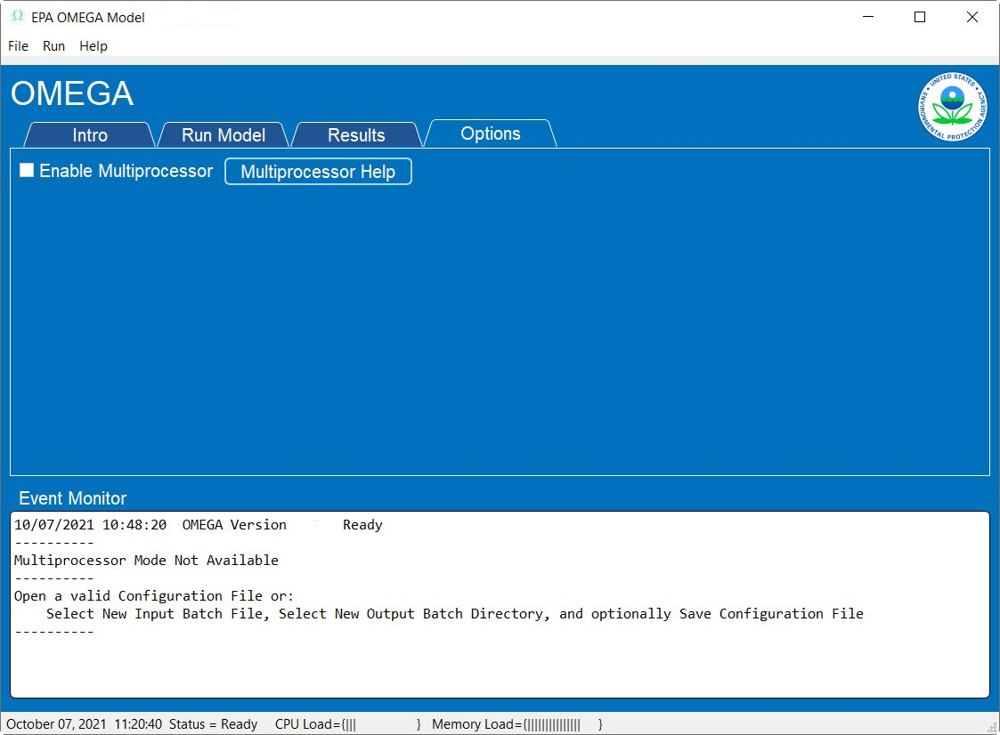

.. image:: _static/epa_logo_1.jpg

.. _running_and_understanding_the_demo_label:

Running the Demo Example using the Graphical User Interface (GUI)
=================================================================

.. _graphical_user_interface_label:

GUI Basics
^^^^^^^^^^
The EPA OMEGA Model is highly modular and can be run using several methods including but not limited to the command line, the Python environment, and the Graphical User Interface (GUI).  The GUI is the best option for new users of OMEGA to reproduce existing model runs and become familiar with the model's input and output structure.  This introduction will guide the user through running the demo example.

After launching the GUI, the 'Intro' tab will appear as shown in :numref:`ug_label1`.

.. _ug_label1:

    GUI 'Intro' Tab

The elements of the GUI 'Run Model' page are shown in :numref:`ug_label2`.

.. _ug_label2:
.. figure:: _static/gui_figures/gui_run_model_page_elements.jpg
    :align: center

    GUI 'Run Model' Page Elements

Description of the 'Run Model' page elements:

::

    Note: Context help is always available by hovering the cursor over an element.

*  Element 1 - Tab Selection
    Tabs to select areas of the GUI.

::

    Note: The 'Results' tab is not currently active.

*  Element 2 - Input Batch File
    Allows the user to select the Input Batch File.  The Input Batch File is a standard OMEGA input file that describes the complete parameters for a model run.  The Input Batch File may be selected from the file menu or the "..." button within the element field.  When the Input Batch File is selected, the complete path be displayed.  Hovering the cursor over the complete path will display just the base file name.

*  Element 3 - Output Batch Directory
    Allows the user to select the Output Batch Directory.  The Output Batch Directory instructs OMEGA where to store the results of a model run.  The Output Batch Directory may be selected from the file menu or the folder button within the element field.  When the Output Batch Directory is selected, the complete path be displayed.  Hovering the cursor over the complete path will display just the base file name.

*  Element 4 - Project Description
    Allows the user to enter any useful text that will be saved in an optional Configuration File for future reference.  This element is free format text to allow standard functions (such as copy and paste) to be used.  The saved text will be displayed whenever the Configuration File is opened.

*  Element 5 - Event Monitor
    The Event Monitor prompts the user during model run setup (file selection, etc.) and keeps a running record of OMEGA model execution in real time.  This is a standard text field to allow simple copying of text as needed for further study or debugging purposes. Log files are also produced in the batch and session output folders as the model runs, in fact the Event Monitor echoes these files as the model runs.

*  Element 6 - Run Model
    When everything is properly configured, this button will be enabled for initiation of the OMEGA model run.

Running the Demo Example
^^^^^^^^^^^^^^^^^^^^^^^^
The elements required to run the model are loaded by creating a new model run, or by using an existing Configuration File.  As this is the first time the Demo Example will be run, a new model run will be created.

::

    Note: The Event Monitor will provide additional guidance through the model loading process.

Creating a New Model Run From The Demo Example
--------------------------------------------
* Select the 'Run Model' tab.
* Load an existing OMEGA Input Batch File using the file menu or button within the field.  (Required)
* Select a new or existing OMEGA Output Batch Directory using the file menu or button within the field.  (Required)
* Add a Project Description.  (Optional)
* Use the file menu to save the new Configuration File.  (Optional)

The 'Run Model' page will look similar to :numref:`ug_label3` below.  The displayed values represent one of the supplied demonstration model configurations.

Existing Configuration File
---------------------------
If a model run configuration was previously saved, the configuration may be reloaded to simplify repeating runs.  From the file menu, select 'Open Configuration File' to launch a standard File Explorer window to load an existing Configuration File.  When properly loaded, the 'Run Model' page will look similar to :numref:`ug_label3` below.  The displayed values represent one of the supplied demonstration model configurations.

.. _ug_label3:
.. figure:: _static/gui_figures/gui_model_loaded.jpg
    :align: center

    GUI Configuration File Loaded

Set Model Run Options
+++++++++++++++++++++
Selecting the 'Options' tab will show a display similar to :numref:`ug_label11` below.

.. _ug_label11:

    GUI Options Page Display

The OMEGA model can be optionally configured to utilize multiple system processors for true multitasking that significantly reduces model completion time.  Checking the 'Enable Multiprocessor' box instructs OMEGA to use multiprocessor mode.  The 'Multiprocessor Help' button provides additional information.

The Event Monitor will indicate multiprocessor availability during GUI launch as shown in :numref:`ug_label1` above.

To use the Multiprocessor mode, a batch file customized to the configuration
of this computer must be executed before the GUI is launched.

Example Multiprocessor Batch File:

::

    ECHO OFF

    REM set BASEPATH to the python install on your machine that has dispy installed
    set BASEPATH=C:\dev\GitHub\EPA_OMEGA_Model\venv\

    REM location of python.exe (in Scripts path for venvs, else in basepath for straight install):
    set PYTHONPATH=%BASEPATH%Scripts\

    REM location of dispy package:
    set DISPYPATH=%BASEPATH%Lib\site-packages\dispy\

    REM how many cpus to serve (e.g. number of cores minus one)
    set NUM_CPUS=7

    ECHO ON
    "%PYTHONPATH%python" "%DISPYPATH%dispynode.py" --clean --cpus=%NUM_CPUS% --client_shutdown --ping_interval=15 --daemon --zombie_interval=1

.. _ug_run_the_model:

Running The Model
-----------------
With all of the model requirements loaded, select the 'Run Model' tab and the 'Model Run' button will be enabled.  Press the 'Model Run' button to start the model run.

As the model is running, the 'Run Model' page will look similar to :numref:`ug_label4` below.

.. _ug_label4:
.. figure:: _static/gui_figures/gui_model_running.jpg
    :align: center

    Model Running

The GUI provides real time information during the model run:

* The model starting information is detailed in the event monitor.  This includes the time and Input Batch File used.
* The model status, error count, and elapsed time from model start are continuously updated adjacent to the 'Run Model' button.
* The load on the system CPU and system Memory is monitored in the Windows Status Bar at the bottom of the GUI window.
* The Event Monitor provides a continuous stream of information gathered from the simultaneous OMEGA processes.

When the model run is completed, the 'Run Model' page will look similar to :numref:`ug_label5` below.

.. _ug_label5:
.. figure:: _static/gui_figures/gui_model_complete.jpg
    :align: center

    Model Completed

Final GUI Data:

* The model ending information is detailed in the event monitor.  This includes the time and the Output Batch Directory used.
* The model status and final model run time are displayed adjacent to the 'Run Model' button.

Interpreting the Demo Example Results
^^^^^^^^^^^^^^^^^^^^^^^^^^^^^^^^^^^^^

.. admonition:: Demo example: Manufacturer compliance plot

    The manufacturer compliance plot provides several visual details on how the manufacturers are achieving compliance (or not) for each model year, and is a good starting point to inform the user of the model results.  An example run with the demo inputs is shown in :numref:`ug_plot`.

    .. _ug_plot:
    .. figure:: _static/ug_figures/comp_plot.jpg
        :align: center

        Typical manufacturer compliance plot

    The following describes the key features of this plot:

    * The Y-axis represents the total CO2 emissions, in metric tons (or Mg) for each model year.
    * The blue line and dots represent the required industry standard for each year, in metric tons (Mg).
    * The orange line and dots represent the industry-achieved net standard after credits have been applied or carried to other model years.
    * Green lines indicate the source model year (green dot) and the model year in which credits have been applied (the ending arrow)
    * Vertical down arrows, in red, indicate that some or all credits were expired (forfeited) that were generated in that model year.
    * Red x icons indicate years that compliance was not achieved.

Other plots that may be of interest to the user include:

* sales shares, based on context size class, market category, market class, reg class
* total industry sales
* average vehicle certification CO2 g/mi, by market category and market class
* average vehicle certification energy consumption (kWh/mi), by market category and market class
* average vehicle cost, by market category and market class

There are also 3 primary output files associated with the effects module. Those files are:

* physical_effects.csv
* cost_effects.csv
* tech_tracking.csv

These files are saved to the output folder along with other model output files. The tech_tracking file is always generated by the model,
regardless of runtime inputs. However, the physical effects and cost effects are generated only if the user has requested them. There are
3 choices associated with what effects are generated: "None", "Physical" and "Physical and Costs". If "None" is entered as the input value,
only the tech tracking file will be generated. If "Physical" is entered, then only physical effects will be calculated. Cost effects cannot
be generated if physical effects are not calculated first. Therefore, there is no choice for "Costs" alone.

The tech_tracking.csv file provides volumes and vehicles projected to be equipped with the technologies included in the simulated_costs.csv
input file. The data are presented at the vehicle level for all model years and ages included in the model run. The user can use this file to
generate pivot charts of technology usage by vehicle ID, model year, age, calendar year, manufacturer, base year reg class, reg class, in-use
fuel, or non-responsive market group. Note that the curb weight and weight reduction data in this file represent the given vehicle's curb weight
inclusive of any weight reduction applied to reduce weight, and the level of weight reduction applied to that given vehicle where a weight
reduction of 5 percent would be shown as 0.05.

The physical effects file provides all physical effects such as emission inventories, fuel consumption and vehicle miles traveled. Again,
these data are presented at the vehicle level for all model years and ages included in the model run. The units of each data field in the file
is included in the header (i.e., the field name) for each column of data. The user can use this file to generate pivot charts of physical effects
by vehicle ID, model year, age, calendar year, manufacturer, model year, base year reg class, reg class, in-use fuel, or non-responsive market
group.

The cost effects file provides all of the monetized effects associated with the physical effects described above. Importantly, each of the
physical and cost effects are calculated on an absolute basis. In other words, an inventory of CO2 tons multiplied by "costs"
of CO2 per ton provides the "cost" of CO2 emissions. However, the calculation of criteria and GHG emission impacts is done using the $/ton
estimates included in the cost_factors-criteria.csv and cost_factors-scc.csv input files. The $/ton estimates provided in those files are
best understood to be the marginal costs associated with the reduction of the individual pollutants as opposed to the absolute costs
associated with a ton of each pollutant. As such, the criteria and climate "costs" calculated by the model should not be seen as true costs
associated with pollution, but rather the first step in estimating the benefits associated with reductions of those pollutants. For that
reason, the user must be careful not to consider those as absolute costs, but once compared to the "costs" of another scenario (presumably
via calculation of a difference in "costs" between two scenarios) the result can be interpreted as a benefit.

Additionally, OMEGA also outputs the following CSVs from the Producer Module:

* a year-by-year list of credit balances
* a ledger of credit transactions between model years to achieve compliance

