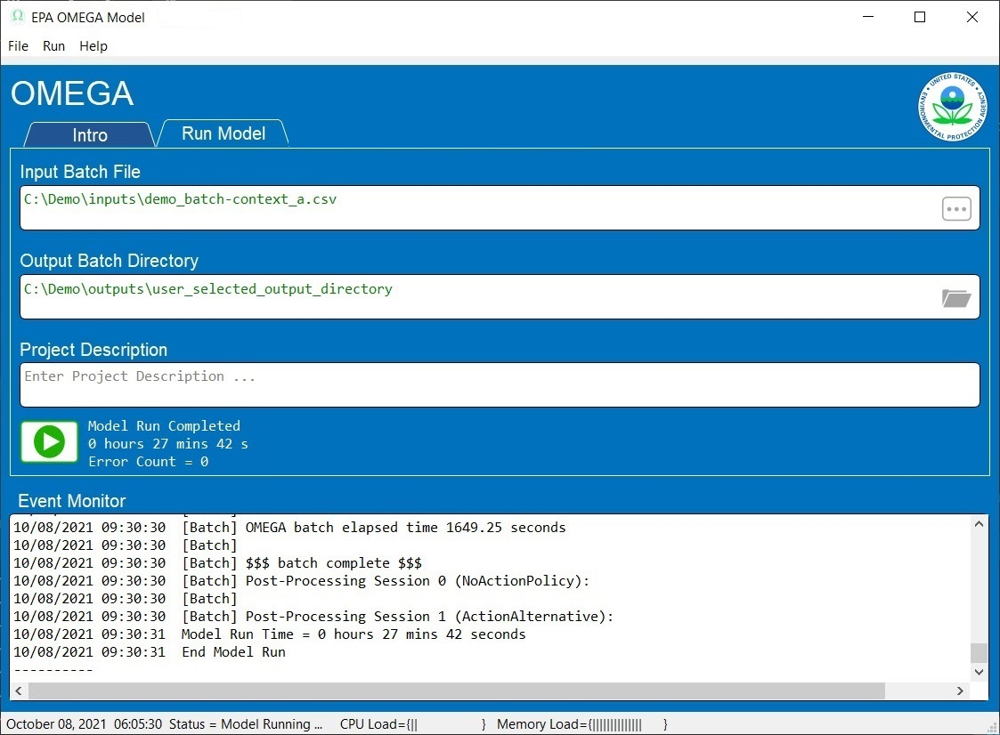

.. image:: _static/epa_logo_1.jpg

.. _running_and_understanding_the_demo_label:

Running OMEGA using the Graphical User Interface (GUI)
======================================================

.. _graphical_user_interface_label:

GUI Basics
^^^^^^^^^^
The EPA OMEGA Model is highly modular and can be run using several methods including but not limited to the command line, the Python environment, and the Graphical User Interface (GUI).  The GUI is the best option for new users of OMEGA to reproduce existing model runs and become familiar with the model's input and output structure.  This introduction will guide the user through running by example.

After launching the GUI, the ``Intro`` tab will appear as shown in :numref:`ug_label1`.

.. _ug_label1:
.. figure:: _static/gui_figures/gui_intro_page.jpg
    :align: center

    GUI ``Intro`` Tab

Selecting the ``Run Model`` tab allows the user to set up an OMEGA model run. The elements of the ``Run Model`` tab are shown in :numref:`ug_label2`.

.. _ug_label2:
.. figure:: _static/gui_figures/gui_run_model_page_elements.jpg
    :align: center

    GUI ``Run Model`` Tab Elements

Description of the ``Run Model`` tab elements:

.. highlight:: none

::

    Note: Context help is always available by hovering the cursor over an element.

*  Element 1 - Tab Selection
    Tabs to select areas of the GUI.

*  Element 2 - Input Batch File
    Allows the user to select the Input Batch File.  The Input Batch File is a standard OMEGA input file that describes the complete parameters for a model run.  The Input Batch File may be selected from the file menu or the "..." button within the element field.  When the Input Batch File is selected, the complete path will be displayed.  Hovering the cursor over the complete path will display just the base file name.

*  Element 3 - Output Batch Directory
    Allows the user to select the Output Batch Directory.  The Output Batch Directory instructs OMEGA where to store the results of a model run.  The Output Batch Directory may be selected from the file menu or the folder button within the element field.  When the Output Batch Directory is selected, the complete path be displayed.  Hovering the cursor over the complete path will display just the base file name.

*  Element 4 - Project Description
    Allows the user to enter any useful text that will be saved in an optional Configuration File for future reference.  This element is free format text to allow standard functions (such as copy and paste) to be used.  The saved text will be displayed whenever the Configuration File is opened.

*  Element 5 - Event Monitor
    The Event Monitor prompts the user during model run setup (file selection, etc.) and keeps a running record of OMEGA model execution in real time.  This is a standard text field to allow simple copying of text as needed for further study or debugging purposes. Log files are also produced in the batch and session output folders as the model runs, in fact the Event Monitor echoes these files as the model runs.

*  Element 6 - Run Model
    When everything is properly configured, this button will be enabled for initiation of the OMEGA model run.

Running OMEGA
^^^^^^^^^^^^^
The elements required to run the model are loaded by creating a new model run, or by using an existing Configuration File.

::

    Note: The Event Monitor will provide additional guidance through the model loading process.

Creating a New Model Run
------------------------
* Select the ``Run Model`` tab.
* Load an existing OMEGA Input Batch File using the file menu or button within the field.  (Required)
* Select a new or existing OMEGA Output Batch Directory using the file menu or button within the field.  (Required)
* Add a Project Description.  (Optional)
* Use the file menu to save the new Configuration File.  (Optional)

The ``Run Model`` tab will look similar to :numref:`ug_label3` below.

Existing Configuration File
---------------------------
If a model run configuration was previously saved, the configuration may be reloaded to simplify repeating runs.  From the file menu, select ``Open Configuration File`` to launch a standard File Explorer window to load an existing Configuration File.  When properly loaded, the ``Run Model`` tab will look similar to :numref:`ug_label3` below.

.. _ug_label3:
.. figure:: _static/gui_figures/gui_model_loaded.jpg
    :align: center

    Configuration File Loaded

.. _ug_run_the_model:

Running the Model
-----------------
With all of the model requirements loaded, select the ``Run Model`` tab and the 'Model Run' button will be enabled.  Press the ``Model Run`` button to start the model run.

As the model is running, the ``Run Model`` tab will look similar to :numref:`ug_label4` below.

.. _ug_label4:
.. figure:: _static/gui_figures/gui_model_running.jpg
    :align: center

    Model Running

The GUI provides real time information during the model run:

* The model starting information is detailed in the event monitor.  This includes the time and Input Batch File used.
* The model status, error count, and elapsed time from model start are continuously updated adjacent to the ``Run Model`` button.
* The load on the system CPU and system Memory is monitored in the Windows Status Bar at the bottom of the GUI window.
* The Event Monitor provides a continuous stream of information gathered from the simultaneous OMEGA processes.

When the model run is completed, the ``Run Model`` tab will look similar to :numref:`ug_label5` below.

.. _ug_label5:

    Model Completed

Final GUI Data:

* The model ending information is detailed in the event monitor.  This includes the time and the Output Batch Directory used.
* The model status and final model run time are displayed adjacent to the ``Run Model`` button.

Interpreting the Model Results
^^^^^^^^^^^^^^^^^^^^^^^^^^^^^^

Each session folder has an ``out`` folder which contains a number of default outputs.  The outputs fall into three categories described in this section: image file outputs, detailed outputs in csv-formatted text files, and a run log text file.

.. _gui_label_graphical_output:

Auto-generated image file outputs
---------------------------------

While the detailed modeling results are primarily recorded in csv-formatted text files (described in :numref:`gui_label_csv_output_files`), OMEGA also produces a number of standard graphical image outputs. This lets the user quickly and easily review the results, without requiring any further post-processing analyses. Some of the various types of auto-generated images are listed in :numref:`gui_label_table_default_image_outputs`.

.. _gui_label_table_default_image_outputs:
.. csv-table:: Typical Image File Outputs (``.png``)
    :widths: auto
    :header-rows: 1

    Abbreviated File Name, File Description
    ...Cert Mg v Year...png,"compliance including credit transfers, initial and final compliance state"
    ...Shares.png,"absolute market share by market category, market class, regulatory class and context size class"
    ...V Cert CO2e gpmi...png,"sales-weighted average vehicle certification CO2e g/mi by market category / class"
    ...V Tgt CO2e gpmi...png,"sales-weighted average vehicle target CO2e g/mi by market category / class"
    ...V kWh pmi...png,"sales-weighted average vehicle cert direct kWh/mi by market category / class"
    ...V GenCost...png,"sales-weighted average vehicle producer generalized cost by market category / class"
    ...V Mg...png,"sales-weighted average vehicle cert CO2e Mg by market category / class"

.. admonition:: Example: Reading a manufacturer compliance plot

    The manufacturer compliance plot provides several visual details on how the manufacturers are achieving compliance (or not) for each model year, and is a good starting point to inform the user of the model results.  An example is shown in :numref:`gui_label_figure_reading_compliance_plot`.

    .. _gui_label_figure_reading_compliance_plot:
    .. figure:: _static/gui_figures/comp_plot.png
        :align: center

        Typical manufacturer compliance plot

    The following describes the key features of this plot:

    * The Y-axis represents the total CO2e emissions, in metric tons (or Mg) for each model year.
    * The blue line and dots represent the required industry standard for each year, in metric tons (Mg).
    * The orange line represents the industry-achieved net standard after credits have been applied or carried to other model years. The orange dots represent the existence of credits banked prior to the analysis start year (they are placed on the chart to be visible, but the Mg level of the dots has no meaning.)
    * Green arrows indicate the source model year (arrow origin) and the model year in which credits have been applied (arrow end.)
    * Vertical down arrows, in red, indicate that some or all of the credits generated by that model year expired unused.
    * Red circle-x symbols indicate years that compliance was not achieved, after considering the carry-forward and carry-back of credits.

.. admonition:: Example: Using image files to compare policy alternative results

    In this example, the action alternative (Alt 1) is generally more stringent than the no-action alternative (Alt 0), so we should expect to see this difference in policy reflected in the results. :numref:`gui_label_figure_context_a_mktclass_gpmi_targets_cert` highlights some of the main differences between these two alternatives. The upper panels show the GHG targets (grams CO2e per mile), which decrease in each model year through 2030 in Alt 0, while in Alt 1 the targets are decreasing through 2050 with an accelerated rate after 2041. While the GHG targets are determined at the vehicle level, the plots shown here are weighted average values for each market class. The underlying individual vehicle targets are available in the '...vehicles.csv' output file (see :numref:`gui_label_csv_output_files`) and are a function of the respective policy definitions and the attributes of the vehicles that are used in the assignment of targets. See :numref:`Policy Module` and :numref:`al_label_table_policy_alternative_inputs` for more detail on the policy definitions. For both policy alternatives, the targets are lower for vehicles in the non-hauling market category compared to hauling. Note that there is no difference in the targets between BEV and ICE vehicles within the hauling and non-hauling market categories.

    The lower panels show the certification emissions, which like the targets, are also expressed here in CO2e grams per mile. These values are the result of producer, consumer, and policy elements in the model run. For the less stringent Alt 0, the ICE market classes show some modest reduction in certification emissions in the earlier years, which then level off and begin increasing after 2035. For BEVs, certification levels actually begin with negative values due to the policy application of off-cycle credits; specifically, 'AC leakage' technology, as defined in an 'offcycle_credits.csv' input file. In Alt 0, upstream emissions are applied to BEV certification values beginning in 2035. The no-action policy upstream emissions rates (defined in a 'policy_fuels.csv' file) decline from 2035 to 2040, as reflected in the declining BEV certification emissions over that timeframe. For the more stringent Alt 1, ICE certification values decrease nearly through 2050. In 2045, the available ICE technologies have been exhausted, and certification values level off at the minimum possible levels. BEV certification levels remain constant throughout for Alt 1, and reflect only off-cycle credits since there is no accounting for upstream emissions in this policy alternative.

    .. |fig_gui_mktclass_targetco2_a| image:: _static/gui_figures/demo_results_mktclass_targetco2_context-a_alt-0.png
        :scale: 50%
    .. |fig_gui_mktclass_targetco2_b| image:: _static/gui_figures/demo_results_mktclass_targetco2_context-a_alt-1.png
        :scale: 50%
    .. |fig_gui_mktclass_certco2_c| image:: _static/gui_figures/demo_results_mktclass_certco2_context-a_alt-0.png
        :scale: 50%
    .. |fig_gui_mktclass_certco2_d| image:: _static/gui_figures/demo_results_mktclass_certco2_context-a_alt-1.png
        :scale: 50%

    .. csv-table::
        :widths: auto

        |fig_gui_mktclass_targetco2_a|,|fig_gui_mktclass_targetco2_b|
        |fig_gui_mktclass_certco2_c|,|fig_gui_mktclass_certco2_d|

    .. _gui_label_figure_context_a_mktclass_gpmi_targets_cert:
    .. figure:: _static/1x1.png
        :align: center

        Target CO2 (upper) and certification CO2 (lower) for no-action (left, Alt 0) and action (right, Alt 1) policy alternatives

    :numref:`gui_label_figure_context_a_compliance` shows the compliance results for the two policy alternatives used in this example. The year-to-year changes in targets (blue points) reflect the CO2e grams per mile targets shown in :numref:`gui_label_figure_context_a_mktclass_gpmi_targets_cert`, as well as changes in sales and other policy elements used to calculate and scale the absolute Mg CO2e values, such as multipliers and VMT. Certification emissions (red points) generally overlay the targets in each year. Similarly, compliance emissions (orange line) are aligned with certification emissions, since the strategic use of hisorical (pre-analysis) credits has not been implemented in the model for this example. Minor corrections for year-over-year credit transfers are shown with the green arrows, although the magnitude of transfers is small in this case; larger transfers would be discernible as a difference between the red points and orange line. For Alt 1, the certification emissions begin to depart from the targets in 2045. With insufficient credits to carry-forward (or carry-back) to 2045 and 2046, those two years are non-compliant (red circle-x symbols.) The remaining years, 2047-2050, have an indeterminate compliance status since the model was only run out to 2050, and there is still a possible opportunity to carry-back credits from future years.

    .. |fig_gui_compliance_a| image:: _static/gui_figures/demo_results_compliance_context-a_alt-0.png
        :scale: 50%
    .. |fig_gui_compliance_b| image:: _static/gui_figures/demo_results_compliance_context-a_alt-1.png
        :scale: 50%

    .. csv-table::
        :widths: auto

        |fig_gui_compliance_a|,|fig_gui_compliance_b|

    .. _gui_label_figure_context_a_compliance:
    .. figure:: _static/1x1.png
        :align: center

        Compliance results for no-action (left, Alt 0) and action (right, Alt 1) policy alternatives

    :numref:`gui_label_figure_context_a_shares` shows new vehicle shares by market class. The more stringent Alt 1 has higher BEV shares for both hauling and non-hauling market classes compared to the less stringent Alt 0. The significant increase in BEV shares in 2048 coincides with the producer’s state of non-compliance; the producer’s attempts to maximize BEV share at this time is limited by the consumer share response (defined in a ‘sales_share_params.csv’), and the specified limits on producer price cross-subsidization (defined in the batch ``.csv`` file.)  BEV shares also increase in the less stringent Alt 0, although at a slower rate than the action alternative. This increase occurs smoothly as BEVs become relatively less expensive due to cost learning over time. A step-up and plateau in BEV shares from 2040 to 2044 is due to the no-action policy’s minimum production requirement values, specified in a ‘required_sales_share.csv’ file.

    .. |fig_gui_shares_a| image:: _static/gui_figures/demo_results_mktclass_share_context-a_alt-0.png
        :scale: 50%
    .. |fig_gui_shares_b| image:: _static/gui_figures/demo_results_mktclass_share_context-a_alt-1.png
        :scale: 50%

    .. csv-table::
        :widths: auto

        |fig_gui_shares_a|,|fig_gui_shares_b|

    .. _gui_label_figure_context_a_shares:
    .. figure:: _static/1x1.png
        :align: center

        Market class shares for no-action (left, Alt 0) and action (right, Alt 1) policy alternatives

    :numref:`gui_label_figure_context_a_productionandgeneralizedcost` shows the vehicle production costs (upper panels) and producer generalized costs (lower panels) for the two policy alternatives. BEV production costs decrease at a faster rate than ICE vehicles due to cost learning. Still, in the less stringent no-action policy (Alt 0) BEV production costs remain higher than ICE costs throughout the analysis timeframe. That’s not true for the more stringent action alternative (Alt 1), where production cost parity is reached in 2045 as additional technology added causes ICE costs to converge with BEV costs. The lower panels of :numref:`gui_label_figure_context_a_productionandgeneralizedcost` show that producer generalized costs follow the same trends as vehicle production costs. However, there are a few important differences; First, the generalized costs in this example include the portion of fuel cost that producers assume is valued by consumers in the purchase decision (defined in ‘producer_generalized_cost.csv’), making generalized costs higher than production costs. Note that the increase in Alt 0 ICE production costs in 2035 actually corresponds to a decrease in generalized costs, as the addition of ICE technology changes the fuel consumption rates, and therefore the fuel operating costs per mile. Second, because of the difference in fuel operating costs for BEV and ICE vehicles, cost parity occurs earlier for generalized costs than for production costs.

    .. |fig_gui_vehcost_a| image:: _static/gui_figures/demo_results_mktclass_vehcost_context-a_alt-0.png
        :scale: 50%
    .. |fig_gui_vehcost_b| image:: _static/gui_figures/demo_results_mktclass_vehcost_context-a_alt-1.png
        :scale: 50%
    .. |fig_gui_vehcost_c| image:: _static/gui_figures/demo_results_mktclass_generalizedvehcost_context-a_alt-0.png
        :scale: 50%
    .. |fig_gui_vehcost_d| image:: _static/gui_figures/demo_results_mktclass_generalizedvehcost_context-a_alt-1.png
        :scale: 50%

    .. csv-table::
        :widths: auto

        |fig_gui_vehcost_a|,|fig_gui_vehcost_b|
        |fig_gui_vehcost_c|,|fig_gui_vehcost_d|

    .. _gui_label_figure_context_a_productionandgeneralizedcost:
    .. figure:: _static/1x1.png
        :align: center

        Vehicle Production Cost (upper) and Generalized Cost (lower) for no-action (left, Alt 0) and action (right, Alt 1) policy alternatives

    In this example, overall new vehicle sales are determined by the assumed price elasticity of demand (as defined in the batch ``.csv`` file), and the change in generalized cost for vehicles relative to the analysis context. :numref:`gui_label_figure_context_a_sales` shows the sales results for the two policy alternatives. Because the no-action alternative (left panel) is the same as the context policy, the model automatically calibrates the aggregate generalized cost in each year so that overall sales volumes match the analysis context sales projections. See :numref:`Consumer Module` for more details. The right panel shows sales for the action alternative, Alt 1. Deviations from the projected sales, above and below, are the result of differences in generalized costs between the two alternatives. Prior to 2035, Alt 1 has lower generalized costs then Alt 0, so sales are higher than the context projections. After 2035, Alt 1 has higher generalized costs, so sales are lower than the context projections. :numref:`gui_label_figure_context_a_generalized_costs` shows the incremental generalized costs as derived from the ‘…summary_results.csv’ output file.

    .. |fig_gui_sales_a| image:: _static/gui_figures/demo_results_sales_context-a_alt-0.png
        :scale: 50%
    .. |fig_gui_sales_b| image:: _static/gui_figures/demo_results_sales_context-a_alt-1.png
        :scale: 50%

    .. csv-table::
        :widths: auto

        |fig_gui_sales_a|,|fig_gui_sales_b|

    .. _gui_label_figure_context_a_sales:
    .. figure:: _static/1x1.png
        :align: center

        Total new vehicle sales for no-action (left, Alt 0) and action (right, Alt 1) policy alternatives

Detailed csv-formatted text output files
----------------------------------------

While the auto-generated image files are convenient for quickly looking at high-level results, the csv-formatted output files provide a full accounting of detailed results. This includes analysis vehicle information as well as credit logs to provide a better understanding of producer compliance decisions, and intermediate iteration steps to help illuminate the producer-consumer modeling. The resolution of the majority of these output files is at the same level defined by the user in the run inputs; namely by producer, vehicle, and analysis year. :numref:`gui_label_csv_output_files` summarizes the complete set of csv-formatted output files.

.. _gui_label_csv_output_files:
.. csv-table:: Text File Outputs (``.csv``)
    :widths: auto
    :header-rows: 1

    Abbreviated File Name, File Description
    ...GHG_credit_balances.csv,"beginning and ending model year GHG credit balances by calendar year"
    ...GHG_credit_transactions.csv,"model year GHG credit transactions by calendar year"
    ...inputfile_metadata.csv,"data related to the complete set of input files"
    ...manufacturer_annual_data.csv,"manufacturer compliance and cost data by model year"
    ...new_vehicle_prices.csv,"new vehicle sales-weighted average manufacturer generalized cost data by model year"
    ...powertrain_cost_results.csv,"vehicle-level technology tracking data by model year and age"
    ...producer_consumer_iteration_log.csv,"detailed producer-consumer cross-subsidy iteration data by model year"
    ...summary_results.csv,"contains summarized data by year and is the source of the data for most of the image files"
    ...vehicle_annual_data.csv,"registered count and VMT data by model year and age"
    ...vehicles.csv,"detailed base year and compliance (produced) vehicle data"

Two of these output files, in particular, may be helpful for the user to better understand the details of the model results; ‘summary_results.csv’ and ‘powertrain_cost_results.csv.’ The examples given here are meant to illustrate how these outputs can be used to quantify specific effects of the policies.

**Summary results output file**

The top level ‘...summary_results.csv’ output file is unique among the csv-formatted output files in that it combines results for all sessions in a batch into a single file. While some of the other output files contain significantly more detail and vehicle-level resolution, the summary file is a convenient source for some of the important key outputs, and is aggregated to a single row for each session + analysis year.

.. admonition:: Example: Using a 'summary_results.csv' file to compare policy alternative results

    :numref:`gui_label_figure_context_a_costs` shows vehicle production costs for the action (Alt 1) and no-action (Alt 0) policy alternatives. These values are the same as those shown in the auto-generated images in :numref:`gui_label_figure_context_a_productionandgeneralizedcost`, combined into a single plot. In the right panel, the incremental costs have been calculated from the ‘summary_results.csv’ file. The most impactful effects of the policy definitions can be seen here: in 2035, the incremental cost of Alt 1 is reduced as upstream emissions accounting is introduced in the no-action case; in 2042, the incremental cost begins to increase as the Alt 1 year-over-year stringency increases.

    .. |fig_gui_avgcost_a| image:: _static/gui_figures/demo_results_avgcost_context-a_alt-1_and_alt-0.png
        :scale: 50%
    .. |fig_gui_avgcost_b| image:: _static/gui_figures/demo_results_avgcostdelta_context-a_alt-1_minus_alt-0.png
        :scale: 50%

    .. csv-table::
        :widths: auto

        |fig_gui_avgcost_a|,|fig_gui_avgcost_b|

    .. _gui_label_figure_context_a_costs:
    .. figure:: _static/1x1.png
        :align: center

        Average per vehicle production cost: absolute costs (left), and change in costs due to the action alternative policy (right)

    :numref:`gui_label_figure_context_a_generalized_costs` shows the producer generalized costs for the action and no-action policy alternatives. As with the auto-generated image files showing generalized costs, the costs here are higher than vehicle production costs because of the example's inclusion of 5 years of fuel operating costs. The incremental generalized costs shown in the right panel are helpful for understanding the sales effects shown in Figure :numref:`gui_label_figure_context_a_sales`. In the years when the action alternative has higher generalized costs, new vehicles sales decrease relative to the analysis context projections; and when costs are lower, new vehicle sales are higher.

    .. |fig_gui_generalizedcost_a| image:: _static/gui_figures/demo_results_genralizedcost_context-a_alt-1_and_alt-0.png
        :scale: 50%
    .. |fig_gui_generalizedcost_b| image:: _static/gui_figures/demo_results_generalizedcostdelta_context-a_alt-1_minus_alt-0.png
        :scale: 50%

    .. csv-table::
        :widths: auto

        |fig_gui_generalizedcost_a|,|fig_gui_generalizedcost_b|

    .. _gui_label_figure_context_a_generalized_costs:
    .. figure:: _static/1x1.png
        :align: center

        Vehicle generalized cost: absolute costs (left), and change in costs due to the action alternative policy (right)

**Vehicles output file**

.. admonition:: Example: Using the 'vehicles.csv' output file to compare policy alternatives

    :numref:`gui_label_figure_context_a_techshares` shows the shares of applied technologies at the level of resolution specified by the tech package details in the ‘simulated_vehicles.csv’ input file. While the particular details of the technology package definitions are not relevant for the purpose of this example, the differences between policy alternatives is illustrative. With the more stringent action alternative (Alt 1), BEV shares are clearly higher than in Alt 0, especially in the years approaching 2050. The technology packages with ‘turb12’ and ‘atk2’ have lower certification emissions than the packages with ‘turb11’ and ‘gdi-only’, so the transition to the more advanced packages occurs earlier in the analysis timeframe under the more stringent Alt 1, accordingly.

    .. |fig_gui_co2_techshares_a| image:: _static/gui_figures/demo_results_techshares_context-a_alt-0.png
        :scale: 50%
    .. |fig_gui_co2_techshares_b| image:: _static/gui_figures/demo_results_techshares_context-a_alt-1.png
        :scale: 50%

    .. csv-table::
        :widths: auto

        |fig_gui_co2_techshares_a|,|fig_gui_co2_techshares_b|

    .. _gui_label_figure_context_a_techshares:
    .. figure:: _static/1x1.png
        :align: center

        Technology shares for no-action (left, Alt 0) and action (right, Alt 1) policy alternatives

.. _gui_label_runllog_output_files:

Run log output file
----------------------------------------

.. csv-table:: Text File Outputs (``.txt``)
    :widths: auto
    :header-rows: 1

    Abbreviated File Name, File Description
    o2log...txt,"session console output"

The session log file contains console output and may provide useful information in the event of a runtime error.

.. admonition:: Post-processing Notes

    Post-compliance-modeling image files and other outputs are generated by :any:`omega_model.postproc_session`.

    The producer-consumer iteration log and new vehicle price files as well as the log file are generated and/or saved during compliance modeling rather than post-processing.

.. attention::

    A two-pass session will have results similar to the above example, but on a per-manufacturer basis with a commensurately larger number of outputs.

.. attention::

    Running OMEGA from the GUI executable is by far the slowest way to run the model since it runs single-threaded.  For large or complex runs, it's recommended to run from the source code to take advantage of multiprocessing. See :any:`Chapter 6<6_developer_guide>` for more details.
