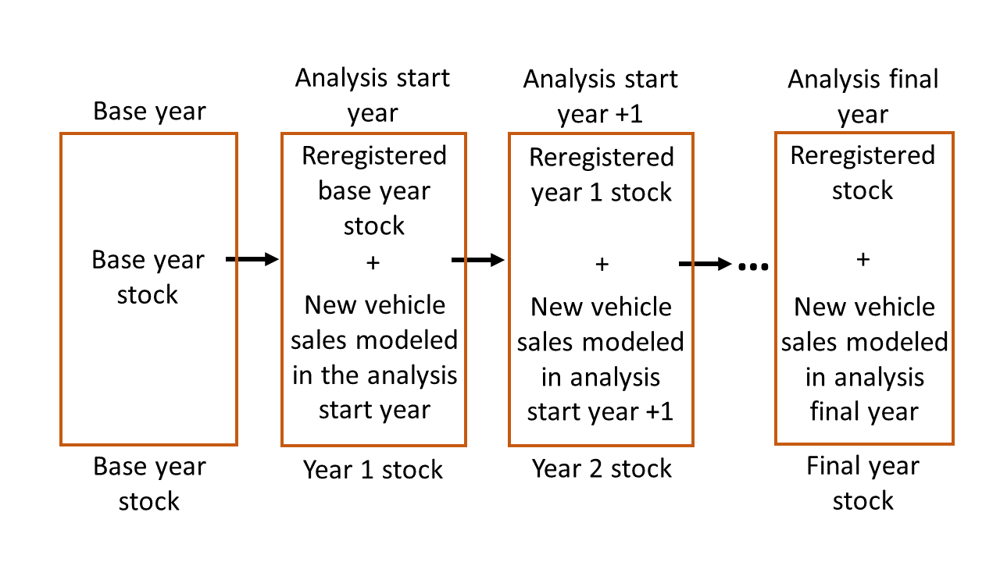

.. image:: _static/epa_logo_1.jpg

Model Architecture and Algorithms
=================================
OMEGA is structured around four main modules which represent the distinct and interrelated decision-making agents and system elements that are most important for modeling how policy influences the environmental and other effects of the light duty sector. This chapter begins with a description of the simulation process, including the overall flow of an OMEGA run, and fundamental data structures and model inputs. That section is followed by descriptions of the algorithms and internal logic of the `Policy Module`_, `Producer Module`_, and `Consumer Module`_, and then by a section on the approach for `Iteration and Convergence Algorithms`_ between these three modules. Finally, the accounting method is described for the physical and monetary effects in the `Effects Module`_.

Throughout this chapter, references to a demo analysis are included to provide additional specificity to the explanations in the main text. These examples, highlighted in shaded boxes, are also included with the model code. Please refer to  :numref:`ug_run_the_model` for more information on how to view and rerun the demo analysis.

Overall Simulation Process
^^^^^^^^^^^^^^^^^^^^^^^^^^

.. _simulation_scope_and_resolution:

Simulation Scope and Resolution
--------------------------------------
The model boundary of OMEGA as illustrated in :numref:`al_label_modelboundary` defines the system elements which are modeled internally, and the elements which are specified as user inputs and assumptions. The timeframe of a given analysis spans the years between analysis start and end years defined by the user. Together, the boundary and analysis timeframe define the scope of an analysis.

.. _al_label_modelboundary:

.. figure:: _static/al_figures/model_boundary.png
    :align: center

    OMEGA model boundary

.. admonition:: Demo example: Analysis timeframe

    For the demo analysis, the base year is defined as calendar year 2019. The year immediately following the base year is automatically used as the analysis start year. The analysis final year in this example is set to 2050 in the ‘demo_batch-context-X.csv’ input file. Therefore, the analysis timeframe is a 31-year span, inclusive of 2020 and 2050. The selection of 2019 as the base year is automatically derived from the last year of historical data contained in the ‘vehicles.csv’ and ‘ghg_credits.csv’ input files. These inputs describe the key attributes and counts for registered vehicles, and producers’ banked Mg CO2e credits as they actually existed. Note that for this example, base year vehicle inputs are limited to MY2019 new vehicles and their attributes. For an analysis which is intended to project the impacts of various policy alternatives on the reregistration and use of earlier model years, the base year inputs would describe the entire stock of registered vehicles, including MY2018, MY2017, etc.

.. sidebar:: Analysis start year and the base year

   The analysis start year is the first year in which modeling is performed, and is one year after a *base year* representing actual observations of key elements of the light duty sector, such as descriptions of the vehicle stock and new vehicle attributes. Due to the timing of when this base year input data becomes available (typically, 2 or more years after vehicle production and registration data is available), it is often necessary for the first analysis year to be earlier than the actual year in which the model is run.

Typically, the analysis start year will already be in the past at the time the model is run. Having the most up-to-date base year data can reduce the number of historical years that need to be modeled, although as noted in the sidebar, there are usually limits to data availability. Some overlap between the modeled and historical years may be beneficial, as it gives the user an opportunity to validate key model outputs against actual data and adjust modeling assumptions if needed.

Model inputs for the policy alternatives and analysis context projections must be available for every year throughout the analysis timeframe. Many of the input files for OMEGA, utilize a ‘start_year’ field, which allows the user to skip years with repetitive inputs if desired. In general, OMEGA will carry over input assumptions from the most recent prior value whenever the user has not specified a unique value for the given analysis year. Similarly, in cases where the user-provided input projections do not extend to the analysis end year, the value in the last specified year is assumed to hold constant in subsequent years. For example, in the demo analysis, 2045 is the last year for which input values are specified in ‘cost_factors-criteria.csv’, so OMEGA will apply the same 2045 values for 2046 through 2050.

An OMEGA analysis can be conducted at various levels of resolution depending on the user’s choice of inputs and run settings. The key modeling elements where resolution is an important consideration include vehicles, technologies, market classes, producers, and consumers.

.. sidebar:: Vehicles and Candidate Vehicles

    A modeled ‘vehicle’ in OMEGA is one that has been produced and registered for use in the analysis timeframe. This simulated vehicle production is the outcome of the model’s consideration of a large number of ‘candidate vehicle’ choices. Many of these candidates are not chosen for production, but nevertheless must be considered along with their attributes.

**Vehicle resolution:** The definition of a ‘vehicle’ in an OMEGA analysis is an important user decision that determines one of the fundamental units of analysis around which the model operates. In reality, the vehicle stock is made up of hundreds of millions of vehicles, owned and operated by a similarly large number of individuals and companies. Theoretically, a user could define the vehicle resolution down to the individual options and features applied, or even VIN-level of detail. But given limitations in computational resources, the OMEGA user will more likely define vehicles at the class or nameplate level (e.g. ‘crossover utility vehicle’, or ‘AMC Gremlin’.)  Regardless of how vehicles are represented, OMEGA will retain the details of each vehicle throughout the model (including in the outputs) at the level of resolution that the user has chosen. For example, if a user defines vehicle inputs at the nameplate level, the outputs will report nameplate level vehicle counts, key attributes, emissions rates, and physical and cost effects.

**Technology package resolution:** In OMEGA, producer decisions are made using complete packages of technologies which are integral to, and inseparable from, the definition of a candidate vehicle. In other words, a change to any of the individual technology components would result in a different candidate vehicle. The 'simulated_vehicles.csv' file contains the information for each candidate vehicle that is needed for modeling producer decisions, including the costs and emissions rates that are associated with the technology package.

**Technology component resolution:** Though the model operates using full technology packages (mentioned above), it may sometimes be helpful to track the application of particular sub-components of a package. The user can choose to add flags to the 'simulated_vehicles.csv' file to identify which types of components are present on the candidate vehicles. These flags are then used by the model to tabulate the penetration of components in the vehicle stock over time.

**Market class resolution:** The level of detail, and type of information used within the Producer and Consumer modules is different. For example, we assume that consumers are not aware of the compliance implications and detailed design choices made by the producer, unless those factors are evident in the price, availability, or key attributes of a vehicle. Therefore, consumer decisions regarding the demanded shares of vehicles are modeled based on vehicle characteristics aggregated at the market class level. The user's determination of the appropriate resolution for the market classes will depend on the chosen specification for share response modeling within the Consumer Module. Note that within the Consumer Module, while share response is modeled at the market class level, other consumer decisions (like reregistration and use) can be based on more detailed vehicle-level information.

**Producer resolution:** The producers in OMEGA are the regulated entities subject to the policy alternatives being analyzed and are responsible (together with the consumers and policy) for the decisions about the quantities and characteristics of the vehicles produced. The user can choose to model the producers either as an aggregate entity with the assumption that compliance credits are available in an unrestricted market (i.e. 'perfect trading'), or as individual entities with no trading between firms.

**Consumer resolution:** The approach to account for heterogeneity in consumers is an important consideration when modeling the interaction between producer decisions and the demand for vehicles. By taking advantage of user-definable submodules, a developer can set-up the Consumer Module to account for different responses between consumer segments.

Whatever the level of resolution, the detail provided in the inputs 1) must meet the requirements of the various modeling subtasks, and 2) will determine the level of detail of the outputs. When preparing analysis inputs, it is therefore necessary to consider the appropriate resolution for each module. For example:

* Within the Policy Module, vehicle details are needed to calculate the target and achieved compliance emissions. This might include information about regulatory classification and any vehicle attributes that are used to define a GHG standard.

* Within the Producer Module, the modeling of producer decisions requires sufficient detail to choose between compliance options based the GHG credits and generalized producer cost associated with each option.

* Within the Consumer Module, the modeling of consumer decisions requires sufficient detail to distinguish between market classes for representing both the purchase choices among different classes, and the reregistration and use of vehicles within a given class.

.. admonition:: Demo example: Modeling resolution

    .. csv-table:: How modeling resolution is defined in an OMEGA run
        :widths: auto
        :header-rows: 1

        Modeling element,Where is the resolution defined?,Description of resolution in the demo
        Vehicle resolution,vehicles.csv,51 2019 base year vehicles differentiated by context size class ('Small Crossover' 'Large Pickup' etc) manufacturer_id and electrification_class ('N' 'HEV' 'EV')
        Technology package resolution:,simulated_vehicles.csv,578088 candidate vehicles for the analysis timeframe 2020 through 2050 with technology packages for ICE and BEV powertrains
        Technology component resolution:,simulated_vehicles.csv,detailed flags for identifying technology package contents of ac_leakage ac_efficiency high_eff_alternator start_stop hev phev bev weight_reduction  deac_pd deac_fc cegr atk2 gdi turb12 turb11
        Market class resolution,consumer.market_classes.py user-definable submodule and market_classes.csv,4 classes in 2 nested levels with BEV and ICE categories within first tier hauling and non-hauling categories
        Consumer resolution,consumer.sales_share_gcam.py user-definable submodule,consumer heterogeneity is inherent in share weights used to estimate market class shares
        Producer resolution,`demo_batch-context-X.csv` and manufacturers.csv,2 producers ('OEM_A' and 'OEM_B') and 'Consolidate Manufacturers' run setting set to FALSE

Process Flow Summary
--------------------
In an OMEGA session, the model runs by looping over analysis years and  producers. Within each successive loop, the simulation of producer and consumer decisions results in new vehicles entering the stock of registered vehicles, and the reregistration and use of existing vehicles from the prior year’s stock.

As shown in :numref:`al_label_overallprocessflow` , this simulation process involves two iterative loops. In one loop, the Policy Module determines whether or not the producer’s strategic compliance target is met by the candidate production options under consideration. In the other iterative loop, the Consumer Module determines whether or not the market will accept the quantities of vehicles offered at the prices set by the producer. Both the Producer-Policy and the Producer-Consumer iterative loops must achieve convergence for the simulation to proceed. Once all the analysis years and producers have been completed, the effects calculations are performed and results are written to the output files.

.. _al_label_overallprocessflow:
.. figure:: _static/al_figures/overall_process_flow.png
    :align: center

    OMEGA process flow

Model Inputs
------------

As described in the :numref:`inputs_and_outputs_label` overview, OMEGA model inputs are grouped into two categories; *policy alternative* inputs and *analysis context* inputs. The policy alternatives define the GHG standards that are being evaluated by the model run, while the analysis context refers collectively to the external assumptions that apply to all policies under analysis.

**Policy Alternatives Inputs**

An OMEGA run requires a full description of the GHG standards themselves so that the modeled producer compliance considerations are consistent with how an EPA rule would be defined in the Federal Register and Code of Federal Regulations. As described in :numref:`Policy Module`, OMEGA is intended primarily for the analysis of fleet averaging standards, and the demo example has been set up to illustrate how accounting rules for GHG credits in a fleet averaging program can be defined. This includes the coefficients for calculating emissions rate targets (gram CO2e per mile) based on vehicle attributes, the methods for determining emissions rate certification values (e.g. drive cycle and fuel definitions, off-cycle credits), and the rules for calculating and accounting for Mg CO2e credits over time (e.g. banking and trading rules, and lifetime VMT assumptions.) See :numref:`al_label_table_policy_alternative_inputs` for a complete list of the policy alternative inputs used in the demo example.

**Analysis Context Inputs**

The analysis context defines the inputs and assumptions that the user assumes are independent of the policy alternatives. This clear delineation of exogenous factors is what enables the apples-to-apples comparison of policy alternatives within a given analysis context. This is the primary purpose for which OMEGA was designed – to quantify the incremental effects of a policy for informing policy decisions. At the same time, considering how the incremental effects of a policy might vary depending on the analysis context assumptions is a useful approach for understanding the sensitivity of the projected results to differences in assumptions.

.. admonition:: Demo example: Analysis Context inputs for 'Context A'

    The demo example includes two policy alternatives ('alt0' and 'alt1') and two sets of analysis context assumptions ('A' and 'B'.) :numref:`al_label_table_policy_context_a_inputs` shows the complete set of input files and settings for Context A as defined in the 'demo_batch-context_a.csv' file.

    .. _al_label_table_policy_context_a_inputs:
    .. csv-table:: Input files and settings for 'Context A'
        :widths: auto
        :header-rows: 1

        Analysis context element,Input file name/ Input setting value,Description
        Context Name,AEO2021,"Together with 'Context Case' setting, selects which set of input values to use from the fuel price and new vehicle market files."
        Context Case,Reference case,"Together with 'Context Name' setting, selects which set of input values to use from the fuel price and new vehicle market files."
        Context Fuel Prices File,context_fuel_prices.csv,"Retail and pre-tax price projections for any fuels considered in the analysis (e.g. gasoline, electricity.)"
        Context New Vehicle Market File,context_new_vehicle_market.csv,"Projections for new vehicle key attributes, sales, and mix under the analysis context conditions, including whatever policies are assumed."
        GHG Credits File,ghg_credits.csv,"Balance of existing banked credits, by model year earned."
        Manufacturers File,manufacturers.csv,"List of producers considered as distinct entities for GHG compliance. When 'Consolidate Manufacturers' is set to TRUE, in the batch input file, 'consolidated_OEM' value is used for all producers."
        Market Classes File,market_classes.csv,Market class ID's for distinguishing vehicle classes in the Consumer Module.
        New Vehicle Price Elasticity of Demand,-1,Scalar value of the price elasticity of demand for overall new vehicle sales.
        Onroad Fuels File,onroad_fuels.csv,Parameters inherent to fuels and independent of policy or technology (e.g. carbon intensity.)
        Onroad Vehicle Calculations File,onroad_vehicle_calculations.csv,Multiplicative factors to convert from certification energy and emissions rates to onroad values.
        Onroad VMT File,annual_vmt_fixed_by_age.csv,Annual mileage accumulation assumptions for estimating vehicle use in Consumer and Effects modules
        Producer Cross Subsidy Multiplier Max,1.05,Upper limit price multiplier value considered by producers to increase vehicle prices though cross subsidies.
        Producer Cross Subsidy Multiplier Min,0.95,Lower limit price multiplier value considered by producers to decrease vehicle prices though cross subsidies.
        Producer Generalized Cost File,producer_generalized_cost.csv,Parameter values for the producers generalized costs for compliance decisions (e.g. the producers view of consumers consideration of fuel costs in purchase decisions.)
        Production Constraints File,production_constraints-cntxt_a.csv,Upper limits on market class shares due to constraints on production capacity.
        Sales Share File,sales_share_params-cntxt_a.csv,Parameter values required to specify the demand share estimation in the Consumer Module.
        Vehicle Price Modifications File,vehicle_price_modifications-cntxt_a.csv,Purchase incentives or taxes/fees which are external to the producer pricing decisions.
        Vehicle Reregistration File,reregistration_fixed_by_age.csv,"Proportion of vehicles reregistered at each age, by market class."
        Vehicle Simulation Results and Costs File,simulated_vehicles.csv,Vehicle production costs and emissions rates by technology package and cost curve class.
        Vehicles File,vehicles.csv,The base year vehicle stock and key attributes. Note that the demo example contains MY2019 vehicles. Prior model years could also be included if needed for stock and use modeling.
        Context Criteria Cost Factors File,cost_factors-criteria.csv,The marginal pollution damages per unit mass from criteria pollutant emissions.
        Context SCC Cost Factors File,cost_factors-scc.csv,The marginal costs per unit mass from GHG emissions (i.e. Social Cost of Carbon.)
        Context Energy Security Cost Factors File,cost_factors-energysecurity.csv,The marginal energy security cost per unit of fuel consumption.
        Context Congestion-Noise Cost Factors File,cost_factors-congestion-noise.csv,The marginal cost per mile of noise and congestion from changes in VMT.
        Context Powersector Emission Factors File,emission_factors-powersector.csv,The marginal cost per kWh of upstream emissions from electricity generation.
        Context Refinery Emission Factors File,emission_factors-refinery.csv,The marginal cost per gallon upstream emissions from fuel refining.
        Context Vehicle Emission Factors File,emission_factors-vehicles.csv,The marginal cost per mile of direct emissions (i.e. tailpipe emissions) from changes in VMT.
        Context Implicit Price Deflators File,implicit_price_deflators.csv,Factors for converting costs to a common dollar basis.
        Context Consumer Price Index File,cpi_price_deflators.csv,Factors for converting costs to a common dollar basis.

.. admonition:: Demo example: Unique Analysis Context inputs for 'Context B'

    While most of the example input files are common for contexts ‘A’ and ‘B’, in cases where context assumptions vary, input files are differentiated using ‘context_a’ and ‘context_b’ in the file names. :numref:`al_label_table_policy_context_b_unique_inputs` shows the input files and settings that are unique for Context B as defined in the in the ‘demo_batch-context_b.csv’ file.

    .. _al_label_table_policy_context_b_unique_inputs:
    .. csv-table:: Input files and setting differences between contexts 'A' and 'B'
        :widths: auto
        :header-rows: 1

        Analysis context element,Input file name/ Input setting value,Difference between contexts 'A' and 'B'
        Context Case,High oil price,"Taken from AEO2021, Context A uses the Reference Case fuel prices and Context B uses the 'High oil price' case fuel prices."
        Producer Cross Subsidy Multiplier Max,1.4,Context B uses a higher upper limit price multiplier value compared to the 1.05 value for Context A.
        Producer Cross Subsidy Multiplier Min,0.6,Context B uses a reduced lower limit price multiplier value compared to the 0.95 value for Context A.
        Production Constraints File,production_constraints-cntxt_b.csv,"Context B has a linearly increasing maximum production constraint for BEVs from 2020 to 2030, compared to Context A which has no production limits specified in that timeframe."
        Sales Share File,sales_share_params-cntxt_b.csv,"Context B has BEV share weight parameters for the Consumer Module which represent a logistic function that increases earlier, reaching a value of 0.5 in 2025 instead of 2030 in Context A. In other words, Context B represents greater consumer demand for BEVs, all else equal."
        Vehicle Price Modifications File,vehicle_price_modifications-cntxt_b.csv,"Context B introduces an external BEV purchase incentive of $10,000 in 2025, which decreases to $5,000 in 2027, and then linearly to zero in 2036 compared to Context A which has no purchase incentives in this timeframe."

Projections and the Analysis Context
------------------------------------
The output of an OMEGA run is a modeled projection of the future. While this projection should not be interpreted as a single point prediction of what will happen, it does represent a forecast that is the result of the modeling algorithms, inputs, and assumptions used for the run. Normally, these modeled projections of the future will vary from year-to-year over the analysis timeframe due to year-to-year changes in the policy, as well changes in producer decisions due to considerations of compliance strategy, credit utilization, and production constraints. Another reason that results in future are not constant from one year to the next is because the exogenous factors in the analysis context are themselves projections of the future, and any year-to-year changes in those factors will influence the model results.

It is important that we consider the relationship between these exogenous projections and the factors being modeled internally within OMEGA to avoid inconsistencies. Three situations are described here, along with an explanation for how the model integrates external projections in a consistent manner.

**Projections that are purely exogenous**

Input projections for items that are assumed to be not influenced at all by the policy response modeled within OMEGA are left as specified in the inputs. Examples might include projections of fuel prices, the state of available technology, or upstream emissions factors. While in reality these things might be influenced by the policy alternatives, we are assuming complete independence for modeling purposes, and no additional special treatment is needed for consistency.

.. sidebar:: Context policy

    Among the range of assumptions that define the analysis context is an assumption about the light-duty vehicle emissions policy. This is defined as the *context policy*, and is necessarily the first policy alternative session that must be run in order to ensure that the modeled results are consistent with the analysis context.

**Calibrating to projected elements that are also modeled with policy influences**

Both the consumer and producer decisions will influence the modeled new vehicle sales and attributes; for example, new vehicle prices, overall sales, sales mix, technology applications, emissions rates and fuel consumption rates. While some of these elements might not be within the scope of the input projections, when a projected element is also modeled as being responsive to policy, OMEGA uses a calibration approach to maintain consistency. Specifically, after calibration, the results of a model run using the context policy will produce results that match the projections in the analysis context. If that were not the case, results for any other policy alternatives could deviate in unrealistic ways from the underlying projections.

.. admonition:: Demo example: Overall sales projections and the context policy

    The overall sales level is an item that is both specified as a projection in the context inputs, and is also modeled internally as responsive to changes in vehicle prices, fuel operating costs, etc. In each batch run (each batch contains two or more policy alternatives), OMEGA automatically calibrates the overall average new vehicle prices in the first session, which represents the context policy. This calibration process ensures that overall sales match the context projected sales by generating calibrated new vehicle prices (P) which are associated with the context. In subsequent sessions of the batch run for the other policy alternatives, these calibrated prices are used as the basis to which any price changes are applied (the P in equation :eq:`al_label_eqn_demand_elasticity`.)

**Elements not explicitly projected in new vehicle market inputs**

Some elements related to vehicle attributes and sales mix may be neither part of the projection inputs nor modeled internally, yet still be important to consider in the future projections. In these cases, base year vehicle fleet attributes and relative mix characteristics are assumed to hold constant into the future.

.. admonition:: Demo example: Projections for new vehicle size class mix

    In the demo example, overall new vehicle sales projections are taken as purely exogenous. The ‘context_new_vehicle_market.csv’ file specifies the sales mix projections from AEO though 2050 by size class. As shown in :numref:`al_label_fig_context_projections_size_class_share`, the projected sales mix of size classes varies by year, and between Context A and Context B.

    .. _al_label_fig_context_projections_size_class_share:
    .. figure:: _static/al_figures/context_projections_size_class_share_by_context_a_b.png
        :align: center

        Exogenous projections of size class from ‘context_new_vehicle_market.csv’

    All vehicle attributes which are not explicitly projected exogenously and not modeled internally are held constant from the base year fleet. For example, while size class projections are provided for overall new sales in each year, the projections are not defined at the individual producer level. Therefore, MY2019 base year relative shares of size classes for each producer are assumed to hold constant in the future. As shown in the left bar chart of :numref:`al_label_fig_context_projections_applied_to_base_year_oem_a_b`, in MY2019 OEM A was more heavily focused on the Large Pickup, Small Utility, and Small Crossover classes, while OEM B was more heavily focused on the Large Utility and Midsize car classes. These relative differences between producers are maintained in the model during the process of applying the size class projections for new sales overall to the individual vehicle projections, and their associated producers, in the base year. The result is shown on the right of Figure :numref:`al_label_fig_context_projections_applied_to_base_year_oem_a_b`. The combined sales of OEM A and OEM B will match the overall new sales size class shares from :numref:`al_label_fig_context_projections_size_class_share`, while retaining the relative tendency for OEM A and OEM B to produce different size class mixes.

    .. _al_label_fig_context_projections_applied_to_base_year_oem_a_b:
    .. figure:: _static/al_figures/context_projections_applied_to_base_year_oem_a_b.png
        :align: center

        Context size class projections applied to MY2019 base year vehicles

.. _Policy Module:

Policy Module
^^^^^^^^^^^^^
OMEGA's primary function is to help evaluate and compare policy alternatives which may vary in terms of regulatory program structure and stringency. Because we cannot anticipate all possible policy elements in advance, the code within the Policy Module is generic, to the greatest extent possible. This leaves most of the policy definition to be defined by the user as inputs to the model. Where regulatory program elements cannot be easily provided as inputs, for example the equations used to calculate GHG target values, the code has been organized into user-definable submodules. Much like the definitions recorded in the Code of Federal Regulations (CFR), the combination of inputs and user-definable submodules must unambiguously describe the methodologies for determining vehicle-level emissions targets and certification values, as well as the accounting rules for determining how individual vehicles contribute to a manufacturer's overall compliance determination.

:numref:`al_label_plcym_ov` shows the flow of inputs and outputs for the Policy Module. As shown in this simple representation, the vehicle GHG targets and achieved certification values are output from the module, as a function of the attributes of candidate vehicles presented by the Producer Module.

.. _al_label_plcym_ov:
.. figure:: _static/al_figures/policymod_ov.png
    :align: center

    Overview of the Policy Module

Throughout OMEGA, *policy alternatives* refer only to the regulatory options that are being evaluated in a particular model run. There will also be relevant inputs and assumptions which are technically policies but are assumed to be fixed (i.e. exogenous) for a given comparison of alternatives. Such assumptions are defined by the user in the *analysis context*, and may reflect a combination of local, state, and federal programs that influence the transportation sector through regulatory and market-based mechanisms. For example, these exogenous context policies might include some combination of state-level mandates for zero-emissions vehicles, local restrictions or fees on ICE vehicle use, state or Federal vehicle purchase incentives, fuel taxes, or a carbon tax. A comparison of policy alternatives requires that the user specify a no-action policy (aka context policy) and one or more action alternatives.

Policy alternatives that can be defined within OMEGA fall into two categories: those that involve fleet average emissions standards with compliance based on the accounting of credits, and those that specify a required share of a specific technology. OMEGA can model either policy type as an independent alternative, or model both types together; for example, in the case of a policy which requires a minimum share of a technology while still satisfying fleet averaging requirements.

**Policy alternatives involving fleet average emissions standards:**
In this type of policy, the key principle is that the compliance determination for a manufacturer is the result of the combined performance of all vehicles, and does not require that every vehicle achieves compliance individually. Fleet averaging in the Policy Module is based on CO2 *credits* as the fungible accounting currency. Each vehicle has an emissions target and an achieved certification emissions value. The difference between the target and certification emissions in absolute terms (Mg CO2) is referred to as a *credit*, and might be a positive or negative value that can be transferred across years, depending on the credit accounting rules defined in the policy alternative. The user-specified policy inputs can be used to define restrictions on credit averaging and banking, including limits on credit lifetime or the ability to carry a negative balance into the future. The analogy of a financial bank is useful here, and OMEGA has adopted data structures and names that mirror the familiar bank account balance and transaction logs.

OMEGA is designed so that within an analysis year, under an unrestricted *fleet averaging* policy, credits from all the producer’s vehicles are counted without limitations towards the producer’s credit balance. Vehicles with positive credits may contribute to offset other vehicles with negative credits. The OMEGA model calculates overall credits earned in an analysis year as the difference between the aggregate certification emissions minus the aggregate target emissions. An alternative approach of calculating overall credits as the sum of individual vehicle credits is unnecessary and in some cases may not be possible. To give one example, if a policy applies any constraints on the averaging or transfer of credits, it would not be possible to determine compliance status simply by counting each vehicle’s credit contribution fully towards the overall credits.

The transfer of credits between producers can be simulated in OMEGA by representing multiple regulated entities as a hypothetical 'consolidated' producer, under an assumption that there is no cost or limitation to the transfer of compliance credits among entities. OMEGA is not currently designed to explicitly model any strategic considerations involved with the transfer of credits between producers.

Emissions standards are defined in OMEGA using a range of policy elements, including:

* rules for the accounting of upstream emissions
* definition of compliance incentives, like multipliers
* definition of regulatory classes
* definition of attribute-based target function
* definition of the vehicles’ assumed lifetime miles

.. admonition:: Demo example: Input files for no-action and action policy definitions

    .. _al_label_table_policy_alternative_inputs:
    .. csv-table:: Description of Policy Alternative input files
        :widths: auto
        :header-rows: 1

        Policy element, No-action policy [Action policy] input files, Description
        Drive cycles, drive_cycles-alt0[alt1].csv; drive_cycle_weights-alt0[alt1].csv, Drive cycle ID's and weights for calculating weighted average emissions from certification tests.
        Fuels, policy_fuels-alt0[alt1].csv, Direct and indirect CO2 values used in certification calculations for each fuel.
        GHG credit rules, ghg_credit_params-alt0[alt1].csv, Credit carry-forward and carry-back rules.
        GHG targets, ghg_standards-alt0[alt1].csv, Formula definitions for calculating g CO2/mi targets from vehicle attributes and regulatory classes. Also includes lifetime VMT assumptions.
        Offcycle credits, offcycle_credits-alt0[alt1].csv, Offcycle credit values for specific technologies.
        Upstream emissions accounting, policy_fuel_upstream_methods-alt0[alt1].csv, Selection of which methods to use for the calculation of indirect emissions certification values.
        Advanced technology multipliers, production_multipliers-alt0[alt1].csv, Values for multipliers used in credit calculations to incentivize the introduction of specific technologies.
        Reg classes, regulatory_classes-alt0[alt1].csv, Regulatory class ID's and descriptions.
        Technology mandates, required_sales_share-alt0[alt1].csv, Minimum required production shares as required by the policy.

**Policy alternatives requiring specific technologies:**
This type of policy requires all, or a portion, of a producer’s vehicles to have particular technologies. OMEGA treats these policy requirements as constraints on the producer’s design options. This type of policy alternative input can be defined either separately, or together with a fleet averaging emissions standard; for example, a minimum Zero Emission Vehicle (ZEV) share requirement could be combined with an emissions standard where the certification emissions associated with ZEVs are counted towards the producer’s achieved compliance value.

**Policy representation in the analysis context:**
Some policies are not modeled in OMEGA as policy alternatives, either because the policy is not aimed directly at the producer as a regulated entity, or because the particular OMEGA analysis is not attempting to evaluate the impact of that policy relative to other alternatives. However, even when a policy is not reflected in any of the analyzed policy alternatives, it may still be appropriate to represent that policy in the Analysis Context inputs. This is especially true when that external policy (or policies) might significantly influence the producer or consumer decisions. Some examples include:

* Fuel tax policy
* State and local ZEV policies
* Vehicle purchase incentives
* Investment in refueling and charging infrastructure
* Accelerated vehicle retirement incentives

.. _Producer Module:

Producer Module
^^^^^^^^^^^^^^^
Producer Module Overview
------------------------
The modeling of producer decisions is central to the optimization problem that OMEGA has been developed to solve. In short, the objective is to minimize the producers' generalized costs subject to the constraints of regulatory compliance and consumer demand. The ‘producer’ is defined in OMEGA as a regulated entity that is subject to the policy alternatives being modeled, and responsible for making decisions about the attributes and pricing of new vehicles offered to consumers. A user might choose to model producers as an individual manufacturer of light duty vehicles, as a division of a single manufacturer, or as a collection of manufacturers. This choice will depend on the goals of the particular analysis, and what assumptions the user is making about the transfer of compliance credits within and between manufacturers.

:numref:`al_label_pm_ov` shows the flow of inputs and outputs for the Producer Module. Analysis context inputs are not influenced by the modeling within the Consumer, Producer, and Policy Modules, and are therefore considered as exogenous to OMEGA.

.. _al_label_pm_ov:
.. figure:: _static/al_figures/producermod_ov.png
    :align: center

    Overview of the Producer Module

**Inputs to the Producer Module:** Policy Alternative inputs are used to calculate a compliance target for the producer (in Mg CO2) for a given analysis year using the provided attribute-based vehicle GHG targets, vehicle regulatory class definitions, and assumed lifetime VMT for compliance. Other policy inputs may define, for example, the credit lifetime for carry-forward and carry-back, or a floor on the minimum share of ZEV vehicles produced.

Analysis context inputs and assumptions that the Producer Module uses define all factors, apart from the policies under evaluation, that influence the modeled producer decisions. Key factors include the vehicle costs and emissions for the technologies and vehicle attributes considered, and the producer constraints on pricing strategy and cross-subsidization.

During the iteration process, shares of new vehicles demanded are generated by the Consumer Module as inputs to the Producer Module. These shares are at the market class-level, and based on the prices and attributes of the candidate vehicles offered by the producer in that iteration. See :numref:`Iteration and Convergence Algorithms` for a description of the iteration and convergence algorithms.

**Outputs of the Producer Module:** During the iteration process, the outputs of the Producer Module describe the candidate vehicles -- prices, quantities, and key attributes -- which forms the basis for determining compliance status (by iterating with the Policy Module) and demanded sales shares (by iterating with the Consumer Module.) Once model convergence is achieved, the Producer Module outputs the details of the produced vehicles.

.. _producer_compliance_strategy_section:

Producer Compliance Strategy
----------------------------
The Producer Module simulates decisions about vehicle design, pricing, and production quantities that minimize compliance costs while satisfying other considerations imposed by the policy, consumers, and production constraints. With a fleet averaging policy that allows credit banking and trading, the producer is making these product decisions within an overall strategy of managing compliance credits from year-to-year.

**Vehicle design strategy**

.. sidebar:: The producer's view of consumers

    The producer, as an independent decision-making agent, will not have perfect information about the internal consumer decision process. Within the Producer Module, OMEGA allows the user to define the consumer decisions from the producer’s perspective, which may be different from (or the same as) the representation within the Consumer Module.

While the producer’s modeled objective function is cost minimization, the term ‘cost’ is used generically here, as it is not necessarily the case that the lowest production cost option is the best option for the producer. Consumer willingness to pay for a particular vehicle attribute can result in another choice if the producer expects that the additional production costs can be more than offset by a higher price. Here, the term *producer generalized costs* is defined as the net of vehicle production costs and the producer’s view of consumer’s willingness to pay for that vehicle.

The Producer Module will first attempt to select the available vehicle design options (i.e. tech package applications) and sales mix that minimizes generalized costs while meeting the strategic compliance target (Mg CO2e.) This is the starting point of an iterative process, since in many cases the demand estimated by the Consumer Module will not match this first set of vehicle attributes, prices, and quantities within the desired convergence tolerance.

**Vehicle pricing and sales mix strategy**

In addition to influencing key vehicle attributes by the design decisions, the producer also has some flexibility in how vehicle prices are set. Using cross-subsidization strategies to spur greater sales of some vehicles at the expense of others, producers can incentivize market class sales mix changes in order to reduce generalized costs. This assumption that producers will attempt to minimize their generalized costs is consistent with a producer goal of profit maximization.

In reality, there are limits to the ability of producers to adjust vehicle prices. The user can define upper and lower limits to how much price cross-subsidization can be applied. Also, the model automatically only searches for solutions that maintain the overall average vehicle price, thus forcing any cross-subsidization strategies to be revenue neutral.

**Credit management strategy**

With a policy that allows credit banking, the efficient management of compliance credits from year-to-year involves a degree of look-ahead, both in terms of expected changes in regulatory stringency and other policies, and expected changes in generalized costs over time. At this time, OMEGA assumes that producers aim to meet the GHG target in each year, with any banked credits used only to make up differences between the certification and target values. The producer logic associated with the process box labeled “Determine Strategic Target Offset” in the process flow diagram (:numref:`al_label_overallprocessflow`) therefore simply applies the offset, if any, to the policy GHG target. In a future revision, we plan to consider incorporating producer decisions that are intentionally under- or over-target based on the assumption that producers make strategic decisions looking beyond the immediate present to minimize generalized costs over a longer time horizon.

Vehicle Definitions
-------------------
The vehicle is the fundamental unit of analysis within the Producer Module, and the decisions made by producers determine the vehicle attributes and sales in the modeled results. The vehicle resolution is determined by the user (see :numref:`simulation_scope_and_resolution`) consistent with the resolution defined in the base year vehicles input file.  Depending on the focus of a particular run, vehicles might be defined at a market class level using an aggregate representation over multiple producers, or at the nameplate or even subconfiguration level.

Along with a definition of resolution, the base year vehicles inputs also define the key exogenous attributes that are necessary for 1) generating future projections, 2) assigning the policy emissions targets, 3) estimating consumer demanded quantities, 4) determining appropriate emissions rates and costs from the applied technology packages.

.. admonition:: Demo example: Vehicle definitions in base year fleet

    .. _al_label_table_key_base_year_attributes_and_uses:
    .. csv-table:: Key base year vehicle attributes and their uses from 'vehicles.csv'
        :widths: auto
        :header-rows: 1

        Field Name,Attribute Required For:,Example 1,Example 2,Example 3,Example 4
        vehicle_name,tracking of producer decisions in modeled results,ICE Large car,ICE Large Crossover truck,ICE-HEV Large Pickup truck 4WD,ICE Large Van truck minivan 4WD
        manufacturer_id,grouping for producer modeling,OEM_B,OEM_A,OEM_A,OEM_A
        model_year,determination of analysis start year,2019,2019,2019,2019
        reg_class_id,reference (assigned by policy in analysis timeframe),car,truck,truck,truck
        epa_size_class,reference,Large Cars,Standard SUV 2WD,Standard Pick-up Trucks 4WD,"Special Purpose Vehicle, minivan 4WD"
        context_size_class,sales mix projections,Large,Large Crossover,Large Pickup,Large Van
        electrification_class,reference (modeled element in analysis timeframe),N,N,HEV,N
        cost_curve_class,cost and emissions rates for tech packages,ice_MPW_LRL,ice_MPW_HRL,ice_Truck,ice_MPW_HRL
        in_use_fuel_id,reference (modeled element in analysis timeframe),{'pump gasoline':1.0},{'pump gasoline':1.0},{'pump gasoline':1.0},{'pump gasoline':1.0}
        cert_fuel_id,reference (modeled element in analysis timeframe),{'gasoline':1.0},{'gasoline':1.0},{'gasoline':1.0},{'gasoline':1.0}
        sales,sales mix projections,536531,496834,78297,13795
        cert_direct_oncycle_co2e_grams_per_mile,reference (modeled element in analysis timeframe),345.3,418.6,405.8,403.0
        cert_direct_oncycle_kwh_per_mile,reference (modeled element in analysis timeframe),0,0,0,0
        footprint_ft2,policy targets ('Alternative 0' only),50.5,54.7,68.5,56.0
        eng_rated_hp,reference (modeled element in analysis timeframe),268,318,364,296
        tot_road_load_hp,reference (modeled element in analysis timeframe),12.5,16.1,19.3,17.3
        etw_lbs,reference (modeled element in analysis timeframe),4035,5095,5518,5000
        length_in,reference,195.3,201.6,231.6,200.6
        width_in,reference,73.8,78.0,80.6,78.1
        height_in,reference,58.2,71.1,77.0,70.4
        ground_clearance_in,reference,5.2,8.3,,6.5
        wheelbase_in,reference,114.0,118.4,143.1,119.3
        interior_volume_cuft,reference,,148.3,,
        msrp_dollars,reference (modeled element in analysis timeframe),42554,46592,40740,39962
        passenger_capacity,policy targets ('Alternative 1' only),5.0,6.6,5.5,7.0
        payload_capacity_lbs,reference,1030,1438,1748,
        towing_capacity_lbs,reference,1000,5598,10509,3500
        unibody_structure,reference,1,1,0,1

Vehicle Simulation and Cost Inputs
------------------------------------------
One of the most important sets of inputs to the Producer Module is the simulated vehicles file. It contains the vehicle parameters used by OMEGA to generate all possible vehicle technology (and cost) options available to the producers – these production options represent distinct points in what might be considered a point 'cloud'. The use of these vehicle clouds by OMEGA is described in :numref:`veh clouds section`.

The simulated vehicle file contains the various vehicles of different core attributes (such as vehicle size, weight, powertrain, etc), the CO2-reducing technologies that are applied to each, and their predicted energy consumption, CO2 performance, and cost. While not required by all users, EPA uses its own simulation tool (ALPHA) to predict the energy consumption and CO2 emissions for each vehicle and technology combination. For the demo, these vehicle and technology options (and associated CO2 performance) are consolidated into the 'simulated_vehicles.csv' file. The simulated vehicles file contains the following fields for use in the Producer Module:

* the associated **cost curve class** (defined by powertrain family and described below)
* vehicle properties such as curb weight, type of base powertrain (ICE/HEV/PHEV/BEV, etc)
* other included technologies (e.g., A/C credits, high efficiency alternator, etc)
* test cycle performance (energy consumption (for plug-in vehicles) and/or CO2 emissions)
* vehicle attributes, such as included technologies, costs

**Significance of the cost curve class:**
Each cost curve class includes multiple vehicles and represents the design space for all vehicle options in each class. In the demo, multiple vehicles are grouped within a single cost curve class to reduce the number of simulations required to represent the design space. OMEGA producer decisions are made based on discrete vehicle options within each vehicle cost curve class. For possible future consideration, EPA recommends the generation of RSEs (response surface equations) to derive particular cost clouds unique to each vehicle. This would allow for more unique cost and vehicle clouds without excessive simulation calculation burden.

.. _veh clouds section:

Vehicle Cost Clouds, Cost Curves, and Aggregation
-------------------------------------------------

The technology packages and their application to candidate vehicles are described in the model inputs as a discrete set of options that were generated using tools and approaches external to OMEGA (e.g. vehicle simulation, benchmarking, cost teardowns, etc.) Because the product design problem being solved is multi-dimensional (i.e. an intersection of technology package applications and market share decisions for multiple vehicles), the choice set must be built up from various combinations of vehicle-level decisions that cannot be readily predicted in advance.

The Producer Module uses an approach of aggregating the discrete, vehicle-level decisions at several levels, while retaining the vehicle-specific information that can be accessed later in other stages of the modeling and presented in the results. These processes of vehicle aggregation (also referred to as composition or the creation of “composite vehicles”) and decomposition are critical for the solution search process. First, aggregation allows the model to efficiently search for a solution without a complete enumeration of all possible choice combinations. Second, decomposition allows the model to draw upon the key vehicle attribute details that have been retained and are required for calculating the compliance emissions values and estimating the consumer response.

**Vehicle-level technology application options**

In oder to minimize cost, a producer would need to select the minimum cost package available at a given compliance emissions rate (i.e. g CO2/mi.) This subset of cost-minimizing vehicle technology packages is referred to as the *cost curve*, while the broader set of points is the *cost cloud*. Note that ‘cost’ here is referring to the producer generalized cost, as explained in :numref:`producer_compliance_strategy_section`.

.. admonition:: Demo example: Vehicle cost clouds

    An example cost cloud for a single vehicle in MY2025 (vehicle #62, a 4WD minivan) for the no-action policy in Context A is shown in :numref:`al_label_pm_vehicle_cloud`. The costs for the blue points are production costs. The orange point costs are producer generalized costs, and include 5 years of fuel costs at 15,000 miles per year that the producer assumes are valued by consumers at the time of purchase (as defined in the analysis context input file ‘producer_generalized_costs.csv’.) Note that the producer generalized costs are higher than the production costs, and also form a cloud with a different shape than the blue production cost cloud. Essentially, the orange cloud is shifted up and rotated counterclockwise relative to the blue cloud because the technology packages with higher emissions rates also have relatively higher fuel costs that are assumed to factor into consumer purchases.

    :numref:`al_label_pm_vehicle_cloud` also contains the resultant cost curve (black line) that represents the cost-minimizing frontier of the cost cloud. The Producer Module automatically generates this piece-wise linear approximation of the frontier using points in the cloud.

    .. _al_label_pm_vehicle_cloud:
    .. figure:: _static/al_figures/2025_ICE_Large_Van_truck_minivan_4WD_cost_curve.png
        :align: center

        Example vehicle cloud

**Compliance options based on design decisions across multiple vehicles**

Because a producer can offer a range of different vehicles, each with distinct costs associated with applying technology packages, it is not likely that the lowest cost compliance solution will be a uniform application of technology to all vehicles. Nor will selecting the lowest cost option for each vehicle likely result in producer compliance, except in cases where a policy is non-binding. In order to consider design options for multiple vehicles simultaneously, the Producer Module aggregates individual vehicles into composites, with one composite vehicle for each market class and reg class combination. It is important that the resultant cost curves (producer generalized cost vs. g CO2/mi emissions rates) are not aggregated further since 1) aggregating emissions rates across market classes would no longer be valid after iteration when the Consumer Module changes the relative shares of market classes, and 2) aggregating emissions rates across regulatory classes would, under some policy definitions, make it impossible to calculate the Mg CO2 compliance credits (e.g. in policy cases where there are limits to the transfer of credits between regulatory classes.)

.. admonition:: Demo example: Vehicle aggregation into market class - reg class cost curves

    :numref:`al_label_pm_composite_vehicle` shows the black cost curve of veh #62 as presented in :numref:`al_label_pm_vehicle_cloud`, along with the other vehicles that are in the same combination of market class (ICE non-hauling) and reg class (‘a’.) Note that the simulated_vehicles.csv file for this demo example does not contain distinct costs and emissions rates for every vehicle. As a result, even though there are 12 vehicles are represented here, they overlay into only three distinct cost curves. If a user provided simulated_vehicles.csv inputs defined with greater resolution, every vehicle could be associated with its own distinct cost curve.

    The bold orange line in :numref:`al_label_pm_composite_vehicle` is the MY2025 cost minimizing frontier for a composite vehicle made by aggregating the individual vehicle cost curves in the same market class and reg class combination. The relative shares of vehicles within a market class and reg class remain fixed in the Producer-Consumer iteration process. Therefore the composite vehicle cost curve does not change as a result of the consumer response. This curve, along with the composite vehicle cost curves from the other market class and reg class combinations, is used to generate the producer compliance options.

    .. _al_label_pm_composite_vehicle:
    .. figure:: _static/al_figures/2025_composite_vehicle_non_hauling_ICE_a_reg_class_cost_curve_composition.png
        :align: center

        Example aggregation of vehicles into a composite vehicle

Once composite vehicle cost curves are generated for each market class and reg class combination, the Producer Module creates compliance options from a combination of design choices for the relative shares of composite vehicles and the emissions rate of each composite vehicle. The resulting compliance options are defined in terms of cost vs. Mg CO2 credits rather than g CO2/mi.  See :numref:`Iteration and Convergence Algorithms` (iteration and convergence) for more discussion of how the model converges on a solution by searching among these compliance options, and generating interpolated compliance options that are successively more refined with each iteration.

**Extracting key vehicle attributes from the composite vehicles through decomposition**

Once a compliance option is selected through the iteration and convergence process, a user will likely want to know how specific vehicle design decisions contributed to that solution.

.. admonition:: Demo example: Decomposition of composite vehicle

    Because the composite vehicle is made up of individual vehicles of fixed sales shares (at least relative to the other vehicles in the same market class, reg class combination), there is one-and-only-one solution for individual vehicle costs and emissions rates that will result in the selected option for the composite vehicle’s cost and emissions rate.  :numref:`al_label_pm_composite_vehicle_decomposition` shows the same orange composite vehicle curve from :numref:`al_label_pm_composite_vehicle`, along with star symbols to indicate the selected option for the composite vehicle and associated points for the individual vehicles.

    .. _al_label_pm_composite_vehicle_decomposition:
    .. figure:: _static/al_figures/2025_composite_vehicle_non_hauling_ICE_a_reg_class_cost_curve_decomposition.png
        :align: center

        Example decomposition of composite vehicle back to individual vehicles

.. _Consumer Module:

Consumer Module
^^^^^^^^^^^^^^^
The Consumer Module is a significant addition to OMEGA. With the ongoing evolutions in the light-duty vehicle market, including major growth in technologies and services, the need for an endogenous consumer response is clear. The Consumer Module is structured to project how consumers of light-duty vehicles would respond to policy-driven changes in new vehicle prices, fuel operating costs, trip fees for ride hailing services, and other consumer-facing elements. The module is set up to allow the inputs to affect total new vehicle sales (both in number and proportion of sales attributes to different market classes), total vehicle stock (including how the used vehicle market responds), and total vehicle use (the VMT of the stock of vehicles).

An important consideration with the addition of the Consumer Module is ensuring consistency between the set of vehicles and their attributes that the Producer Module supplies and the set of vehicles and their attributes that the Consumer Module demands. In order to estimate the set of new vehicles that provide this equilibrium, the Consumer and Producer modules iterate until convergence is achieved - where the set of vehicles, including their prices and attributes, that satisfy producers is the same set of vehicles that satisfy consumers.

Consumer Module Overview
------------------------
As explained in the Overview chapter, and shown in :numref:`mo_label_compare`, OMEGA is structured in a modular format. This means that each primary module --- the Policy Module, Producer Module, Consumer Module and Effects Module --- can be changed without requiring code changes in other modules. This ensures users can update model assumptions and methods while preserving the consistency and functionality of OMEGA.

An overview of the Consumer Module can be seen in :numref:`al_label_cm_ov`. This overview shows the connections between the Consumer Module, the analysis context, and other OMEGA modules. The Consumer Module receives inputs from the analysis context and the Producer Module, and computes outputs used in iteration with the Producer Module and for use in the Effects Module.

.. _al_label_cm_ov:
.. figure:: _static/al_figures/consmod_ov.png
    :align: center

    Overview of the Consumer Module

.. sidebar:: Reregistration

    Reregistration measures the vehicles that have been kept in the fleet for onroad use, or reregistered, each year; that is, it measures the used vehicle stock. Reregistration can be thought of as those vehicles that survive (the inverse of scrappage). Scrappage measures the vehicles that are taken out of use each year. The term is used throughout OMEGA for precision in describing the vehicle stock of interest in an analysis of policy effects, which is made up of registered and in-use vehicles, as opposed to vehicles which have not been physically scrapped.

The Consumer Module’s purpose is to estimate how light duty vehicle ownership and use respond to key vehicle characteristics within a given analysis context. There are five main user-definable elements estimated within the Consumer Module, as seen in :numref:`al_label_inside_cm`. These estimates are: market class definitions, new sales volumes, new vehicle sales shares by market class (where market classes depend on the requirements of the specific consumer decision approach used in the analysis), used vehicle market responses (including reregistration), and new and used vehicle use measured using vehicle miles traveled (VMT). Further explanations of each of these elements are described in the following sections.

.. _al_label_inside_cm:
.. figure:: _static/al_figures/inside_cm.png
    :align: center

    Inside the Consumer Module

.. sidebar:: Market shares of new vehicles

    Throughout this chapter, 'shares' refers to the portion of all new vehicle sales that are classified into each of the different user-definable vehicle market classes.

Each of these five elements represents a user-definable submodule within the Consumer Module code. The code within each submodule may be updated by a user, or the submodule may be replaced with an alternative submodule. When a modifies a submodule, they must ensure that the submodule retains consistency with the other submodules within the Consumer Module, as well as with the rest of OMEGA. For example, if the market class submodule is changed from the demo analysis version, the sales share submodule must be updated as well since sales shares are determined by market class.

.. admonition:: Demo example: Consumer Module user-definable submodules

    The user-definable submodules in the demo analysis version of the Consumer Module are listed in the table below.

    .. csv-table::
        :widths: auto
        :header-rows: 1

        Element,Submodule
        Market class definitions, market_classes.py
        New vehicle sales volume, sales_volume.py
        New vehicle sales shares, sales_share.py
        Used vehicle reregistration, reregistration_fixed_by_age.py
        New and used vehicle use, annual_vmt_fixed_by_age.py

The Consumer Module works in two phases: first, an iterative new vehicle phase, followed by a non-iterative stock and use phase. During the first phase, the Consumer Module and Producer Module iterate to achieve convergence on the estimates of new vehicles produced and demanded that meet the standards set in the Policy Module. The Producer Module sends a set of candidate vehicles, including their prices and attributes, to the Consumer Module to consider. The Consumer Module uses that set of candidate vehicles to estimate total new vehicles demanded and the shares of those new vehicles in the specified market classes, which are passed back to the Producer Module. If the estimates do not converge within a tolerance, a new set of candidate vehicles is sent to the Consumer Module for consideration. See :numref:`Iteration and Convergence Algorithms` for more information on the Consumer-Producer iteration process. Once convergence between the Producer and Consumer modules is achieved, the set of candidate vehicles are no longer considered candidates for consideration, but are the estimated new vehicle fleet, and the Consumer Module enters the second phase. In this phase, total vehicle stock (new and used vehicles and their attributes) and use (VMT) are estimated.

**Inputs to the Consumer Module**
In general, the Consumer Module uses exogenous inputs from the analysis context, and endogenous inputs from the Producer Module. The exogenous inputs may include data such as fuel prices, existing vehicle stock, and specific modeling parameters, for example, the parameters used in estimations of vehicle ownership and use decisions. The analysis context must also contain the inputs required to define projections of vehicle ownership and use in the absence of any policy alternatives being analyzed. These projections might be provided directly as inputs to the Consumer Module, such as projections of vehicle ownership from the Annual Energy Outlook (AEO), or generated within the Consumer Module based on exogenous inputs, including future demographic or macroeconomic trends. Endogenous inputs are factors determined within the model and passed to the Consumer Module from the Producer Module. They may include vehicle prices and other relevant vehicle attributes, such as fuel consumption rate. Because the Consumer Module’s internal representation of consumer decisions can be defined by the user, the specific exogenous and endogenous inputs required will depend on the models, methods, and assumptions specified by the user. The vehicle attributes needed as inputs to the Consumer Module are determined by the methods used to estimate new vehicle sales, the market shares of vehicles demanded, used vehicle reregistration, and new and used vehicle use. For example, vehicle attributes used to define market classes must be included as inputs from the Producer Module. As an additional example, if the user defines vehicle sales responses to differ based on consumer income, the user must ensure that income is included in the analysis context inputs.

**Outputs of the Consumer Module**
The Consumer Module produces two categories of outputs: sales estimates during the iterative Phase 1, and stock and use estimates during the non-iterative Phase 2. During the iterative phase, outputs of the Consumer Module, including new vehicle sales and responsive market shares (explained in the following section), are fed back to the Producer Module for iteration and convergence. See :numref:`phase1` for more information on what happens during Phase 1, and :numref:`Iteration and Convergence Algorithms` for more detailed information on how OMEGA estimates iteration and convergence between the Producer and Consumer modules. Once that convergence is achieved, the Consumer Module estimates the outputs of the stock of vehicles, including both new and reregistered used vehicles, and VMT, which are used by the Effects Module.

Market Class Definitions
------------------------
During the iterative first phase, the Consumer Module considers vehicle prices and attributes at an aggregate level by grouping vehicles into market classes. These market classes are the fundamental unit of analysis for which the Consumer Module estimates new vehicle sales and shares. The choice of market classes is tied to the specification used to estimate the shares of new vehicles sold, and is dependent on the attributes available in the input data files. For example, vehicles might be identified by attributes such as fuel type (electric, gas, diesel, etc.), expected use (primarily for goods or passenger transport), or size.

Users can define market classes in the market class definitions submodule (as shown in :numref:`al_label_inside_cm`.) In doing so, the user must ensure that all other inputs and user-definable submodules (for example, with respect to stock and use estimation) within the Consumer Module are defined consistently. For example, if the sales share submodule is defined as estimating shares of vehicles in a set of fuel type categories, those fuel type categories must be defined within the market class submodule.

The designation of market classes can be used to reflect market heterogeneity in purchasing behavior or vehicle use based on specific vehicle attributes. Accordingly, market classes are defined using vehicle attributes and inputs from the analysis context (i.e. the base year vehicle inputs.) In addition, the user can categorize market classes as ‘responsive,’ where the shares of total vehicles attributed to those market classes change due to endogenously modeled elements that change in response to policy (like relative costs), or ‘nonresponsive,’ where the shares of total vehicles attributed to those market classes do not change with the policy being analyzed.

.. sidebar:: Independent market share assumption

    The assumptions of independence in parent market class categories is consistent with the assumption of independence of irrelevant alternatives (IIA) commonly used in nested choice models.

Before the Consumer Module can estimate new vehicle sales or market shares responses, all vehicles must be categorized into their market classes. This categorization is defined as a series of nested market category levels. The user can define any number of market classes, or levels, as well as the hierarchy of the levels. In defining the hierarchy, it is important to note that OMEGA assumes that the sales share estimates within a parent category are independent of sales share estimates outside the parent category. This means that changing the available market classes outside the parent category will not change the sales share estimates within the parent category.

.. admonition:: Demo example: Market class structure

    :numref:`mo_label_mktree` below illustrates an example of a nested market class hierarchy using the demo analysis market classes as an example. Hauling/non-hauling market classes are the highest, parent, level. Vehicles are separated into the appropriate hauling and non-hauling class using their attributes. Nested within the hauling and non-hauling categories, there are BEV/ICE market classes. The candidate vehicle inputs from the Producer Module, for example, vehicle prices, fuel cost and VMT, are used to determine the share of vehicles in the BEV/ICE market classes, as described in the examples below. During the iterative first phase, if the share of BEVs that consumers will accept given the candidate vehicle attributes does not converge within a tolerance with the share that the Producer Module estimates, the iterative process continues. The demanded BEV share is passed back to the Producer Module, which will return a new set of candidate vehicles and their attributes, including prices. Given the updated candidate vehicle inputs, the Consumer Module will redistribute vehicles into the BEV and ICE classes, with the BEV/ICE share estimates in the hauling category being independent from those in the non-hauling category. This possible redistribution between market class categories is represented by the dashed lines between each set of BEV/ICE classes. Note that the dashed lines travel within the hauling class and within the non-hauling class, but do not travel across them.

        .. _mo_label_mktree:
        .. figure:: _static/al_figures/market_class_tree.png
            :align: center

            Illustration of the Market Class Structure in the Demo Analysis

Within a given analysis context, the shares of vehicles allocated to nonresponsive market class categories do not shift between those nonresponsive market categories, even under different policy alternatives or during iteration with the Producer Module. Shares of vehicles allocated to responsive market class categories may shift between the responsive market categories.

.. admonition:: Demo example: Nonresponsive and responsive market classes

    Within the demo analysis, vehicles are separated into four market classes depending on whether they are categorized as hauling (primarily meant for transporting goods or towing, as a body-on-frame vehicle would be expected to do) or non-hauling (primarily meant for passenger transportation, as a unibody vehicle might do), and their fuel type (battery electric vehicle (BEV) or internal combustion engine vehicles (ICE)). The hauling/non-hauling market classes are defined as nonresponsive market class categories. The share of vehicles defined as hauling or non-hauling, regardless of the fuel type, depends on analysis context inputs, and is unaffected by model results. The BEV/ICE market classes are defined as responsive market class categories, the share of vehicles in that market class is estimated within the Consumer Module and is responsive to vehicle cost and fuel consumption rate of the set of candidate vehicles input from the Producer Module.

.. _phase1:

Phase 1: Producer-Consumer Iteration
------------------------------------
During the iterative first phase of the Consumer Module, the Producer Module and Consumer Module iterate to estimate total new vehicle sales, market shares, and prices at the market class level, based on the candidate vehicle options being offered by the producer. The iteration process is described more fully in the `Iteration and Convergence Algorithms`_ section. It begins with the Producer Module providing a set of candidate vehicles that meet the policy targets as defined within the Policy Module while minimizing the producer's generalized costs. At this initial step, overall volumes are taken directly from the analysis context projections, along with sales shares projection of nonresponsive market class categories. If the sales and market shares result estimated within the Consumer Module is not within a given threshold of the estimates from the Producer Module, iteration between the modules occurs. The process entails the Producer Module offering successive sets of candidate vehicles and their attributes, including prices, which still achieve the policy targets until a there is set of candidate vehicles which results in agreement between the Producer Module and Consumer Module estimates of sales and market shares, or until an iteration limit is reached. On the Producer Module side, the process also includes determining the level of cross-subsidization between vehicle classes, which is covered more fully in the `Iteration and Convergence Algorithms`_ section. Within this iterative first phase of the Consumer Module, there are two main determinations being made: the total sales volume consumers will accept, and the share of vehicles they demand from each market class. Much of the method and assumptions used to estimate sales and shares impacts can be defined by the user in the New Vehicle Sales Volumes and New Vehicle Sales Shares submodule as seen in :numref:`al_label_inside_cm`, including the method of estimating a change in sales volumes or responsive market shares, consumer responsiveness to price, and what is included in the price consumers take into account.

**Sales volumes**

The Consumer Module estimates the total new vehicles sold at the aggregated market class level with the user-definable submodule for new vehicle sales. The estimate for the change in new vehicle sales starts with an assumption of sales volumes in the Context Policy (the "no-action alternative"). These estimates can be an exogenous input from the analysis context, or estimated within the Consumer Module. Sales volumes under a defined policy (an "action alternative") can be responsive to policy if the estimation is defined as relying, at least in part, on inputs from the Producer Module, or may be unresponsive to policy if the estimation is defined to rely solely on inputs from the analysis context. In defining how the Consumer Module estimates sales volumes, the user must ensure consistency between the inputs available from both the Producer Module and the analysis context, as well as with the other user-definable submodules within the Consumer Module. For example, if a user defines sales volumes as responsive to a specific vehicle attribute, that attribute must be included in the set of candidate vehicles and their attributes input from the Producer Module.

.. admonition:: Demo example: New vehicle sales estimates

    In the demo analysis, sales volumes under the no-action policy alternative, which is also the Context Policy, are an exogenous input from the analysis context. An elasticity of demand, defined by the user, is used in conjunction with the change in price between a no-action alternative and an action alternative to estimate the change in sales from the no-action alternative level. Demand elasticity is defined as the percent change in the quantity of a good demanded for a 1%  change in the price of that good, where the good demanded in the Consumer Module is new light duty vehicles. They are almost always negative: as the price of a good increases (a positive denominator), the amount of that good purchased falls (a negative numerator). Larger (in absolute value) negative values are associated with more "elastic", or larger, changes in demand for a given change in price. This value represents how responsive consumers are to a change in price. The general elasticity equation is:

    .. Math::
      :label: al_label_eqn_demand_elasticity

      E_D=\frac{\frac{\Delta Q} {Q}} {\frac{\Delta P} {P}}

    Where:

    * :math:`E_D` is the elasticity of demand
    * :math:`\Delta Q` is the change in the quantity demanded
    * :math:`Q` is the quantity demanded before the price changes
    * :math:`\Delta P` is the change in the good's price
    * :math:`P` is the good's price before the change

    In the demo analysis, the default elasticity of demand is set to -1. This means, for a 1% change in the consumer generalized price (described below), the vehicles demanded by consumers will fall by 1%.
    In order to estimate the change in sales expected as function of the estimated change in price, this equation is rearranged:

    .. Math::
       :label: change in sales

       \Delta Q=E_D * Q *  \frac{P} {\Delta P}

    At an aggregate level, the average expected change in the price of new vehicles is multiplied by the defined demand elasticity to get the estimated change in vehicles demanded. This change is combined with projected new vehicle sales under the no-action alternative to get the total new vehicle sales under the action alternative outlined in the Policy Module.

If a user adopts the demo analysis method of estimating sales volumes using an elasticity of demand, they must ensure that net vehicle price, *P*, is defined. This net price is estimated under the no-action and the action alternatives, and the no-action alternative net price is subtracted from the action alternative net price to get an estimated change in net price, :math:`\Delta P`, that can be used with the user-specified elasticity. The net price should include factors the user assumes consumers consider in their purchase decision. Some factors that might be included are the share of total costs the producers pass onto the consumers, and the amount of future fuel costs consumers consider in their purchase decision.

.. admonition:: Demo example: Net price

    In the demo analysis, the net price value in the sales volume estimate includes assumptions about the share of the total cost that producers pass onto the consumer and the amount of fuel consumption considered in the purchase decision. With respect to the share of total cost that producers pass onto consumers, the demo analysis assumes "full cost pass-through." This means that the full increase in cost that producers are subject to in achieving emission reduction targets is passed on to the consumers. However, due to cross-subsidization, those costs may be spread across multiple market classes.

    The role of fuel consumption in the purchase decision is represented by the number of years of fuel consumption consumers consider when purchasing a new vehicle, and can range from 0 through the full lifetime of the vehicle. Fuel costs are estimated using vehicle fuel consumption rates from the Producer Module, projections of fuel prices from the analysis context, the user-specified VMT schedules, and the user-specified vehicle reregistration schedules. The resulting portion of fuel costs considered by consumers is added to the candidate vehicle prices from the Producer Module to produce a net vehicle price, which is then used in conjunction with the elasticity of demand to estimate the change in vehicle sales. The demo analysis assumes that consumers consider 5 years of fuel costs in the vehicle purchase decision.

**Sales shares**

The new vehicles sold are categorized into the user-definable market classes using estimates of sales shares. As mentioned above, those market classes can be nonresponsive or responsive to the policy being analyzed. Nonresponsive vehicle shares do not change with updated candidate vehicle sets or across policy alternatives. Though not responsive to endogenous inputs, the nonresponsive sales shares do not have to be constant. For example, they may be provided as a set of values for different points in time if the shares are expected to change exogenously over time. In addition, users can define sales shares to explicitly consider consumer heterogeneity by defining separate sales share estimates for different consumer groups. For example, sales share responses can differ between rural and urban consumers. If users identify heterogenous consumer groups with separate sales share responses, the analysis context must include the appropriate inputs. For example, the proportion of the vehicle buying population in urban and rural areas for each year being analyzed within the model.

.. admonition:: Demo example: Nonresponsive market share estimates

    Within the demo analysis, the hauling/non-hauling market classes are nonresponsive. The sales shares for these classes are defined using exogenous inputs from the analysis context. The shares change over time as relative projections of hauling and non-hauling vehicles change over time. However, within a given analysis context, the shares do not change across the no-action and action alternatives defined in the Batch Input File.

For responsive market classes, users can define how market shares are responsive to attributes of candidate vehicle sets fed in from the Producer Module, for example vehicle price. In addition, the inputs used to estimate shares must be available within the set of candidate vehicles and their attributes, or as part of the analysis context.

.. admonition:: Demo example: Responsive market share estimates

    The demo analysis defines BEV and ICE market classes as responsive to the action alternatives being analyzed. The method used to estimate BEV shares is based on an S-shaped curve, estimated using the logit curve functional form. Logit curves have been used to estimate technology adoption over time in peer reviewed literature as far back as 1957, and are still widely used today, including in estimating adoption of electric vehicle technologies. Technology adoption in a logit curve is modeled as a period of low adoption, followed by a period of rapid adoption, and then a period where the rate of adoption slows. This can be thought of as analogous to the "early adopter", "mainstream adopter" and "laggard" framework in technology adoption literature. The logit curve equation in the demo analysis estimates the share of BEVs demanded by consumers, accounting for how quickly (or slowly) new technology is phased into public acceptance, as well as how responsive consumers are to the candidate vehicle prices input from the Producer Module. The basic logit equation is:

    .. Math::
       :label: logit_curve

       s_{i}=\frac{\alpha_{i} * p_{i}^{\gamma}} {\Sigma_{j=1}^{N} \alpha_{j} * p_{j}^{\gamma}}

    Where:

    * :math:`s_{i}` is the share of vehicles in market class *i*
    * :math:`\alpha_{i}` is the share weight of market class *i*. This determines how quickly consumers accept new technology.
    * :math:`p_{i}` is the generalized cost of each vehicle in market class *i*
    * :math:`\gamma` represents how sensitive the model is to price.

   The table below shows a subset of input parameters used to estimate sales shares in the demo analysis for Context A. Context B uses the same parameters with slightly different values. The full list of parameter values used in the demo analysis for each context can be found in the demo inputs for the contexts in the file 'sales_share_params-cntxt_*.csv', where * is either a or b.

    .. _al_label_table_sales_share_parameter_inputs:
    .. csv-table:: Example of Sales Share Parameters in 'sales_share_params.csv'
        :widths: auto
        :header-rows: 1

        market_class_id,start_year,annual_vmt,payback_years,price_amortization_period,share_weight,discount_rate,o_m_costs,average_occupancy,logit_exponent_mu
        hauling.BEV,2020,12000,5,5,0.142,0.1,1600,1.58,-8
        hauling.BEV,2021,12000,5,5,0.142,0.1,1600,1.58,-8
        hauling.BEV,2030,12000,5,5,0.5,0.1,1600,1.58,-8
        hauling.BEV,2031,12000,5,5,0.55,0.1,1600,1.58,-8
        non_hauling.BEV,2020,12000,5,5,0.142,0.1,1600,1.58,-8
        non_hauling.BEV,2021,12000,5,5,0.142,0.1,1600,1.58,-8
        non_hauling.BEV,2030,12000,5,5,0.5,0.1,1600,1.58,-8
        non_hauling.BEV,2031,12000,5,5,0.55,0.1,1600,1.58,-8

If the user retains the demo analysis method of determining responsive BEV shares (using a logit curve as described above), the parameters representing the speed of acceptance, :math:`\alpha_{i}`, and price responsiveness, :math:`\gamma`, are factors the user can modify in the sales share submodule inputs (see :any:`sales share inputs <omega_model.consumer.sales_share_ice_bev>`)

In addition, the user must specify the price used in the logit equation. This price should include factors the user estimates are significant in determining relative market shares; cost factors can be monetary, such as capital and maintenance costs, or non-monetary, such as time. In addition, price estimation needs to be consistent with the speed of acceptance and price responsiveness parameters.

.. admonition:: Demo example: BEV share parameters

    The share weight and price sensitivity parameters in the demo analysis are currently informed by the inputs and assumptions used in the market share logit equation in the passenger transportation section of GCAM-USA (documentation and information on how to download GCAM-ISA can be found at https://jgcri.github.io/gcam-doc/gcam-usa.html ) In addition, the price used in estimating BEV shares is the consumer generalized cost used by the GCAM-USA share weight estimation method. The consumer generalized cost estimation from GCAM includes capital costs (including candidate vehicle prices fed in from the Producer Module, and the cost of a home charger), fuel costs, maintenance costs, and parameter values for amortization period and discount rate. The amortization period and discount rate, like most of the user-definable submodule, can be defined by a user. In the demo analysis, they are set at 10 years and 10%. These parameters are used to estimate an annualized vehicle cost. That annualized cost is then divided by a user defined annual vehicle mileage to convert the value to dollars per mile. Note that fuel costs are also included in GCAM’s generalized costs as $/mi, and are not discounted.

Phase 2: Vehicle Stock and Use
------------------------------
If convergence with respect to the sales and shares of new vehicles is achieved, the Consumer Module estimates total vehicle stock and use. To do so, it needs to keep internal consistency between-  the number of vehicles demanded and the use of those vehicles. The method of determining total vehicle stock and vehicle use are in user-definable submodules represented by the used vehicle market response element and the new and used vehicle use element in :numref:`al_label_inside_cm`. Vehicle stock is the total onroad registered fleet, including both new vehicles sales and the reregistered (used) vehicles. The data contained in the set of vehicle stock includes both vehicle count, as well as the attributes of the vehicles in the set, including model year and the vehicle features or attributes used to designate market classes. Vehicle use is the measure of how much each vehicle is driven in the analysis year, measured in vehicle miles traveled (VMT). VMT is determined at the vehicle level.

**Vehicle stock**

:numref:`mo_label_stockflow` below steps through the flow of how total vehicle stock is estimated in OMEGA. To estimate vehicle stock, the model starts with a base year stock of vehicles, which is an input from the analysis context. The base year is the last year actual observations, and is unmodified during the analysis. The analysis start year is the first year in which modeling is performed and immediately follows the base year. The stock of vehicles at the end of the analysis start year includes the new vehicles produced, plus the set of vehicles that were reregistered from the base year stock. For each subsequent modeled (analysis) year, the total stock is determined from the new vehicles produced in that year plus the reregistered vehicles from the prior year.

.. _mo_label_stockflow:

    Vehicle stock estimation flow diagram

The method of estimating the reregistered fleet is in a user-definable used vehicle reregistration submodule. This method can make use of a static schedule, for example, where a vehicle's age is the only determinant of the proportion of vehicles remaining in the fleet over time, or depend on other vehicle attributes, like cumulative VMT. If users modify the reregistration submodule to follow a different prescribed static rate, or to allow interdependencies between the rate of reregistration and other vehicle attributes, they need to retain consistency between the reregistration submodule and other submodules, for example the submodules estimating new vehicle sales and total VMT.

.. admonition:: Demo example: Vehicle stock estimates

    In the demo analysis, the analysis start year stock of vehicles comes from the analysis context, and reregistration is estimated using fixed schedules based on vehicle age. For every calendar year, a specified proportion of vehicles in each model year is assumed to be reregistered for use in the following calendar year. In this fixed schedule, the proportion of vehicles of a given model year remaining in the registered stock (i.e. the survival rate) falls as the vehicles age. For example, in 2030, the proportion of the original MY 2025 vehicles remaining is larger than the proportion of MY 2015 vehicles remaining.

**Vehicle use**

Vehicle use is estimated as the vehicle miles traveled for each vehicle in the stock for the analysis year. This can be thought of as a measure of consumer demand for mobility. The method of estimating total VMT for the stock of vehicles is in a user-definable new and used vehicle use submodule. VMT can be estimated simply as a function of vehicle age, or may be a function of age, market class, analysis context inputs or more. Use could also include estimates of rebound driving. Rebound driving is estimated as the additional VMT consumers might drive as a function of reduced cost of driving.

.. admonition:: Demo example: VMT estimates

    In the demo analysis, total VMT demanded is an input from the analysis context and is constant across policy alternatives. Total VMT demanded is combined with the initial stock of vehicles and their attributes from the analysis context to determine the proportion of VMT attributed to cohorts of vehicles separated by age and market class. For each calendar year, the total VMT projected in the analysis context is allocated across the internally estimated stock of vehicles using this fixed relationship. This method allows VMT per vehicle to change with the total stock of vehicles, while assuming that consumer demand for mobility is not affected by the action alternatives under consideration. The demo analysis does not currently implement VMT rebound estimations.

.. _Iteration and Convergence Algorithms:

Iteration and Convergence Algorithms
^^^^^^^^^^^^^^^^^^^^^^^^^^^^^^^^^^^^
OMEGA finds a solution in each analysis year using iterative search algorithms. As shown in the process flow diagram in :numref:`al_label_overallprocessflow`, the model uses two iterative loops; a Producer-Policy loop and a Producer-Consumer loop. For both loops, convergence criteria must be achieved within a specified tolerance for the simulation to proceed. This section describes those loops in more detail, with additional information from the demo example.

**'Producer-Policy' Iteration: Compliance Search**

The iteration process begins with a search for the vehicle design options and market class shares that minimize producer generalized costs and achieve the desired compliance outcome, independent of any feedback from the Consumer Module regarding vehicle demand. In this step, individual compliance options are built up, with each option fully defining the shares of each market class, and the technology package applications on each of the producer’s vehicles. From all these compliance options, up to a pair of points is selected which are closest, above and below, to the strategic GHG target (i.e. Mg CO2e.). If all points are under- or over-target then the point nearest to the target is chosen. The market shares and technologies of the selected point(s) become seed values for the next sub-iteration.  In each successive sub-iteration, the search area becomes narrower while also covering the options with greater resolution. Finally, when a point falls below the convergence tolerance for Mg CO2 credits or the search range has fallen below a minimum tolerance, the closest point is selected as the compliance option for the initial compliance search.

.. admonition:: Demo example: Initial compliance search

    :numref:`al_label_figure_2025_0_compliance_search` shows the various sub-iterations for the initial compliance search in the demo example for 2025. The left figure shows a number of blue points for the 0th sub-iteration. The two low cost points nearest to 0 Mg CO2e credits form the basis for the search in the next sub-iteration. The right figure show all 15 sub-iterations (0th to 14th), including the points selected in the 0th sub-iteration (blue stars.) Note that the sub-iterations shown by the colored gradient scale have progressively lower costs, and more closely focused around 0 Mg CO2e. The selected compliance option from the initial Producer-Policy compliance search is shown by a single red star.

    .. |fig_al_ic_1_a| image:: _static/al_figures/2025_0_producer_compliance_search.png
        :scale: 50%
    .. |fig_al_ic_1_b| image:: _static/al_figures/2025_0_producer_compliance_search_colored.png
        :scale: 50%

    .. csv-table::
        :widths: auto

        |fig_al_ic_1_a|,|fig_al_ic_1_b|

    .. _al_label_figure_2025_0_compliance_search:
    .. figure:: _static/1x1.png
        :align: center

        Initial compliance search (2025_0)

    :numref:`al_label_figure_2025_0_compliance_search_zoom_in` is another view of the same search, with greater magnification around the selected production option and surrounding options which were not selected.

    .. _al_label_figure_2025_0_compliance_search_zoom_in:
    .. figure:: _static/al_figures/2025_0_producer_compliance_search_final.png
        :align: center

        Zoom in on producer's initial compliance selection (2025_0)

**'Producer-Consumer' Iteration: Market Shares and Pricing**

After a purely cost-minimizing option is selected in the initial compliance search, the Producer Module provides the vehicle attributes and prices, at the market class level, for consideration by the Consumer Module. Within a given Producer-Consumer iteration loop, the vehicle design options are fixed. The search for a solution is based on consideration of various market class share and pricing options. Criteria for convergence include 1) the percent change in average total price, and 2) the difference in the producer and consumer market shares. To achieve convergence, both of these metrics must be close to zero, within the specified tolerance.

.. admonition:: Demo example: Consumer-Producer iteration

    Within a single Producer-Consumer iteration loop, vehicle designs are fixed, but pricing and market class shares vary. :numref:`al_label_figure_2025_0_initial_producer_consumer_iteration` shows the various components of the first Producer-Consumer iteration loop for 2025 in the demo example (Context A, no action policy alternative.)

    The upper left panel shows the range of producer cross-subsidy price multiplier options.  The full range of multipliers in the 0th sub-iteration are dark blue points, which then narrow in range over eight sub-iterations. The final range of multipliers is shown by the red points.

    In the upper right panel, those same pricing options are shown in terms of absolute prices. While the multipliers applied to hauling and non-hauling vehicles cover a similar range of values, the lower absolute prices for non-hauling vehicles results in a range of prices that is somewhat narrower than the range for hauling vehicles.

    The two convergence criteria are illustrated in the bottom two panels of :numref:`al_label_figure_2025_0_initial_producer_consumer_iteration` (share delta for hauling BEVs in the lower left panel, and average total price delta in the lower right panel.) In this Producer-Consumer iteration, the market class shares offered by the producer do not converge with the shares demanded by the consumer over the range of cross-subsidy pricing options available. This is visible in the lower left panel, since the 0.4% share delta value in the final sub-iteration does not meet the convergence criteria. If convergence had been achieved, the iteration process of this analysis year would be complete, and the produced vehicles would be finalized. Otherwise, the iteration will proceed, with a new consideration of vehicle design options offered by the Producer Module.

    .. |fig_al_ic_2_a| image:: _static/al_figures/2025_0_producer_cross_subsidy_multipliers.png
        :scale: 50%
    .. |fig_al_ic_2_b| image:: _static/al_figures/2025_0_producer_cross_subsidized_prices.png
        :scale: 50%
    .. |fig_al_ic_2_c| image:: _static/al_figures/2025_0_hauling_BEV_abs_market_share_delta.png
        :scale: 50%
    .. |fig_al_ic_2_d| image:: _static/al_figures/2025_0_average_total_price_absolute_percent_delta.png
        :scale: 50%

    .. csv-table::
        :widths: auto

        |fig_al_ic_2_a|,|fig_al_ic_2_b|
        |fig_al_ic_2_c|,|fig_al_ic_2_d|

    .. _al_label_figure_2025_0_initial_producer_consumer_iteration:
    .. figure:: _static/1x1.png
        :align: center

        Initial Producer-Consumer iteration (2025_0)

**Repeat Iteration of 'Producer-Policy' and 'Producer-Consumer'**

If the prior round of iterations is unable to find a converged solution, the process will continue by repeating a series of Producer-Policy compliance searches and Producer-Consumer market share and pricing searches. The process is the same as in the initial iteration, with one exception: that the Producer-Policy compliance search will use the market shares from the prior iteration’s Producer-Consumer search.

These iterations are repeated until the market class share and average total price convergence criteria are met, and the compliance search is complete. Alternatively, if the number of Producer-Consumer iterations exceeds the set limit, then the sales and market shares from the last iteration are used. In this case, any deviation from the Producer’s strategic compliance target in that analysis year must be made up for through the use of banked credits. Finally, the produced vehicles are logged for consideration in the Consumer Module’s vehicle stock and use submodules, and in the Effects Module.

.. admonition:: Demo example: First iteration beyond initial Producer-Policy and Producer-Consumer iterations

    :numref:`al_label_figure_2025_1_compliance_search` shows the points considered in the compliance search in the first iteration (2025_1) following the initial iteration(2025_0). Similar to the initial iteration, each point represents a compliance option that is the result of a unique combination of candidate vehicle design choices and market class shares. Note that compared to :numref:`al_label_figure_2025_0_compliance_search`, the points in :numref:`al_label_figure_2025_1_compliance_search` are more sparse since the market shares in this iteration have been constrained to the shares selected in the prior Producer-Consumer iteration.

    .. |fig_al_ic_3_a| image:: _static/al_figures/2025_1_producer_compliance_search.png
        :scale: 50%
    .. |fig_al_ic_3_b| image:: _static/al_figures/2025_1_producer_compliance_search_colored.png
        :scale: 50%

    .. csv-table::
        :widths: auto

        |fig_al_ic_3_a|,|fig_al_ic_3_b|

    .. _al_label_figure_2025_1_compliance_search:
    .. figure:: _static/1x1.png
        :align: center

        Compliance search iteration (2025_1) following initial iteration (2025_0)

    .. _al_label_figure_2025_1_compliance_search_zoom_in:
    .. figure:: _static/al_figures/2025_1_producer_compliance_search_final.png
        :align: center

        Zoom in on producer's compliance selection (iteration 2025_1)

    :numref:`al_label_figure_2025_1_further_producer_consumer_iteration` is similar to :numref:`al_label_figure_2025_0_initial_producer_consumer_iteration`, and represents the Producer-Consumer pricing and market class share search in a subsequent round of iteration, after the producer has revised the vehicle design options. Unlike the initial iteration, the range of cross-subsidy pricing flexibility is now sufficient to allow the convergence criteria to be met, as shown in the lower left and lower right panels.

    .. |fig_al_ic_4_a| image:: _static/al_figures/2025_1_producer_cross_subsidy_multipliers.png
        :scale: 50%
    .. |fig_al_ic_4_b| image:: _static/al_figures/2025_1_producer_cross_subsidized_prices.png
        :scale: 50%
    .. |fig_al_ic_4_c| image:: _static/al_figures/2025_1_hauling_BEV_abs_market_share_delta.png
        :scale: 50%
    .. |fig_al_ic_4_d| image:: _static/al_figures/2025_1_average_total_price_absolute_percent_delta.png
        :scale: 50%

    .. csv-table::
        :widths: auto

        |fig_al_ic_4_a|,|fig_al_ic_4_b|
        |fig_al_ic_4_c|,|fig_al_ic_4_d|

    .. _al_label_figure_2025_1_further_producer_consumer_iteration:
    .. figure:: _static/1x1.png
        :align: center

        Producer-Consumer iteration (2025_1) beyond initial iteration (2025_0)

.. _Effects Module:

Effects Module
^^^^^^^^^^^^^^
In its primary function as a regulatory support tool, OMEGA’s modeled outputs are intended to inform the type of benefit-cost analyses used
in EPA rulemakings and other analyses. We would likely use many of OMEGA’s outputs directly in the analysis for a regulatory action. In other cases, OMEGA
produces values that might help inform other models like MOVES. The scope of OMEGA’s effects modeling includes estimating both monetized
or cost effects and physical effects. The Effects Module builds on the outputs of the Consumer and Producer modules along with the analysis
context inputs as shown in :numref:`effects_module_figure`.

.. _effects_module_figure:
.. figure:: _static/al_figures/effectsmod_ov.png
    :align: center

    Overview of the Effects Module

* Key examples of physical effects that OMEGA will estimate:
	* Stock of registered vehicles, along with key attributes
	* VMT of registered vehicles
	* Tailpipe GHG and criteria pollutant emissions
	* Upstream (refinery, power sector) GHG and criteria pollutant emissions
* Key examples of monetized effects that OMEGA will estimate:
	* Vehicle production costs
	* Vehicle ownership and operation costs, including fuel and maintenance
	* Other consumer effects
	* Impacts of criteria air pollutants
	* Impacts of greenhouse gas pollutants
	* Congestion, noise, and safety costs

The Effects Module generates: physical effects, cost effects, safety effects, benefits and social effects. In general, the cost effects and benefits output files build upon the physical effects output file in conjunction with several of the context input files. Those context input files are the cost factor and emission rate input files. For example, the benefits file would present CO2-related benefits as the CO2 cost factor (a social cost of carbon per metric ton value set in the input file) multiplied by the emission impacts of CO2 (or other GHG) calculated using physical effects. Similarly, fuel costs would be calculated as fuel prices (dollars/gallon as provided in the input file) multiplied by gallons consumed as presented in the physical effects file.

One attribute appears in both the cost effects and the benefits files. That attribute is the drive value which is the economic value of the increased owner/operator surplus provided by added driving and is estimated as one half of the product of the decline in vehicle operating costs per vehicle-mile and the resulting increase in the annual number of miles driven via the rebound effect, plus the cost of driving those round miles. Since the drive value is calculated using a change in operating costs, the new operating costs must be compared to another operating cost. Drive value is calculated as a cost and presented in the cost effects file as the drive surplus plus the fuel costs associated with driving any rebound miles. Drive value is then calculated as a
benefit by calculating the the drive value cost in an action scenario relative to the no-action scenario. If the drive value cost is greater in the action scenario, a positive drive value benefit will be the result while a lower drive value cost in the action scenario would represent a negative benefit, or disbenefit.

Importantly, the cost factor inputs (as OMEGA calls them) have been generated using several discount rates. The values calculated using each of the different discount rates should not be added to one another. In other words, PM costs calculated using a 3 percent discount rate and a 7 percent discount rate should never be added together. Similarly, climate costs calculated using a 3 percent discount rate and a 2.5 percent discount rate should never be added. This does not necessarily hold true when adding criteria air pollutant costs and climate costs when it is acceptable to add costs using different discount rates. Lastly, when discounting future values, the same discount rate must be used as was used in generating the cost factors.

The default effects files are annual summary results by calendar year, regulatory class and fuel type. If desired, vehicle-level output files can be selected via the runtime_options.csv file that controls the effects. The vehicle-level output files can be very large depending on the number of vehicles, length of vehicle life and number of calendar years included in the run. Files can be saved in a compressed 'parquet' format for use with Python's pandas library to minimize file sizes.

Physical Effects Calculations
-----------------------------
Physical effects are calculated at the vehicle level for all calendar years included in the analysis. Vehicle_ID and VMT driven by the given vehicle are pulled from the VehicleAnnualData class. Vehicle attributes are pulled from VehicleFinal class. Fuel attributes are pulled from the OnroadFuel class which draws them from the onroad_fuels input file.

Fuel Consumption
----------------
Liquid fuel consumption and electricity consumption are calculated for a given Vehicle ID as:

**Liquid fuel consumption**

.. Math::
    :label: ice_fuel_consumption

    FuelConsumption_{gallons}=VMT_{liquid fuel} * \frac{(CO_{2} grams/mile)_{onroad, direct}} {(CO_{2} grams/gallon) * TransmissionEfficiency}

Where:

* :math:`VMT_{liquid fuel}=VMT * FuelShare_{liquid fuel}`
* :math:`(CO_{2} grams/mile)_{onroad, direct}` is calculated within OMEGA and accounts for any credits that do not improve fuel consumption and test-to-onroad gaps
* :math:`(CO_{2} grams/gallon)` is the :math:`CO_{2}` content of the in-use, or retail, fuel
* :math:`TransmissionEfficiency` is the efficiency of liquid fuel transmission as set by the user

**Electricity consumption**

.. Math::
    :label: bev_fuel_consumption

    FuelConsumption_{kWh}=VMT_{electricity} * \frac{(kWh/mile)_{onroad, direct}} {TransmissionEfficiency}

Where:

* :math:`VMT_{electricity}=VMT * FuelShare_{electricity}`
* :math:`(kWh/mile)_{onroad, direct}` is calculated within OMEGA and accounts for any credits that do not improve fuel consumption and test-to-onroad gaps
* :math:`TransmissionEfficiency` is the efficiency of the power grid as set by the user

.. note:: Multi-fuel vehicle fuel consumption

    Multi-fuel vehicles consume both electricity and liquid fuel. Consumption of both is calculated for such vehicles and emission effects such
    as upstream and tailpipe emissions are calculated uniquely for both fuels.

Emission Inventories
--------------------
Emission inventories are calculated for a given Vehicle ID as:

**Vehicle Exhaust Criteria Emissions (except for SO2)**

.. Math::
    :label: tailpipe_criteria_tons

    ExhaustEmissions_{Pollutant, US tons}=VMT_{liquid fuel} * \frac{(grams/mile)_{Pollutant}} {grams/US ton}

Where:

* :math:`Pollutant` would be any of the criteria air pollutants such as VOC, PM2.5, NOx, etc., with the exception of :math:`SO_{2}`
* :math:`VMT_{liquid fuel}=VMT * FuelShare_{liquid fuel}`
* :math:`(grams/mile)_{Pollutant}` is an emission rate from the vehicle emission rates input file
* :math:`grams/US ton` = 907,185

**Vehicle Exhaust SO2**

.. Math::
    :label: tailpipe_so2_tons

    ExhaustEmissions_{SO_{2}, US tons}=FuelConsumption_{liquid fuel} * \frac{(grams/gallon)_{SO_{2}}} {grams/US ton}

Where:

* :math:`FuelConsumption_{liquid fuel}` is calculated by equation :math:numref:`ice_fuel_consumption`
* :math:`(grams/gallon)_{SO_{2}}` is the :math:`SO_{2}` emission rate from the emission rates input file
* :math:`grams/US ton` = 907,185

**Vehicle Exhaust CH4 and N2O Emissions**

.. Math::
    :label: tailpipe_non_co2_tons

    ExhaustEmissions_{Pollutant, Metric tons}=VMT_{liquid fuel} * \frac{(grams/mile)_{Pollutant}} {grams/Metric ton}

Where:

* :math:`Pollutant` would be either :math:`CH_{4}` or :math:`N_{2}O`
* :math:`VMT_{liquid fuel}=VMT * FuelShare_{liquid fuel}`
* :math:`(grams/mile)_{Pollutant}` is an emission rate from the emission rates input file
* :math:`grams/Metric ton` = 1,000,000

**Vehicle Exhaust CO2 Emissions**

.. Math::
    :label: tailpipe_co2_tons

    ExhaustEmissions_{CO_{2}, Metric tons}=VMT_{liquid fuel} * \frac{(CO_{2} grams/mile)_{onroad, direct}} {grams/Metric ton}

Where:

* :math:`VMT_{liquid fuel}=VMT * FuelShare_{liquid fuel}`
* :math:`(CO_{2} grams/mile)_{onroad, direct}` is calculated within OMEGA and accounts for any credits that do not improve fuel consumption and test-to-onroad gaps
* :math:`grams/Metric ton` = 1,000,000

**Vehicle Brake Wear Criteria Emissions**

.. Math::
    :label: brakewear_criteria_tons

    BrakeEmissions_{Pollutant, US tons}=VMT * \frac{(grams/mile)_{Pollutant}} {grams/US ton}

Where:

* :math:`Pollutant` would be any of the criteria air pollutants such as VOC, PM2.5, NOx, etc.
* :math:`(grams/mile)_{Pollutant}` is an emission rate from the vehicle emission rates input file
* :math:`grams/US ton` = 907,185

**Vehicle Tire Wear Criteria Emissions**

.. Math::
    :label: tirewear_criteria_tons

    TireEmissions_{Pollutant, US tons}=VMT * \frac{(grams/mile)_{Pollutant}} {grams/US ton}

Where:

* :math:`Pollutant` would be any of the criteria air pollutants such as VOC, PM2.5, NOx, etc.
* :math:`(grams/mile)_{Pollutant}` is an emission rate from the vehicle emission rates input file
* :math:`grams/US ton` = 907,185

**Vehicle Evaporative Criteria Emissions**

.. Math::
    :label: evap_criteria_tons

    EvaporativeEmissions_{Pollutant, US tons}=FuelConsumption_{liquid fuel} * \frac{(grams/gallon)_{Pollutant}} {grams/US ton}

Where:

* :math:`FuelConsumption_{liquid fuel}` is calculated by equation :math:numref:`ice_fuel_consumption`
* :math:`(grams/gallon)_{Pollutant}` is the :math:`Pollutant` emission rate from the emission rates input file
* :math:`grams/US ton` = 907,185

**Upstream Criteria Emissions**

.. Math::
    :label: upstream_criteria_tons

    & UpstreamEmissions_{Pollutant, US tons} \\
    & =\frac{FC_{kWh} * (grams/kWh)_{Pollutant, EGU} + FC_{gallons} * (grams/gallon)_{Pollutant, Refinery}} {grams/US ton}

Where:

* :math:`Pollutant` would be any of the criteria air pollutants such as VOC, PM2.5, NOx, etc.
* :math:`FC_{kWh}` is :math:`FuelConsumption_{kWh}` calculated by equation :math:numref:`bev_fuel_consumption`
* :math:`(grams/kWh)_{Pollutant, EGU}` is the Electricity Generating Unit (or Power Sector) emission factor for the given Pollutant
* :math:`FC_{gallons}` is :math:`FuelConsumption_{gallons}` calculated by equation :math:numref:`ice_fuel_consumption`
* :math:`(grams/gallon)_{Pollutant, Refinery}` is the Refinery emission rate for the given pollutant
* :math:`grams/US ton` = 907,185

**Upstream GHG Emissions**

.. Math::
    :label: upstream_ghg_tons

    & UpstreamEmissions_{Pollutant, Metric tons} \\
    & =\frac{FC_{kWh} * (grams/kWh)_{Pollutant, EGU} + FC_{gallons} * (grams/gallon)_{Pollutant, Refinery}} {grams/Metric ton}

Where:

* :math:`Pollutant` would be any of the GHGs such as CO2, CH4, N2O
* :math:`FC_{kWh}` is :math:`FuelConsumption_{kWh}` calculated by equation :math:numref:`bev_fuel_consumption`
* :math:`(grams/kWh)_{Pollutant, EGU}` is the Electricity Generating Unit (or Power Sector) emission factor for the given Pollutant
* :math:`FC_{gallons}` is :math:`FuelConsumption_{gallons}` calculated by equation :math:numref:`ice_fuel_consumption`
* :math:`(grams/gallon)_{Pollutant, Refinery}` is the Refinery emission rate for the given pollutant
* :math:`grams/Metric ton` = 1,000,000

**Total Criteria Emissions**

.. Math::
    :label: vehicle_criteria_tons

    & VehicleEmissions_{Pollutant, tons} \\
    & =ExhaustEmissions_{Pollutant, tons} + BrakeEmissions_{Pollutant, tons} \\
    & + TireEmissions_{Pollutant, tons} + EvaporativeEmissions_{Pollutant, tons}

Where:

* :math:`ExhaustEmission_{Pollutant, tons}` is calculated by the applicable exhaust emission equation
* :math:`BrakeEmissions_{Pollutant, tons}` is calculated by :math:numref:`brakewear_criteria_tons`
* :math:`TireEmissions_{Pollutant, tons}` is calculated by :math:numref:`tirewear_criteria_tons`
* :math:`EvaporativeEmissions_{Pollutant, tons}` is calculated by :math:numref:`evap_criteria_tons`

.. Math::
    :label: total_criteria_tons

    & TotalEmissions_{Pollutant, US tons} \\
    & = VehicleEmissions_{Pollutant, US tons} + UpstreamEmissions_{Pollutant, US tons}

Where:

* :math:`VehicleEmissions_{Pollutant, US tons}` is calculated by equation :math:numref:`vehicle_criteria_tons`
* :math:`UpstreamEmissions_{Pollutant, US tons}` is calculated by equation :math:numref:`upstream_criteria_tons`

**Total GHG Emissions**

.. Math::
    :label: total_ghg_tons

    & TotalEmissions_{Pollutant, Metric tons} \\
    & = VehicleEmissions_{Pollutant, Metric tons} + UpstreamEmissions_{Pollutant, Metric tons}

Where:

* :math:`VehicleEmissions_{Pollutant, Metric tons}` is calculated by equation :math:numref:`tailpipe_non_co2_tons` or :math:numref:`tailpipe_co2_tons`
* :math:`UpstreamEmissions_{Pollutant, Metric tons}` is calculated by equation :math:numref:`upstream_ghg_tons`

Cost Effects Calculations
-------------------------
Cost effects are calculated at the vehicle level for all calendar years included in the analysis and for, primarily,
the physical effects described above.

Benefits Calculations
---------------------
Benefits are calculated at the fleet level by calendar year and are calculated based on the changes in physical effects relative to the no-action scenario specified in the batch settings input file for the effects run.
