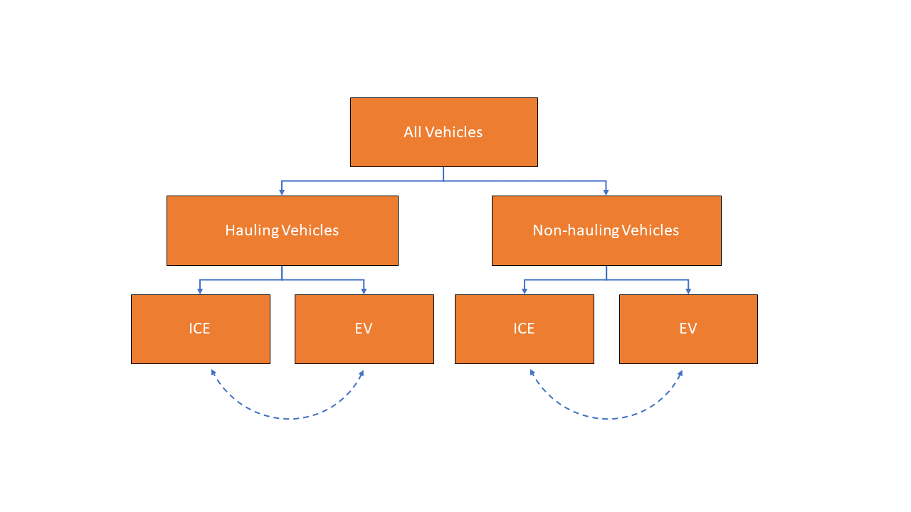

.. image:: _static/epa_logo_1.jpg

Model Architecture and Algorithms
=================================

Overall Simulation Process
^^^^^^^^^^^^^^^^^^^^^^^^^^

Process Flow Summary
--------------------
x

Simulation Scope and Units of Analysis
--------------------------------------
x

Model Inputs
------------
.. todo: [section should just focus on what type of information is provided by the input files, and not about where the data comes from]

As described in the overview, OMEGA model inputs are grouped into two categories: 1) assumptions about the structure and the stringency of the policies being evaluated within the model (these are the policy alternatives) and 2) external assumptions that apply to all policies under analysis (collectively referred to as the analysis context). The policy alternatives define the policy being evaluated in each OMEGA run and are described in the Policy Module section. The analysis context inputs (which include more traditional inputs like fuel prices, technology assumptions, etc) are discussed within the descriptions of the associated modules that use them.

The lists of policy alternatives and analysis context inputs are provided below. Each input is described in more detail in each of the module descriptions listed later in this section.

Policy Alternatives Inputs:
	* Emissions targets
	* Rules on banking/trading of credits
	* Technology multipliers
	* Reg class definitions
	* VMT assumption

Analysis Context Inputs:
	* Vehicle costs
	* Vehicle prices
	* Vehicle energy consumption
	* Off-cycle credit tech values
	* Starting credit balances
	* Fuel Costs (gas and electricity)
	* Vehicle Fleet
	* Vehicle VMT distribution

Projections and the Analysis Context
------------------------------------
x

.. todo: [[add footnote about terminology, that in the implementation, these are called packages]]

Policy Module
^^^^^^^^^^^^^
OMEGA's primary function is to help evaluate and compare policy alternatives which may vary in terms of regulatory program structure and stringency. Because we cannot anticipate all possible policy elements in advance, the code within the Policy Module is generic, to the greatest extent possible. This leaves most of the policy definition to be defined by the user as inputs to the model. Where regulatory program elements cannot be easily provided as inputs, for example the equations used to calculate GHG target values, the code has been organized as user-definable submodules. Much like the definitions recorded in the Code of Federal Regulations (CFR), the combination of inputs and user-definable submodules must unambiguously describe the methodologies for determining vehicle-level emissions targets and certification values, as well as the accounting rules for determining how individual vehicles contribute to a manufacturer's overall compliance determination.

In this documentation, *policy alternatives* refer only to what is being evaluated in a particular model run. There will also be relevant inputs and assumptions which are technically policies but are assumed to be fixed (i.e. exogenous) for a given comparison of alternatives. Such assumptions are defined by the user in the *analysis context*, and may reflect a combination of local, state, and federal programs that influence the transportation sector through regulatory and market-based mechanisms. .. todo: [[add examples, and links]] A comparison of policy alternatives requires the user to specify a no-action, or baseline policy, and one or more action alternatives.

Policy alternatives that can be defined within OMEGA fall into two categories: those that involve fleet average emissions standards and rules for the accounting of compliance credits, and those that specify a required share of a specific technology. OMEGA can model either category as an independent alternative, or model both categories together; for example, in the case of a policy which requires a minimum share of a technology while still satisfying fleet averaging requirements.

**Policy Alternatives Involving Fleet Average Emissions Standards:**
In this type of policy, the key principal is that the compliance status of a manufacturer is a result of the combined performance of all of the vehicles, and not the result of every vehicle achieving compliance individually. Fleet averaging in the Policy Module is based on CO2 *credits* as the fungible accounting currency. Each vehicle has an emissions target and an achieved certification emissions value. The difference between the target and certification emissions in absolute terms (Mg CO2) is referred to as a *credit*, and might be a positive or negative value that can be transferred across years, depending on the credit accounting rules defined in the policy alternative. The user-defined policy inputs can be used to specify restrictions on credit averaging and banking, including limits on credit lifetime or the ability to carry a negative balance into the future. The analogy of a financial bank is useful here, and OMEGA has adopted data structures and names that mirror the familiar bank account balance and transaction logs.
.. todo: [[insert example transaction and balance tables]]

OMEGA is designed so that within an analysis year, credits from all the producer’s vehicles are counted without limitations towards the producer's credit bank. This program feature is known as *fleet averaging*, where vehicles with positive credits may contribute to offset other vehicles with negative credits. The OMEGA model calculates overall credits earned in an analysis year as the difference between the aggregate certification emissions minus the aggregate target emissions. An alternative approach of calculating overall credits as the sum of individual vehicle credits might seem more straightforward, and while technically possible, it is not used for several reasons. First, some credits, such as those generated by advanced technology incentive multipliers, are not easily accounted for on a per-vehicle basis. The transfer of credits between producers can be simulated in OMEGA by representing multiple regulated entities as a single producer, under an assumption that there is no cost or limitation to the transfer of compliance credits among entities. OMEGA is not designed to explicitly model any strategic considerations involved with the transfer of credits between producers. Emissions standards are defined in OMEGA using a range of policy elements, including:

* rules for the accounting of upstream emissions
* definition of compliance incentives, like multipliers
* definition of regulatory classes
* definition of attribute-based target function
* definition of the vehicles’ assumed lifetime miles

**Policy Alternatives Requiring Specific Technologies:**
This type of policy requires all, or a portion, of producer’s vehicles to have particular technologies. OMEGA treats these policy requirements as constraints on the producer’s design options. This type of policy alternative input can be defined either separately, or together with a fleet averaging emissions standard; for example, a minimum Zero Emission Vehicle (ZEV) share requirement could be combined with an emissions standard where the certification emissions associated with ZEVs are counted towards the producer’s achieved compliance value.

**Policy Representation in the Analysis Context:**
Some policies are not modeled in OMEGA as policy alternatives, either because the policy is not aimed directly at the producer as a regulated entity, or because the particular OMEGA analysis is not attempting to evaluate the impact of that policy relative to other alternatives. Still, it is important that the Analysis Context inputs are able to reflect any policies that might significantly influence the producer or consumer decisions. Some examples include:

* Fuel tax policy
* State and local ZEV policies
* Vehicle purchase incentives
* Investment in refueling and charging infrastructure
* Accelerated vehicle retirement incentives

Producer Module
^^^^^^^^^^^^^^^
Producer Module Overview
------------------------
The modeling of producer decisions is a core function of OMEGA, and is based on minimizing the producers' generalized costs, subject to the constraints of regulatory compliance and consumer demand. The ‘producer’ defined in OMEGA encompasses both the broader meaning as a supplier of a transportation good or service to the market, and in the narrower sense as the regulated entity subject to EPA policies.

The Producer Module uses exogenous inputs from the analysis context (including xyz) to meet the compliance targets defined in the Policy Module. Its outputs of xyz must ultimately reconcile with the outputs from the Consumer Module through a series of iterations, as described in the Consumer Module section.

**Inputs to the Producer Module**
Policy Alternative inputs are used to calculate a compliance target for the producer, in Mg CO2 for a given analysis year, using the provided attribute-based standards curve, vehicle regulatory class definitions, and assumed VMT for compliance. Other policy inputs may define, for example, the credit lifetime for carry-forward and carry-back, or a floor on the minimum share of ZEV vehicles produced.

Analysis Context inputs and assumptions that the Producer Module uses define all factors, apart from the policies under evaluation, that influence the modeled producer decisions. Key factors include the vehicle costs and emissions for the technologies and vehicle attributes considered, and the producer constraints on pricing strategy and cross-subsidization.

**Outputs of the Producer Module**
x

Vehicle Definitions
-------------------
The core unit impacted by decisions in the producer module is at the vehicle level.  Each OMEGA “vehicle” is defined in the analysis context and represents a set of distinct attributes.  In the demo, for example, the attributes associated with each vehicle definition are included in the vehicles.csv file.  The figure below shows a subset of attributes that characterize each vehicle in the demo.

.. figure:: _static/mo_figures/vehicles.csv.png
    :align: center

As shown in the figure, vehicles may be defined in part by manufacturer ID, model year, reg class, electrification class, cost curve class, fuel ID, sales, footprint, rated horsepower, road load hp, test weight, MSRP and towing capacity.  A full list of fields used in the demo version can be found by referring to the vehicles.csv file.

Vehicle Simulation and Cost Inputs
------------------------------------------
One of the most important sets of inputs to the Producer Module is the simulated vehicles file.  It contains the vehicles parameters used by OMEGA to generate all possible vehicle technology (and cost) options available to the producers – these are referred to as the “Vehicle Clouds”.  The use of these vehicle clouds by OMEGA is described in 3.3.4.

The simulated vehicle file contains the various vehicles of different core attributes (such as vehicle size, weight, powertrain, etc), the CO2-reducing technologies that are applied to each, and their predicted energy consumption, CO2 performance, and cost.  While not required by all users, EPA uses its own simulation tool (ALPHA) to predict the energy consumption and CO2 emissions for each vehicle and technology combination.  For the demo, these vehicle and technology options (and associated CO2 performance) are consolidated into the simulated_vehicles.csv file.
The simulated vehicles csv file contains the following fields for use in the producer module:

* the associated **cost curve class** (defined by powertrain family and described below)
* vehicle properties such as curb weight, type of base powertrain (ICE/HEV/PHEV/BEV, etc)
* other included technologies (e.g., A/C credits, high efficiency alternator, etc)
* test cycle performance (energy consumption (for plug-in vehicles) and/or CO2 emissions)
* vehicle attributes, such as included technologies, costs

**Significance of the cost curve class:**
Each cost curve class includes multiple vehicles and represents the design space for all vehicle options in each class.  In the demo, EPA grouped multiple vehicles within a single cost curve class to reduce the number of simulations required to represent the design space and to make the producer decision (manageable).
OMEGA producer decisions are made based on discrete vehicle options within each vehicle cost curve class.  These decisions are then applied to every vehicle within that cost curve class.
For possible future consideration, EPA recommends the generation of RSEs (response surface equations) to derive particular costs cloud unique to each vehicle.  This would allow for more unique cost and vehicle clouds without excessive simulation calculation burden.

Vehicle Clouds, Frontiers, and Aggregation
------------------------------------------
Description of the process in applying vehicle clouds:

* Use of vehicle clouds in establishing frontiers
* Interpolation method for identifying best producer options
* Search of discrete points

Producer Compliance Strategy
----------------------------
OMEGA incorporates the assumption that producers make strategic decisions, looking beyond the immediate present to minimize generalized costs over a longer time horizon. The efficient management of compliance credits from year-to-year, in particular, involves a degree of look-ahead, both in terms of expected changes in regulatory stringency and other policies, and expected changes in generalized costs over time.

The producer’s generalized cost is made up of both the monetary expenses of bringing a product to the consumer, and also the value that the producer expects can be recovered from consumers at the time of purchase. The assumption in OMEGA that producers will attempt to minimize their generalized costs is consistent with a producer goal of profit maximization, subject to any modeling constraints defined in the Consumer Module, such as limiting changes in sales volumes, sales mixes, or select vehicle attributes.

Consumer Module
^^^^^^^^^^^^^^^
Consumer Module Overview
------------------------
The Consumer Module’s purpose is to estimate how light duty vehicle ownership and use respond to key vehicle characteristics within a given Analysis Context. The Consumer Module estimates total new sales volumes, the EV share of new vehicle demand, used vehicle market responses (including reregistration), and the use of both new and used vehicles in the market measured using vehicle miles traveled (VMT). An important addition with the Consumer Module, on top of generally incorporating consumer response affects to total new vehicle sales, is that it allows different endogenous consumer responses to Electric vehicles (EVs) and conventional internal combustion engine vehicles (ICEs).

The Consumer Module works in two phases. During the first phase, the Consumer Module and Producer Modules iterate to achieve convergence on the estimates of new vehicles produced and demanded. Vehicle costs and attributes are passed from the Producer Module to teh Consumer Module, while the resulting estimates of the supply of new vehicles demanded, and the EV share of those new vehicles demanded is passed back to the the Producer Module. Once agreement between the Producer and Consumer Module, convergence, is achieved, the Consumer Module enters the second phase. In this phase, total vehicle stock (new and used vehicles and their attributes) and use (VMT) are estimated.

**Inputs to the Consumer Module**
The Consumer Module uses exogenous inputs from the Analysis Context, and endogenous inputs from the Producer Module. Exogenous inputs include fuel prices, on-road stock assumptions, and demographics, among others. Endogenous inputs include vehicle prices, average vehicle cost, and vehicle attributes, such as fuel consumption rate. The choice of vehicle attributes used in the Consumer Module is led by the method used to estimate the shares of vehicles demanded. The Consumer Module can handle other vehicle characteristics fed in from the Producer Module (PM), such as vehicle class, or EV range if those are needed in new sales or vehicle shares estimates.

**Outputs of the Consumer Module**
The Consumer Module produces two categories of outputs, interim outputs during the first phase, and final outputs during the second phase. Interim outputs of the Consumer Module, including new vehicle sales and responsive market shares (explained in the following section), are fed back to the Producer Module for iteration and convergence. Once that convergence is achieved, the Consumer Module estimates the final outputs including new vehicle sales broken down by market class, the total stock, and VMT, which are sent to the Effects Module.

Market Class Definitions
------------------------
The Consumer Module estimates new vehicle shares at an aggregate level, with vehicles separated into high level market classes. These market classes are the fundamental unit of analysis within the Consumer Module. The choice of market classes is tied to the model used to estimate the shares of new vehicles sold, and is dependant on the attributes available in the input data files. For example, vehicles can be identified by their fuel type (electric, gas, diesel, etc.), by their expected use (primarily for goods or passenger transport), or by their geographic description (urban vs. rural).
Users can define market classes; in doing so, the user must ensure that all other inputs and user-defined submodules (for example, with respect to stock and use estimation) within the Consumer Module are defined consistently. The designation of market classes can be used to account for expected market heterogeneity in terms of purchasing behavior or vehicle use based on specific vehicle attributes. In addition, the user can categorize market classes as 'responsive', where the the share of total vehicles attributed to those market classes changes in response to user defined endogenous inputs (like relative costs), or 'nonresponsive', where the share of total vehicles attributed to that market class does not change with the policy being analyzed.

Within the demo analysis, vehicles are separated into four market classes depending on whether they are categorized as hauling (primarily meant for transporting goods or towing, as a body-on-frame vehicle would be expected to do) or non-hauling (primarily meant for passenger transportation, as a unibody vehicle might do), and their fuel type (EV or ICE). The hauling/non-hauling market class is defined as non-responsive. The share of vehicles defined as hauling or non-hauling, regardless of the fuel type, depends on analysis context inputs, and is unaffected by model results. The EV/ICE market class is defined as responsive, and the share of vehicles in that market class is estimated within the Consumer Module.

Before the Consumer Module can estimate sales and or shares response, all vehicles must be categorized into their market classes. For ease of explanation, the process can be thought of as creating branches of a tree. Using the demo analysis market classes, where hauling/nonhauling is categorized as nonresponsive, vehicles are first separated into the appropriate hauling and nonhauling class. The Consumer Module then uses interim inputs from the Producer Module to determine the share of vehicles in the responsive category, EV/ICE. These steps are identified by the solid lines in the figure below. During Phase 1, if the share of EVs that consumers will accept under the given vehicle attributes, including the relative price of ICE and EV, does not converge with the share that Producer Module estimates, the iterative process continues. Given different interim inputs, for example where the relative price of ICE and EVs change during iteration, the Consumer Module will redistribute vehicles into the EV and ICE classes. However, the relative share of hauling and nonhauling vehicles will not change. This is represented by the dashed lines between each set of EV/ICE class. Note that the dashed lines travel within the hauling and non-hauling classes, but do not travel across them.

:numref:`mo_label_mktree` Illustration of the Market Class Structure in the Demo Analysis.

.. _mo_label_mktree:

.. todo: [[make text size in figure larger]]

Phase 1: New Vehicle Sales
--------------------------
The Consumer Module estimates both total new vehicle sales, as well as the demanded market shares of those new vehicles. Within that share estimation, the ability to model both EV and ICE vehicle demand and supply separately is a major part.

**Sales Volumes**

The Consumer Module estimates the total new vehicles sold at the aggregated market class level. The vehicles the Producer Module estimates will be produced with their relevant attributes, including prices, are sent to the Consumer Module. As vehicles are aggregated into the appropriate market classes as identified by the user, the Consumer Module determines how many of vehicles in each category are demanded, given the Analysis Context assumptions.
*   The full cost pass through assumption - is this what we assume? Can users change this assumption?
*  Role of fuel consumption in the vehicle purchase decision - this reduced cost to the consumer, right? But it depends on how many months/years of fuel savings consumers consider in their purchase decision. This is something users can determine, right?

**Sales Shares**

Though users can identify market classes within the Consumer Module, one of the significant updates to OMEGA is the ability to specifically model EV shares as responsive to the policy being analyzed. The method used to estimate EV shares is based on a logit curve, commonly used to estimate technology adoption over time. The logit curve estimation is contained within a user defined submodule, which enables users to tailor assumptions in a way that is consistent with other affected submodules within the Consumer Module. The relevant vehicle attributes, as defined in the user defined submodule, and prices from the Producer Module are input into the logit equation.

The logit curve estimates the share of the technology demanded by consumer, accounting for how quickly (or slowly) new technology is phased into public acceptance, as well as how responsive consumers are to prices. These are factors the user can identify within the user defined submodule. The logit equation is:

.. Math::
    :label: logit_curve

    s_{i}=\frac{\alpha_{i} * p_{i}^{\gamma}} {\Sigma_{j=1}^{N} \alpha_{j} * p_{j}^{\gamma}}

Where:
s_{i} is the share of vehicles in market class *i*

\alpha_{i} is the share weight of market class *i*. This determines how quickly new technology is phased in to consumer acceptance. It is calibrated to observed historical data.

p_{i} is the generalized cost of each vehicle in market class *i*

\gamma represents how sensitive the model is to price

The share weight and price sensitivity parameters in the demo analysis are informed by the inputs and assumptions to the passenger transportation section of GCAM-USA.

Phase 2: Vehicle Stock and Use
------------------------------
After convergence with the Producer Module with respect to the sales of new vehicles is achieved, the Consumer Module estimates total vehicle stock adn use, keeping internal consistency between the number of vehicles demanded adn the use of those vehicles. Vehicle stock is the total on-road registered fleet, including both new vehicles sales, and the reregistered (used) vehicles. A simple way to determine stock is to estimate the reregistered fleet of vehicles from the total used fleet, and add in the new vehicles sold, as determined in the iteration between the Producer Module and Consumer Module. The method of determining the reregistered fleet is in a user defined submodule. In the demo analysis, this is estimated using fixed reregistration schedules based on vehicle age. If a user updates the reregistration submodule, they need to retain consistency between the submodules estimating new vehicle sales.

The method of estimating total VMT for the stock of vehicles is also in a user defined submodule. In the demo analysis, total VMT demanded is an input from the Analysis Context, and is held constant (not including rebound driving) across Policy Alternatives in order to maintain an overall lodical relationship between demand for mobility and available vehicles. This total VMT is allocated across the stock of vehicles using a fixed relationship between the proportion of VMT at each age and market class.

Rebound driving is estimated as the additional VMT consumers might drive as a function of reduced cost of driving. This value is a user defined value. The demo analysis has set rebound driving to 10%.

Iteration and Convergence
^^^^^^^^^^^^^^^^^^^^^^^^^
Algorithm descriptions, code snippets, equations, etc

Effects Module
^^^^^^^^^^^^^^
In its primary function as a regulatory support tool, OMEGA’s modeled outputs are intended to inform the type of benefit-cost analyses used in EPA rulemakings. We would likely use many of OMEGA’s outputs directly in the analysis for a regulatory action. In other cases, OMEGA produces values that might help inform other models like MOVES. The scope of OMEGA’s effects modeling includes estimating both monetized effects and physical effects.

* Key examples of monetized effects that OMEGA will estimate:
	* Vehicle production costs
	* Vehicle ownership and operation costs, including fuel and maintenance and other consumer impacts
	* Consumer Benefits Measures: Previous estimates of effects on consumers were based on holding sales constant and the benefits were estimated as fuel savings minus tech costs. We know sales change (and we are allowing for that). We are working on a way to estimate not only the benefits consumers are considering in their purchase of a new vehicle, but also the ‘surprise’ or ‘bonus’ savings associated with the vehicle that are not considered.
	* Impacts of criteria air pollutants
	* Impacts of greenhouse gas pollutants
	* Congestion, noise, and safety costs
* Key examples of physical effects that OMEGA will estimate:
	* Stock of registered vehicles, along with key attributes
	* VMT of registered vehicles
	* Tailpipe GHG and criteria pollutant emissions
	* Upstream (refinery, power sector) GHG and criteria pollutant emissions

The Effects Module generates 3 output files: physical effects, cost effects and technology volumes. In general, the cost effects output file builds upon the physical effects output
file in conjunction with several of the context input files. Those context input files are the cost factor and emission factor input files. For example, the cost effects file would
present CO2-related costs as the CO2 cost factor (a cost/ton value set in the input file) multiplied by the tons of CO2 as presented in the physical effects file. Similarly, fuel costs
would be calculated as fuel price (dollars/gallon as provided in the input file) multiplied by gallons consumed as presented in the physical effects file.

Each of these physical and cost effects are calculated on an absolute basis. In other words, an inventory of CO2 tons multiplied by "costs" of CO2 per ton provides the "cost" of CO2 emissions. However, the calculation of criteria and GHG emission impacts is done using the $/ton estimates included in the cost_factors-criteria.csv and cost_factors-scc.csv input files. The $/ton estimates provided in those files are best understood to be the marginal costs associated with the reduction of the individual pollutants as opposed to the absolute costs associated with a ton of each pollutant. As such, the criteria and climate "costs" calculated by the model should not be seen as true costs associated with pollution, but rather the first step in estimating the benefits associated with reductions of those pollutants. For that reason, the user must be careful not to consider those as absolute costs, but once compared to the "costs" of another scenario (presumably via calculation of a difference in "costs" between two scenarios) the result can be interpreted as a benefit.

There are certain other parameters included in the cost effects file that must be handled differently than discussed above. For example, drive surplus is the economic value of the increased owner/operator surplus provided by added driving and is estimated as one half of the product of the decline in vehicle operating costs per vehicle-mile and the resulting increase in the annual number of miles driven via the rebound effect. Since the drive surplus is calculated using a change in operating costs, the new operating costs must be compared to another operating cost. Since OMEGA operates on a single scenario, the "other" operating cost does not exist. Drive surplus, safety effects and net benefits are not currently included in OMEGA.

Importantly, the cost factor inputs (as OMEGA calls them) have been generated using several discount rates. The values calculated using each of the different discount rates should not be added to one another. In other words, PM costs calculated using a 3 percent discount rate and a 7 percent discount rate should never be added together. Similarly, climate costs
calculated using a 3 percent discount rate and a 2.5 percent discount rate should never be added. This does not necessarily hold true when adding criteria air polluatnt costs and climate costs when it is acceptable to add costs using different discount rates. Lastly, when discounting future values, the same discount rate must be used as was used in generating the cost factors.

The tech volumes output file provides volume of each vehicle equipped with the technologies for which tech flags or tech data is present in the simulated_vehicles.csv input file. For example, if vehicle number 1 had 100 sales and half were HEVs while the other half were BEVs, the tech volumes output file would show that vehicle as having the following tech volumes: HEV=50; BEV=50. This is not the case for the weight-related technologies where curb weight is presented as the curb weight of the vehicle, weight reduction is presented as the weight reduction that has been applied to the vehicle to achieve that curb weight, and fleet pounds is the registered count of the vehicle multiplied by its curb weight.

Each of the above files presents vehicle-level data for each analysis year that has been run and for each age of vehicle present in that calendar year. The model year of each vehicle is also provided.
