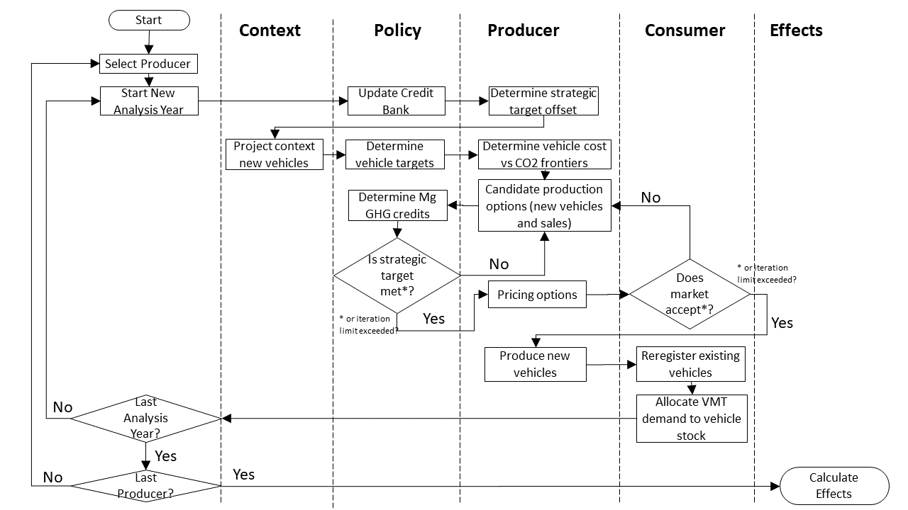
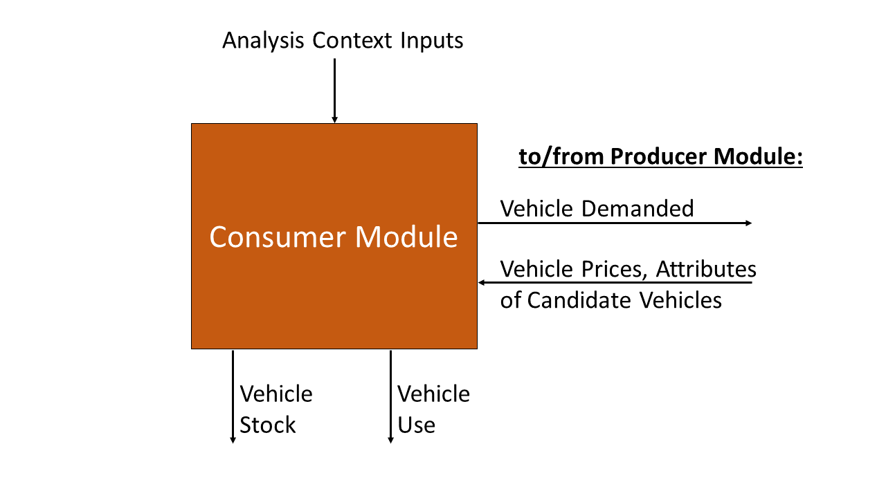
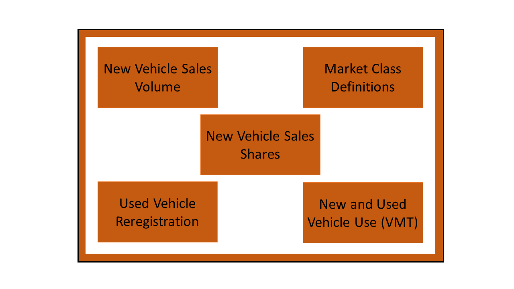

.. image:: _static/epa_logo_1.jpg

Model Architecture and Algorithms
=================================
OMEGA is structured around four main modules which represent the distinct and interrelated actors and system elements that are most important for modeling how policy influences the environmental and other effects of the light duty sector. This chapter begins with a description of the simulation process, including the overall flow of an OMEGA run, and fundamental data structures and model inputs. That's followed by descriptions of the algorithms and internal logic of the `Policy Module`_, `Producer Module`_, and `Consumer Module`_, and then by a section on the approach for iteration and convergence between these three modules. Finally, the accounting method is described for the physical and monetary effects in the `Effects Module`_.

Throughout this chapter, references to a demo analysis are included to provide additional specificity to the explanations in the main text. These examples, highlighted in shaded boxes, are also included with the model code. Please refer to the Developer Guide for more information on how to view and rerun the demo analysis.

Overall Simulation Process
^^^^^^^^^^^^^^^^^^^^^^^^^^

Simulation Scope and Resolution
--------------------------------------
The model boundary of OMEGA as illustrated in :numref:`al_label_modelboundary` defines the system elements which are modeled internally, and the elements which are specified as user inputs and assumptions. The timeframe of a given analysis spans the years between analysis start and end years defined by the user. Together, the boundary and analysis timeframe define the scope of an analysis.

.. _al_label_modelboundary:

.. figure:: _static/al_figures/model_boundary.png
    :align: center

    OMEGA model boundary

.. admonition:: Demo example: Analysis timeframe

    For the demo analysis, the base year is defined as calendar year 2019. The year immediately following the base year is automatically used as the analysis start year. The analysis final year in this example is set to 2050 in the ‘demo_batch.csv’ input file. Therefore, the analysis timeframe is a 31-year span, inclusive of 2020 and 2050. The selection of 2019 as the base year is automatically derived from the last year of historical data contained in the ‘vehicles.csv’ and ‘ghg_credits.csv’ input files. These inputs describe the key attributes and counts for registered vehicles, and producers’ banked Mg CO2e credits as they actually existed. Note that for this example, base year vehicle inputs are limited to MY2019 new vehicles and their attributes. For an analysis which is intended to project the impacts of various policy alternatives on the reregistration and use of earlier model years, the base year inputs would describe the entire stock of registered vehicles, including MY2018, MY2017, etc.

.. sidebar:: Analysis start year and the base year

   The analysis start year is the first year in which modeling is performed, and is one year after a *base year* representing actual observations of key elements of the light duty sector, such as descriptions of the vehicle stock and new vehicle attributes. Due to the timing of when this base year input data becomes available (typically, 2 or more years after vehicle production and registration data is available), it is often necessary for the first analysis year to be earlier than the actual year in which the analysis is conducted.

Typically, the analysis start year will already be in the past at the time the analysis is conducted. Having the most up-to-date base year data can reduce the number of historical years that need to be modeled, although as noted in the sidebar, there are usually limits to data availability. Some overlap between the modeled and historical years is not necessarily a bad thing, since it gives the user an opportunity to validate key model outputs against actual data and adjust modeling assumptions if needed.

Model inputs for the policy alternatives and analysis context projections must be available for every year throughout the analysis timeframe. Many of the input files for OMEGA, utilize a ‘start_year’ field, which allows the user to skip years with repetitive inputs if desired. In general, OMEGA will carry over input assumptions from the most recent prior value whenever the user has not specified a unique value for the given analysis year. Similarly, in cases where the user-provided input projections do not extend to the analysis end year, the value in the last specified year is assumed to hold constant in subsequent years. For example, in the demo analysis, 2045 is the last year for which input values are specified in ‘cost_factors-criteria.csv’, so OMEGA will apply the same 2045 values for 2046 through 2050.

An OMEGA analysis can be conducted at various levels of resolution depending on the user’s choice of inputs and run settings. The key modeling elements where resolution is an important consideration include vehicles, technologies, market classes, producers, and consumers.

.. sidebar:: Vehicles and Candidate Vehicles

    A modeled ‘vehicle’ in OMEGA is one that has been produced and registered for use in the analysis timeframe. This simulated vehicle production is the outcome of the model’s consideration of a large number of ‘candidate vehicle’ choices. Many of these candidates are not chosen for production, but nevertheless must be considered along with their attributes.

**Vehicle resolution:** The definition of a ‘vehicle’ in an OMEGA analysis is an important user decision that determines one of the fundamental units of analysis around which the model operates. In reality, the vehicle stock is made up of hundreds of millions of vehicles, owned and operated by a similarly large number of individuals and companies. Theoretically, a user could define the vehicle resolution down to the individual options and features applied, or even VIN-level of detail. But given limitations in computational resources, the OMEGA user will more likely define vehicles at the class or nameplate level (e.g. ‘crossover utility vehicle’, or ‘AMC Gremlin’.)  Regardless of how vehicles are represented, OMEGA will retain the details of each vehicle throughout the model (including in the outputs) at the level of resolution that the user has chosen. For example, if a user defines vehicle inputs at the nameplate level, the outputs will report nameplate level vehicle counts, key attributes, emissions rates, and physical and cost effects.

**Technology package resolution:** In OMEGA, producer decisions are made using complete packages of technologies which are integral to, and inseparable from, the definition of a candidate vehicle. In other words, a change to any of the individual technology components would result in a different candidate vehicle. The 'simulated_vehicles.csv' file contains the information for each candidate vehicle that is needed for modeling producer decisions, including the costs and emissions rates that are associated with the technology package.

**Technology component resolution:** Even though the model operates using full technology packages (mentioned above), it may sometimes be helpful to track the application of particular sub-components of a package. The user can choose to add flags to the 'simulated_vehicles.csv' file to identify which types of components are present on the candidate vehicles. These flags are then used by the model to tabulate the penetration of components in the vehicle stock over time.

**Market class resolution:** The level of detail, and type of information used within the Producer and Consumer modules is different. For example, we assume that consumers are not aware of the compliance implications and detailed design choices made by the producer, unless those factors are evident in the price, availability, or key attributes of a vehicle. Therefore, consumer decisions regarding the demanded shares of vehicles are modeled based on vehicle characteristics aggregated at the market class level. The user's determination of the appropriate resolution for the market classes will depend on the chosen specification for share response modeling within the Consumer Module. Note that within the Consumer Module, even while share response is modeled at the market class level, other consumer decisions (like reregistration and use) can be based on more detailed vehicle-level information.

**Producer resolution:** The producers in OMEGA are the regulated entities subject to the policy alternatives being analyzed, and are responsible (together with the consumers and policy) for the decisions about the quantities and characteristics of the vehicles produced. The user can choose to model the producers either as an aggregate entity with the assumption that compliance credits are available in an unrestricted market (i.e. 'perfect trading'), or as individual entities with no trading between firms.

.. sidebar:: The Producer's view of consumers

    The producer, as an independent decision-making agent, will not have perfect information about the internal consumer decision process. Within the Producer module, OMEGA allows the user to define the consumer decisions from the producer's perspective, which may be the different (or the same) from the representation within the Consumer Module.

**Consumer resolution:** The approach to account for heterogeneity in consumers is an important consideration when modeling the interaction between producer decisions and the demand for vehicles. By taking advantage of user-definable submodules, a developer can set-up the Consumer Module to account for different responses between consumer segments.

Whatever the level of resolution, the detail provided in the inputs 1) must meet the requirements of the various modeling subtasks, and 2) will determine the level of detail of the outputs. When preparing analysis inputs, it is therefore necessary to consider the appropriate resolution for each module. For example:

* Within the Policy Module, vehicle details are needed to calculate the target and achieved compliance emissions. This might include information about regulatory classification and any vehicle attributes that are used to define a GHG standard.

* Within the Producer Module, the modeling of producer decisions requires sufficient detail to choose between compliance options based the GHG credits and generalized producer cost associated with each option.

* Within the Consumer Module, the modeling of consumer decisions requires sufficient detail to distinguish between market classes for representing both the purchase choices among different classes, and the reregistration and use of vehicles within a given class.

.. admonition:: Demo example: Modeling resolution

    .. csv-table::
        :widths: auto
        :header-rows: 1

        Modeling element,Where is the resolution defined?,Description of resolution in the demo
        Vehicle resolution,vehicles.csv,51 2019 base year vehicles differentiated by context size class ('Small Crossover' 'Large Pickup' etc) manufacturer_id and electrification_class ('N' 'HEV' 'EV')
        Technology package resolution:,simulated_vehicles.csv,578088 candidate vehicles for the analysis timeframe 2020 through 2050 with technology packages for ICE and BEV powertrains
        Technology component resolution:,simulated_vehicles.csv,detailed flags for identifying technology package contents of ac_leakage ac_efficiency high_eff_alternator start_stop hev phev bev weight_reduction  deac_pd deac_fc cegr atk2 gdi turb12 turb11
        Market class resolution,consumer.market_classes.py user-definable submodule and market_classes.csv,4 classes in 2 nested levels with BEV and ICE categories within first tier hauling and nonhauling categories
        Consumer resolution,consumer.sales_share_gcam.py user-definable submodule,consumer heterogeneity is inherent in share weights used to estimate market class shares
        Producer resolution,demo_batch.csv and manufacturers.csv,2 producers ('OEM_A' and 'OEM_B') and 'Consolidate Manufacturers' run setting set to FALSE

Process Flow Summary
--------------------
x

.. _al_label_overallprocessflow:

    OMEGA process flow

Model Inputs
------------
.. todo: [section should just focus on what type of information is provided by the input files, and not about where the data comes from]

As described in the overview, OMEGA model inputs are grouped into two categories: 1) assumptions about the structure and the stringency of the policies being evaluated within the model (these are the policy alternatives) and 2) external assumptions that apply to all policies under analysis (collectively referred to as the analysis context). The policy alternatives define the policy being evaluated in each OMEGA run and are described in the Policy Module section. The analysis context inputs (which include more traditional inputs like fuel prices, technology assumptions, etc) are discussed within the descriptions of the associated modules that use them.

The lists of policy alternatives and analysis context inputs are provided below. Each input is described in more detail in each of the module descriptions listed later in this section.

Policy Alternatives Inputs:
	* Emissions targets
	* Rules on banking/trading of credits
	* Technology multipliers (if applicable)
	* Reg class definitions
	* VMT assumption

Analysis Context Inputs:
	* Vehicle costs
	* Vehicle prices
	* Vehicle energy consumption
    * Fuel emissions factors
	* Off-cycle credit tech values (if applicable).  This file also includes A/C credits, despite the title.
	* Starting credit balances
	* Fuel Costs (gas and electricity)
	* Vehicle fleet.  The characterization of the base year vehicle fleet, which includes the list of all vehicles and sales volumes represented in the base year.  “Vehicles” are further defined in 3.3.2.
	* Vehicle VMT distribution
    * Simulated vehicles.  The list of simulated vehicle and powertrain technology combinations, and associated attributes (weight, applied technology, CO2 emissions, fuel consumption, etc.) available to the manufacturer within the producer module.

Projections and the Analysis Context
------------------------------------
x

.. todo: [[add footnote about terminology, that in the implementation, these are called packages]]

.. _Policy Module:

Policy Module
^^^^^^^^^^^^^
OMEGA's primary function is to help evaluate and compare policy alternatives which may vary in terms of regulatory program structure and stringency. Because we cannot anticipate all possible policy elements in advance, the code within the Policy Module is generic, to the greatest extent possible. This leaves most of the policy definition to be defined by the user as inputs to the model. Where regulatory program elements cannot be easily provided as inputs, for example the equations used to calculate GHG target values, the code has been organized as user-definable submodules. Much like the definitions recorded in the Code of Federal Regulations (CFR), the combination of inputs and user-definable submodules must unambiguously describe the methodologies for determining vehicle-level emissions targets and certification values, as well as the accounting rules for determining how individual vehicles contribute to a manufacturer's overall compliance determination.

:numref:`al_label_plcym_ov` shows the flow of inputs and outputs for the Policy Module. As shown in this simple representation, the policy targets and achieved certification values are output from the module, as a function of the attributes of candidate vehicle presented by the Producer Module.

.. _al_label_plcym_ov:
.. figure:: _static/al_figures/policymod_ov.png
    :align: center

    Overview of the Policy Module

In this documentation, *policy alternatives* refer only to what is being evaluated in a particular model run. There will also be relevant inputs and assumptions which are technically policies but are assumed to be fixed (i.e. exogenous) for a given comparison of alternatives. Such assumptions are defined by the user in the *analysis context*, and may reflect a combination of local, state, and federal programs that influence the transportation sector through regulatory and market-based mechanisms. .. todo: [[add examples, and links]] A comparison of policy alternatives requires the user to specify a no-action, or baseline policy, and one or more action alternatives.

Policy alternatives that can be defined within OMEGA fall into two categories: those that involve fleet average emissions standards and rules for the accounting of compliance credits, and those that specify a required share of a specific technology. OMEGA can model either category as an independent alternative, or model both categories together; for example, in the case of a policy which requires a minimum share of a technology while still satisfying fleet averaging requirements.

**Policy alternatives Involving fleet average emissions standards:**
In this type of policy, the key principal is that the compliance status of a manufacturer is a result of the combined performance of all of the vehicles, and not the result of every vehicle achieving compliance individually. Fleet averaging in the Policy Module is based on CO2 *credits* as the fungible accounting currency. Each vehicle has an emissions target and an achieved certification emissions value. The difference between the target and certification emissions in absolute terms (Mg CO2) is referred to as a *credit*, and might be a positive or negative value that can be transferred across years, depending on the credit accounting rules defined in the policy alternative. The user-defined policy inputs can be used to specify restrictions on credit averaging and banking, including limits on credit lifetime or the ability to carry a negative balance into the future. The analogy of a financial bank is useful here, and OMEGA has adopted data structures and names that mirror the familiar bank account balance and transaction logs.
.. todo: [[insert example transaction and balance tables]]

OMEGA is designed so that within an analysis year, credits from all the producer’s vehicles are counted without limitations towards the producer's credit bank. This program feature is known as *fleet averaging*, where vehicles with positive credits may contribute to offset other vehicles with negative credits. The OMEGA model calculates overall credits earned in an analysis year as the difference between the aggregate certification emissions minus the aggregate target emissions. An alternative approach of calculating overall credits as the sum of individual vehicle credits might seem more straightforward, and while technically possible, it is not used for several reasons. First, some credits, such as those generated by advanced technology incentive multipliers, are not easily accounted for on a per-vehicle basis. The transfer of credits between producers can be simulated in OMEGA by representing multiple regulated entities as a hypothetical 'consolidated' producer, under an assumption that there is no cost or limitation to the transfer of compliance credits among entities. OMEGA is not designed to explicitly model any strategic considerations involved with the transfer of credits between producers. Emissions standards are defined in OMEGA using a range of policy elements, including:

* rules for the accounting of upstream emissions
* definition of compliance incentives, like multipliers
* definition of regulatory classes
* definition of attribute-based target function
* definition of the vehicles’ assumed lifetime miles

.. admonition:: Demo example: Off-cycle credits

    [add example details]

.. admonition:: Demo example: Certification test procedure

    [add example details]

.. admonition:: Demo example: Form of GHG standards

    [add example details]

.. admonition:: Demo example: Production incentives

    [add example details]

.. admonition:: Demo example: Upstream emissions accounting

    [add example details]

**Policy alternatives requiring specific technologies:**
This type of policy requires all, or a portion, of a producer’s vehicles to have particular technologies. OMEGA treats these policy requirements as constraints on the producer’s design options. This type of policy alternative input can be defined either separately, or together with a fleet averaging emissions standard; for example, a minimum Zero Emission Vehicle (ZEV) share requirement could be combined with an emissions standard where the certification emissions associated with ZEVs are counted towards the producer’s achieved compliance value.

.. admonition:: Demo example: Required sales share

    [add example details]

**Policy representation in the analysis context:**
Some policies are not modeled in OMEGA as policy alternatives, either because the policy is not aimed directly at the producer as a regulated entity, or because the particular OMEGA analysis is not attempting to evaluate the impact of that policy relative to other alternatives. However, even when a policy is not reflected in any of the analyzed policy alternatives, it may still be appropriate to represent that policy in the Analysis Context inputs. This is especially true when that external policy (or policies) might significantly influence the producer or consumer decisions. Some examples include:

* Fuel tax policy
* State and local ZEV policies
* Vehicle purchase incentives
* Investment in refueling and charging infrastructure
* Accelerated vehicle retirement incentives

.. _Producer Module:

Producer Module
^^^^^^^^^^^^^^^
Producer Module Overview
------------------------
The modeling of producer decisions is central to the optimization problem that OMEGA has been developed to solve. In short, the objective is to minimize the producers' generalized costs subject to the constraints of regulatory compliance and consumer demand. The ‘producer’ is defined in OMEGA as a regulated entity that is subject to the policy alternatives being modeled, and responsible for making decisions about the attributes and pricing of new vehicles offered to consumers. A user might choose to model producers as an individual manufacturer of light duty vehicles, as a division of a single manufacturer, or as a collection of manufacturers. This choice will depend on the goals of the particular analysis, and what assumptions the user is making about the transfer of compliance credits within and between manufacturers.

:numref:`al_label_pm_ov` shows the flow of inputs and outputs for the Producer Module. Analysis context inputs are not influenced by the modeling within the Consumer, Producer, and Policy Modules, and are therefore considered as exogenous to OMEGA.

.. _al_label_pm_ov:
.. figure:: _static/al_figures/producermod_ov.png
    :align: center

    Overview of the Producer Module

**Inputs to the Producer Module**
Policy Alternative inputs are used to calculate a compliance target for the producer, in Mg CO2 for a given analysis year, using the provided attribute-based standards curve, vehicle regulatory class definitions, and assumed VMT for compliance. Other policy inputs may define, for example, the credit lifetime for carry-forward and carry-back, or a floor on the minimum share of ZEV vehicles produced.

Analysis context inputs and assumptions that the Producer Module uses define all factors, apart from the policies under evaluation, that influence the modeled producer decisions. Key factors include the vehicle costs and emissions for the technologies and vehicle attributes considered, and the producer constraints on pricing strategy and cross-subsidization.

**Outputs of the Producer Module**
x

Vehicle Definitions
-------------------
The core unit impacted by decisions in the Producer Module is at the vehicle level. Each OMEGA “vehicle” is defined in the analysis context and represents a set of distinct attributes. In the demo, for example, the attributes associated with each vehicle definition are included in the vehicles.csv file. The figure below shows a subset of attributes that characterize each vehicle in the demo.

.. _mo_label_vehicles:
.. figure:: _static/mo_figures/vehicles.csv.png
    :align: center

    Sample fields in vehicles.csv file

As shown in :numref:`mo_label_vehicles`, vehicles may be defined in part by manufacturer ID, model year, reg class, electrification class, cost curve class, fuel ID, sales, footprint, rated horsepower, road load hp, test weight, MSRP and towing capacity. A full list of fields used in the demo version can be found by referring to the vehicles.csv file.

Vehicle Simulation and Cost Inputs
------------------------------------------
One of the most important sets of inputs to the Producer Module is the simulated vehicles file. It contains the vehicles parameters used by OMEGA to generate all possible vehicle technology (and cost) options available to the producers – these are referred to as the “Vehicle Clouds”. The use of these vehicle clouds by OMEGA is described in 3.3.4.

The simulated vehicle file contains the various vehicles of different core attributes (such as vehicle size, weight, powertrain, etc), the CO2-reducing technologies that are applied to each, and their predicted energy consumption, CO2 performance, and cost. While not required by all users, EPA uses its own simulation tool (ALPHA) to predict the energy consumption and CO2 emissions for each vehicle and technology combination. For the demo, these vehicle and technology options (and associated CO2 performance) are consolidated into the simulated_vehicles.csv file.
The simulated vehicles csv file contains the following fields for use in the Producer Module:

* the associated **cost curve class** (defined by powertrain family and described below)
* vehicle properties such as curb weight, type of base powertrain (ICE/HEV/PHEV/BEV, etc)
* other included technologies (e.g., A/C credits, high efficiency alternator, etc)
* test cycle performance (energy consumption (for plug-in vehicles) and/or CO2 emissions)
* vehicle attributes, such as included technologies, costs

**Significance of the cost curve class:**
Each cost curve class includes multiple vehicles and represents the design space for all vehicle options in each class. In the demo, EPA grouped multiple vehicles within a single cost curve class to reduce the number of simulations required to represent the design space and to make the producer decision (manageable).
OMEGA producer decisions are made based on discrete vehicle options within each vehicle cost curve class. These decisions are then applied to every vehicle within that cost curve class.
For possible future consideration, EPA recommends the generation of RSEs (response surface equations) to derive particular costs cloud unique to each vehicle. This would allow for more unique cost and vehicle clouds without excessive simulation calculation burden.

Vehicle Clouds, Frontiers, and Aggregation
------------------------------------------
Description of the process in applying vehicle clouds:

* Use of vehicle clouds in establishing frontiers
* Interpolation method for identifying best producer options
* Search of discrete points

.. admonition:: Demo example: Vehicle clouds

    [add example details]

.. admonition:: Demo example: Finding the frontier

    [add example details]

.. admonition:: Demo example: Vehicle aggregation and disaggregation

    [add example details]

Producer Compliance Strategy
----------------------------
OMEGA incorporates the assumption that producers make strategic decisions, looking beyond the immediate present to minimize generalized costs over a longer time horizon. The efficient management of compliance credits from year-to-year, in particular, involves a degree of look-ahead, both in terms of expected changes in regulatory stringency and other policies, and expected changes in generalized costs over time.

The producer’s generalized cost is made up of both the monetary expenses of bringing a product to the consumer, and also the value that the producer expects can be recovered from consumers at the time of purchase. The assumption in OMEGA that producers will attempt to minimize their generalized costs is consistent with a producer goal of profit maximization, subject to any modeling constraints defined in the Consumer Module, such as limiting changes in sales volumes, sales mixes, or select vehicle attributes.

.. _Consumer Module:

Consumer Module
^^^^^^^^^^^^^^^
The Consumer Module is a significant addition to OMEGA. With the ongoing evolutions in the light-duty vehicle market, including major growth in technologies and services, the need for an endogenous consumer response is clear. The Consumer Module is structured to project how consumers of light-duty vehicles would respond to policy-driven changes in new vehicle prices, fuel operating costs, trip fees for ride hailing services, and other consumer-facing elements. The module is set up to allow the inputs to affect total new vehicle sales (both in number and proportion of sales attributes to different market classes), total vehicle stock (including how the used vehicle market responds), and total vehicle use (the VMT of the stock of vehicles).

An important consideration with the addition of the Consumer Module is ensuring consistency between the set of vehicles and their attributes that the Producer Module supplies and the set of vehicles adn their attributes that the Consumer Module demands. In order to estimate the set of new vehicles that provide this equilibrium, the Consumer and Producer modules iterate until convergence is achieved - where the set of vehicles, including their prices adn attributes, that satisfy producers is the same est of vehicles that satisfy consumers.

Consumer Module Overview
------------------------
As explained in the Overview chapter, and shown in :numref:`mo_label_compare`, OMEGA is structured in a modular format. This means that each primary module, the Policy Module, Producer Module, Consumer Module and Effects Module, can be changed without requiring code changes in other modules. This ensures users can update model assumptions and methods while preserving the consistency and functionality of OMEGA.

An overview of the Consumer Module can be seen in :numref:`al_label_cm_ov`. This overview shows the connections between the Consumer Module, the analysis context, and other OMEGA modules. The Consumer Module receives inputs from the analysis context and the Producer Module, and computes outputs used in iteration with the Producer Module and for use in the Effects Module.

.. _al_label_cm_ov:

    Overview of the Consumer Module

.. sidebar:: Reregistration

    Reregistration measures the vehicles that have been kept in the fleet for onroad use, or reregistered, each year; that is, it measures the used vehicle stock. Reregistration can be thought of as those vehicles that survive (the inverse of scrappage). Scrappage measures the vehicles that are taken out of use each year. The term is used throughout OMEGA for precision in describing the vehicle stock of interest in an analysis of policy effects, which is made up of registered and in-use vehicles, as opposed to vehicles which have not been physically scrapped.

The Consumer Module’s purpose is to estimate how light duty vehicle ownership and use respond to key vehicle characteristics within a given analysis context. There are five main user-definable elements estimated within the Consumer Module, as seen in :numref:`al_label_inside_cm`. These estimates are: market class definitions, new sales volumes, new vehicle sales shares by market class (where market classes depend on the requirements of the specific consumer decision approach used in the analysis), used vehicle market responses (including reregistration), and new and used vehicle use measured using vehicle miles traveled (VMT). Further explanations of each of these elements are described in the following sections.

.. _al_label_inside_cm:

    Inside the Consumer Module

.. sidebar:: Market shares of new vehicles

    Throughout this chapter, 'shares' refers to the portion of all new vehicle sales that are classified into each of the different user-defined vehicle market classes.

Each of these five elements represents a user-definable submodule within the Consumer Module code. The code within each submodule may be updated by a user, or the submodule may be replaced with an alternative submodule. When a user updates or replaces a submodule, they must ensure that the submodule retains consistency with the other submodules within the Consumer Module, as well as with the rest of OMEGA. For example, if the market class submodule is changed from the demo analysis version, the sales share submodule must be updated as well.

The Consumer Module works in two phases: first, an iterative new vehicle phase, followed by a non-iterative stock and use phase. During the first phase, the Consumer Module and Producer Module iterate to achieve convergence on the estimates of new vehicles produced and demanded that meet the standards set in the Policy Module. The Producer Module sends a set of candidate vehicles, including their prices and attributes, to the Consumer Module to consider. The Consumer Module uses that set of candidate vehicles to estimate total new vehicles demanded and the shares of those new vehicles in the specified market classes, which are passed back to the Producer Module. If the estimates do not converge, a new set of candidate vehicles is sent to teh Consumer Module for consideration. Once convergence between the Producer and Consumer Module is achieved, the set of candidate vehicles are no longer considered candidates for consideration, but are the estimated new vehicle fleet, and the Consumer Module enters the second phase. In this phase, total vehicle stock (new and used vehicles and their attributes) and use (VMT) are estimated.

**Inputs to the Consumer Module**
In general, the Consumer Module uses exogenous inputs from the analysis context, and endogenous inputs from the Producer Module. The exogenous inputs may include data such as fuel prices, existing vehicle stock, and specific modeling parameters such as those used in estimation of vehicle ownership and use decisions as a function of policies being analyzed. The analysis context must also contain the inputs required to define projections of vehicle ownership and use in the absence of any policy alternatives being analyzed. These projections might be provided directly as inputs to the Consumer Module, such as projections of vehicle ownership from the Annual Energy Outlook (AEO), or generated within the Consumer Module based on exogenous inputs, including future demographic or macroeconomic trends. Endogenous inputs are factors determined within the model and passed to the Consumer Module from the Producer Module. They may include vehicle prices and other relevant vehicle attributes, such as fuel consumption rate. Because the Consumer Module’s internal representation of consumer decisions can be defined by the user, the specific exogenous and endogenous inputs required will depend on the models, methods, and assumptions specified by the user. The vehicle attributes needed as inputs to the Consumer Module are determined by the methods used to estimate new vehicle sales, the market shares of vehicles demanded, used vehicle reregistration, and new and used vehicle use. For example, vehicle attributes used to define market classes must be included as inputs from the Producer Module. As an additional example, if the user defines vehicle sales responses to differ based on consumer income, the user must ensure that income is included in the analysis context inputs.

**Outputs of the Consumer Module**
The Consumer Module produces two categories of outputs: sales estimates during the iterative Phase 1, and stock and use estimates during the non-iterative Phase 2. During the iterative phase, outputs of the Consumer Module, including new vehicle sales and responsive market shares (explained in the following section), are fed back to the Producer Module for iteration and convergence. See section 3.4.3 for more information on what happens during Phase 1, and Section 3.5 for more detailed information on how OMEGA estimates iteration and convergence between the Producer and Consumer modules. Once that convergence is achieved, the Consumer Module estimates the outputs of the stock of vehicles, including both new and reregistered used vehicles, and VMT, which are used by the Effects Module.

Market Class Definitions
------------------------
During the iterative first phase, the Consumer Module considers vehicle prices and attributes at an aggregate level by grouping vehicles into market classes. For this phase, these market classes are the fundamental unit of analysis for which the Consumer Module estimates new vehicle sales and shares. The choice of market classes is tied to the specification used to estimate the shares of new vehicles sold, and is dependent on the attributes available in the input data files. For example, vehicles can be identified by attributes such as fuel type (electric, gas, diesel, etc.), expected use (primarily for goods or passenger transport), or size.

Users can define market classes; in doing so, the user must ensure that all other inputs and user-defined submodules (for example, with respect to stock and use estimation) within the Consumer Module are defined consistently. The designation of market classes can be used to reflect market heterogeneity in purchasing behavior or vehicle use based on specific vehicle attributes. In addition, the user can categorize market classes as 'responsive,' where the shares of total vehicles attributed to those market classes change in response to user-defined endogenous inputs (like relative costs), or 'nonresponsive,' where the shares of total vehicles attributed to those market classes do not change with the policy being analyzed.

Market classes can be defined using vehicle attributes and inputs from the analysis context. In defining market classes, the user must ensure they are defined consistently with the modeling in the sales share submodule. For example, if the sales share submodule is defined as estimating shares of vehicles in a set of fuel type categories, those fuel type categories must be defined within the market class submodule.

Before the Consumer Module can estimate sales and or shares responses, all vehicles must be categorized into their market classes. This categorization is defined as a series of nested market category levels. The user can define any number of market classes, or levels, as well as the hierarchy of the levels. In defining the hierarchy, it is important to note that OMEGA assumes that the sales share estimates within a parent category are independent of sales share estimates outside the parent category. This means that changing the available market classes outside the parent category will not change the sales share estimates within the parent category.

.. admonition:: Demo example: Market class structure

    :numref:`mo_label_mktree` below illustrates an example of a nested market class hierarchy using the demo analysis market classes as an example. Hauling/non-hauling market classes are the highest, parent, level. Vehicles are separated into the appropriate hauling and non-hauling class using the projection of hauling/non-hauling shares from analysis context inputs. Nested within the hauling and non-hauling categories, there are BEV/ICE market classes. The candidate vehicle inputs from the Producer Module, namely vehicle prices, are used to determine the share of vehicles in the BEV/ICE market classes, as described in the examples below. During the iterative first phase, if the share of BEVs that consumers will accept given the candidate vehicle attributes does not converge with the share that the Producer Module estimates, the iterative process continues. The demanded BEV share is passed back to the Producer Module, which will return a new set of candidate vehicles and their attributes, including prices. Given the updated candidate vehicle inputs, the Consumer Module will redistribute vehicles into the BEV and ICE classes, with the BEV/ICE share estimates in the hauling category being independent from those in the non-hauling category. This possible redistribution between market class categories is represented by the dashed lines between each set of BEV/ICE classes. Note that the dashed lines travel within the hauling class and within the non-hauling class, but do not travel across them.

        :numref:`mo_label_mktree` Illustration of the Market Class Structure in the Demo Analysis.

        .. _mo_label_mktree:
        .. figure:: _static/al_figures/market_class_tree.png
            :align: center

Additionally, the user can categorize market classes as ‘responsive,’ where the shares of total vehicles attributed to those market classes change in response to user-defined endogenous inputs (like relative costs), or ‘nonresponsive,’ where the shares of total vehicles attributed to those market classes do not change with the policy being analyzed.

Within a given analysis context, the shares of vehicles allocated to nonresponsive market class categories do not shift between those nonresponsive market categories, even under different policy alternatives or during iteration with the Producer Module. Shares of vehicles allocated to responsive market class categories may shift between the responsive market categories (for this example, between BEVs and ICE vehicles for a given market class).

.. admonition:: Demo example: Nonresponsive and responsive market classes

    Within the demo analysis, vehicles are separated into four market classes depending on whether they are categorized as hauling (primarily meant for transporting goods or towing, as a body-on-frame vehicle would be expected to do) or non-hauling (primarily meant for passenger transportation, as a unibody vehicle might do), and their fuel type (battery electric vehicle (BEV) or internal combustion engine vehicles (ICE)). The hauling/non-hauling market classes are defined as nonresponsive market class categories. The share of vehicles defined as hauling or non-hauling, regardless of the fuel type, depends on analysis context inputs, and is unaffected by model results. The BEV/ICE market classes are defined as responsive market class categories, The share of vehicles in that market class is estimated within the Consumer Module and is responsive to vehicle cost and fuel consumption rate of the set of candidate vehicles input from the Producer Module.

Phase 1: New Vehicle Sales
--------------------------
During the iterative first phase of the Consumer Module, the Producer Module and Consumer Module converge on an estimate of total new vehicle sales, as well as the market shares and attributes of those new vehicles at the market class level. The iteration process is described more fully in the `Iteration and Convergence`_ section. It begins with the Producer Module providing a set of candidate vehicles that meet the policy targets as defined within the Policy Module while minimizing the producer's generalized costs. At this initial step, overall volumes are taken directly from the analysis context projections, along with sales shares projection of nonresponsive market class categories. If the sales and market shares results estimated within the Consumer Modules are not within a given threshold of the estimates from the Producer Module, iteration between the modules occurs. The process entails the Producer Module offering successive sets of candidate vehicles and their attributes which still achieve the policy targets until a there is set of candidate vehicles which results in agreement between the Producer Module and Consumer Module estimates of sales and market shares. Within this iterative first phase of the Consumer Module, there are two main determinations being made: the total sales volume consumers will accept, and the share of vehicles they demand from each defined market class. Much of the method and assumptions used to estimate sales and shares impacts can be defined by the user, including the method of estimating a change in sales volumes or responsive market shares, consumer responsiveness to price, and what is included in the price consumers take into account.

**Sales volumes**

The Consumer Module estimates the total new vehicles sold at the aggregated market class level with the user-defined submodule for new vehicle sales. The estimate for the change in new vehicle sales starts with an assumption of sales volumes in the absence of policy (the "no-action alternative"). These estimates can be an endogenous input from the analysis context, or estimated within the Consumer Module. Sales volumes under a defined policy (an "action-alternative") can be responsive to policy if the estimation is defined as relying, at least in part, on inputs from the Producer Module, or may be unresponsive to policy if the estimation is defined to rely solely on inputs from the analysis context. In defining how the Consumer Module estimates sales volumes, the user must ensure consistency between the inputs available from both the Producer Module and the analysis context, as well as with the other user-defined submodules within the Consumer Module. For example, if a user defines sales volumes as responsive to a specific vehicle attribute, that attribute must be included in the set of candidate vehicles and their attributes input from the Producer Module.

.. admonition:: Demo example: New vehicle sales estimates

    In the demo analysis, sales volumes under the no-action alternative are an endogenous input from the analysis context. An elasticity of demand, defined by the user, is used in conjunction with the change in price between a no-action alternative and an action alternative to estimate the change in sales from the no-action alternative level. Demand elasticity is defined as the percent change in the quantity of a good demanded for a 1%  change in the price of that good, where the good demanded in the Consumer Module is new light duty vehicles. They are almost always negative: as the price of a good increases (a positive denominator), the amount of that good purchased falls (a negative numerator). Larger (in absolute value) negative values are associated with more "elastic", or larger, changes in demand for a given change in price. This value represents how responsive consumers are to a change in price. The general elasticity equation is:

    .. Math::
      :label: demand elasticity

      E_D=\frac{\frac{\Delta Q} {Q}} {\frac{\Delta P} {P}}

    Where:

    * :math:`E_D` is the elasticity of demand
    * :math:`\Delta Q` is the change in the quantity demanded
    * :math:`Q` is the quantity demanded before the price changes
    * :math:`\Delta P` is the change in the good's price
    * :math:`P` is the good's price before the change

    In the demo analysis, the default elasticity of demand is set to -1. This means, for a 1% change in the consumer generalized price (described below), the vehicles demanded by consumers will fall by 1%.
    In order to estimate the change in sales expected as function of the estimated change in price, this equation is rearranged:

    .. Math::
       :label: change in sales

       \Delta Q=E_D * Q *  \frac{P} {\Delta P}

    At an aggregate level, the average expected change in the price of new vehicles is multiplied by the defined demand elasticity to get the estimated change in vehicles demanded. This change is added to the projected new vehicle sales under the no-action alternative to get the total new vehicle sales under the action alternative outlined in the Policy Module.

If a user adopts the demo analysis method of estimating sales volumes using an elasticity of demand, they must define net vehicle price, *P*. This net price is estimated under the no-action and the action alternatives, then the no-action alternative net price is subtracted from the action alternative net price to get an estimated :math:`\Delta P` that can be used with the user-defined elasticity. The net price should include factors the user assumes consumers consider in their purchase decision. Some factors that might be included are the share of total costs the producers pass onto the consumers, and the amount of future fuel costs consumers consider in their purchase decision.

.. admonition:: Demo example: Net price

    In the demo analysis, the net price value in the sales volume estimate includes assumptions about the share of the total cost that producers pass onto the consumer and the amount of fuel consumption considered in the purchase decision. With respect to the share of total cost that producers pass onto consumers, the demo analysis assumes "full cost pass-through." This means that the full increase in cost that producers are subject to in achieving emission reduction targets is passed on to the consumers.

    The role of fuel consumption in the purchase decision is represented by the number of years of fuel consumption consumers consider when purchasing a new vehicle, and can range from 0 through the full lifetime of the vehicle. Using vehicle fuel consumption rates from the Producer Module, projections of fuel costs from the analysis context, the assumed user-defined VMT schedules as described below, and the assumed user-defined vehicle reregistration schedules, also described below, the Consumer Module estimates fuel costs for the set of vehicles under the no-action alternative as well as the action alternative under consideration. The user specified amount of fuel consumption is added to the action alternative set of candidate vehicle prices input from the Producer Module to get the set of net prices used in conjunction with the elasticity of demand to estimate the change in vehicle sales. For the amount of fuel consumption considered in the vehicle purchase decision, the demo analysis assumes 5 years.

**Sales shares**

The new vehicles sold are categorized into the user-defined market classes using estimates of sales shares. As mentioned above, those market classes can be nonresponsive or responsive to the policy being analyzed. Nonresponsive vehicle shares do not change with updated candidate vehicle sets or across policy alternatives. Though not responsive to endogenous inputs, the nonresponsive sales shares do not have to be constant. For example, they may be provided as a set of values for different points in time if the shares are expected to change exogenously over time.

.. admonition:: Demo example: Nonresponsive market share estimates

    Within the demo analysis, the hauling/non-hauling market classes are nonresponsive. The sales shares for these classes are defined using exogenous inputs from the analysis context. The shares change over time as relative projections of hauling and non-hauling vehicles change over time. However, given a consistent analysis context, the shares do not change across the Policy Module defined no-action and action alternatives.

For responsive market classes, users can define how market shares are responsive to attributes of candidate vehicle sets fed in from the Producer Module, for example vehicle price. The user-defined sales shares submodule must be consistent with related submodules. For example, market classes must be consistent with those defined in the market classes submodule. In addition, the inputs used to estimate shares must be available within the set of candidate vehicles and their attributes, or as part of the analysis context.

.. admonition:: Demo example: Responsive market share estimates

    The demo analysis defines BEV and ICE market classes as responsive to the action alternatives being analyzed. The method used to estimate BEV shares is based on an S-shaped curve, estimated using the logit curve functional form, which has been used in peer reviewed economic literature as far back as 1957 to estimate technology adoption over time. Technology adoption in a logit curve is modeled as a period of low adoption, followed by a period of rapid adoption, and then a period where the rate of adoption slows. This can be thought of as analogous to the "early adopter", "mainstream adopter" and "laggard" framework in technology adoption literature. The logit curve equation in the demo analysis estimates the share of BEVs demanded by consumers, accounting for how quickly (or slowly) new technology is phased into public acceptance, as well as how responsive consumers are to the candidate vehicle prices input from the Producer Module. The basic logit equation is:

    .. Math::
       :label: logit_curve

       s_{i}=\frac{\alpha_{i} * p_{i}^{\gamma}} {\Sigma_{j=1}^{N} \alpha_{j} * p_{j}^{\gamma}}

    Where:

    * :math:`s_{i}` is the share of vehicles in market class *i*
    * :math:`\alpha_{i}` is the share weight of market class *i*. This determines how quickly consumers accept new technology.
    * :math:`p_{i}` is the generalized cost of each vehicle in market class *i*
    * :math:`\gamma` represents how sensitive the model is to price.

If the user retains the logit curve estimation method of determining responsive BEV shares, the speed of acceptance, :math:`\alpha_{i}`, and price responsiveness, :math:`\gamma`, are factors the user can identify within the user-defined sales share submodule within the Consumer Module.

In addition, the user must specify the price used in the logit equation. This price should include factors the user estimates are significant in determining relative market shares; cost factors can be monetary, such as capital and maintenance costs, or non-monetary, such as time. In addition, price estimation needs to be consistent with the speed of acceptance and price responsiveness parameters.

.. admonition:: Demo example: BEV share parameters

    The share weight and price sensitivity parameters in the demo analysis are currently informed by the inputs and assumptions used in the market share logit equation in the passenger transportation section of GCAM-USA. In addition, the price used in estimating BEV shares is the consumer generalized cost used by the GCAM-USA share weight estimation method. The consumer generalized cost estimation from GCAM includes capital costs (including candidate vehicle prices fed in from the Producer Module, and the cost of a home charger), fuel costs, maintenance costs, time cost of fueling, and parameter values for amortization period and discount rate. The amortization period and discount rate, like most of the user-defined submodule, can be defined by a user. In the demo analysis, they are set at 10 years and 10%. These parameters are used to estimate an annualized vehicle cost. That annualized cost is then divided by a user defined annual vehicle mileage to convert the value to dollars per mile. Note that fuel costs are also included in GCAM’s generalized costs as $/mi, and are not discounted.

Phase 2: Vehicle Stock and Use
------------------------------
After convergence with respect to the sales and shares of new vehicles is achieved, the Consumer Module estimates total vehicle stock and use. To do so, it needs to keep internal consistency between the number of vehicles demanded and the use of those vehicles. The method of determining total vehicle stock and vehicle use are in user-defined submodules represented by the used vehicle market response element and the new and used vehicle use element in Figure 3.4. Vehicle stock is the total onroad registered fleet, including both new vehicles sales and the reregistered (used) vehicles. The data contained in the set of vehicle stock includes both vehicle count, as well as the attributes of the vehicles in the set, including model year and the vehicle features or attributes used to designate market classes. Vehicle use is the measure of how much each vehicle is driven in the analysis year, meaasured in vehicle miles traveled (VMT). VMT is measured at the vehicle level.

**Vehicle stock**

To estimate vehicle stock, the model starts with an initial stock of vehicles. The initial stock of vehicles can be an exogenous input from the analysis context, or estimated within the Consumer Module as defined by the user. From there, a simple way to determine stock for each modeled calendar year is to add in the produced new vehicles for that year as described in Section 3.4.3, and estimate the reregistered fleet of vehicles from the total used fleet. The total used fleet in the initial analysis year includes all the vehicles from the initial stock. For each subsequent, modeled, year, the total used fleet is the set of initial stock remaining in the fleet, plus the remaining set of modeled vehicles that were added to the fleet from each previous modeled year.

The method of estimating the reregistered fleet is in a user-defined used vehicle reregistration submodule. This method can make use of a static schedule, for example, where a vehicle's age is the only determinant of the proportion of vehicles remaining in the fleet over time, or depend on other vehicle attributes, like VMT. If users update the reregistration submodule to follow a different prescribed static rate, or to allow interdependencies between the rate of reregistration and other vehicle attributes, they need to retain consistency between the reregistration submodule and other submodule, for example the submodules estimating new vehicle sales and total VMT.

.. admonition:: Demo example: Vehicle stock estimates

    In the demo analysis, the initial stock of vehicles comes from the analysis context, and reregistration is estimated using fixed schedules based on vehicle age. For every calendar year, a specified proportion of vehicles in each model year is assumed to be reregistered for use in the following calendar year. In this fixed schedule, the proportion of vehicles reentering the fleet for use falls as the vehicles age. For example, the proportion of reregistered five year old vehicles is larger than the proportion of reregistered fifteen year old vehicles.

**Vehicle use**

Vehicle use is estimated as the vehicles miles traveled for each vehicle in the stock for the analysis year. This can be thought of as a measure of consumer demand for mobility. The method of estimating total VMT for the stock of vehicles is in a user-defined new and used vehicle use submodule. VMT can be estimated simply as a function of vehicle age, or may be a function of age, market class, analysis context inputs or more. Use may also include estimates of rebound driving. Rebound driving is estimated as the additional VMT consumers might drive as a function of reduced cost of driving.

.. admonition:: Demo example: VMT estimates

    In the demo analysis, total VMT demanded is an input from the analysis context and is constant across policy alternatives. Total VMT demanded is combined with the initial stock of vehicles and their attributes from the analysis context to determine the proportion of VMT attributed to cohorts of vehicles separated by age and market class. For each calendar year, the total VMT projected in the analysis context is allocated across the internally estimated stock of vehicles using this fixed relationship. This method allows VMT per vehicle to change with the total stock of vehicles, while assuming that consumer demand for mobility is not affected by the action alternatives under consideration. The demo analysis does not currently implement rebound estimations.

.. _Iteration and Convergence:

Iteration and Convergence
^^^^^^^^^^^^^^^^^^^^^^^^^
Algorithm descriptions, code snippets, equations, etc

.. _Effects Module:

Effects Module
^^^^^^^^^^^^^^
In its primary function as a regulatory support tool, OMEGA’s modeled outputs are intended to inform the type of benefit-cost analyses used
in EPA rulemakings and other analyses. We would likely use many of OMEGA’s outputs directly in the analysis for a regulatory action. In other cases, OMEGA
produces values that might help inform other models like MOVES. The scope of OMEGA’s effects modeling includes estimating both monetized
or cost effects and physical effects. The Effects Module builds on the outputs of the Consumer and Producer modules along with the analysis
context inputs as shown in :numref:`effects_module_figure`.

.. _effects_module_figure:
.. figure:: _static/al_figures/effectsmod_ov.png
    :align: center

    Overview of the Effects Module

* Key examples of physical effects that OMEGA will estimate:
	* Stock of registered vehicles, along with key attributes
	* VMT of registered vehicles
	* Tailpipe GHG and criteria pollutant emissions
	* Upstream (refinery, power sector) GHG and criteria pollutant emissions
* Key examples of monetized effects that OMEGA will estimate:
	* Vehicle production costs
	* Vehicle ownership and operation costs, including fuel and maintenance and other consumer impacts
	* Consumer Benefits Measures: Previous estimates of effects on consumers were based on holding sales constant and the benefits were estimated as fuel savings minus technology costs. We know sales change (and we are allowing for that). We are working on a way to estimate not only the benefits consumers are considering in their purchase of a new vehicle, but also the ‘surprise’ or ‘bonus’ savings associated with the vehicle that are not considered.
	* Impacts of criteria air pollutants
	* Impacts of greenhouse gas pollutants
	* Congestion, noise, and safety costs

The Effects Module generates 3 output files: physical effects, cost effects and technology tracking. In general, the cost effects output file
builds upon the physical effects output file in conjunction with several of the context input files. Those context input files are the cost
factor and emission factor input files. For example, the cost effects file would present CO2-related costs as the CO2 cost factor (a cost/ton
value set in the input file) multiplied by the tons of CO2 as presented in the physical effects file. Similarly, fuel costs would be
calculated as fuel price (dollars/gallon as provided in the input file) multiplied by gallons consumed as presented in the physical effects file.

Each of these physical and cost effects are calculated on an absolute basis. In other words, an inventory of CO2 tons multiplied by "costs"
of CO2 per ton provides the "cost" of CO2 emissions. However, the calculation of criteria and GHG emission impacts is done using the $/ton
estimates included in the cost_factors-criteria.csv and cost_factors-scc.csv input files. The $/ton estimates provided in those files are
best understood to be the marginal costs associated with the reduction of the individual pollutants as opposed to the absolute costs
associated with a ton of each pollutant. As such, the criteria and climate "costs" calculated by the model should not be seen as true costs
associated with pollution, but rather the first step in estimating the benefits associated with reductions of those pollutants. For that
reason, the user must be careful not to consider those as absolute costs, but once compared to the "costs" of another scenario (presumably
via calculation of a difference in "costs" between two scenarios) the result can be interpreted as a benefit.

There are certain other parameters included in the cost effects file that must be handled differently than discussed above. For example,
drive surplus is the economic value of the increased owner/operator surplus provided by added driving and is estimated as one half of the
product of the decline in vehicle operating costs per vehicle-mile and the resulting increase in the annual number of miles driven via the
rebound effect. Since the drive surplus is calculated using a change in operating costs, the new operating costs must be compared to another
operating cost. Since OMEGA operates on a single scenario, the "other" operating cost does not exist. Drive surplus, safety effects and net
benefits are not currently included in OMEGA.

Importantly, the cost factor inputs (as OMEGA calls them) have been generated using several discount rates. The values calculated using each
of the different discount rates should not be added to one another. In other words, PM costs calculated using a 3 percent discount rate and
a 7 percent discount rate should never be added together. Similarly, climate costs calculated using a 3 percent discount rate and a 2.5
percent discount rate should never be added. This does not necessarily hold true when adding criteria air pollutant costs and climate costs
when it is acceptable to add costs using different discount rates. Lastly, when discounting future values, the same discount rate must be
used as was used in generating the cost factors.

The tech volumes output file provides volume of each vehicle equipped with the technologies for which tech flags or tech data is present in
the simulated_vehicles.csv input file. For example, if vehicle number 1 had 100 sales and half were HEVs while the other half were BEVs, the
tech volumes output file would show that vehicle as having the following tech volumes: HEV=50; BEV=50. This is not the case for the
weight-related technologies where curb weight is presented as the curb weight of the vehicle, weight reduction is presented as the weight
reduction that has been applied to the vehicle to achieve that curb weight, and fleet pounds is the registered count of the vehicle
multiplied by its curb weight.

Each of the above files presents vehicle-level data for each analysis year that has been run and for each age of vehicle present in that
calendar year. The model year of each vehicle is also provided.

Physical Effects Calculations
-----------------------------
Physical effects are calculated at the vehicle level for all calendar years included in the analysis. Vehicle_ID and VMT driven by the
given vehicle pulled from the VehicleAnnualData class. Vehicle attributes are pulled from VehicleFinal class. Fuel attributes are pulled
from the OnroadFuel class which draws them from the onroad_fuels input file.

Fuel Consumption
++++++++++++++++
Liquid fuel consumption and electricity consumption are calculated for a given Vehicle ID as:

**Liquid fuel consumption**

.. Math::
    :label: ice_fuel_consumption

    FuelConsumption_{gallons}=VMT_{liquid fuel} * \frac{(CO_{2} grams/mile)_{onroad, direct}} {(CO_{2} grams/gallon) * TransmissionEfficiency}

Where:

* :math:`VMT_{liquid fuel}=VMT * FuelShare_{liquid fuel}`
* :math:`(CO_{2} grams/mile)_{onroad, direct}` is calculated within OMEGA and accounts for any credits that do not improve fuel consumption and test-to-onroad gaps
* :math:`(CO_{2} grams/gallon)` is the :math:`CO_{2}` content of the in-use, or retail, fuel
* :math:`TransmissionEfficiency` is the efficiency of liquid fuel transmission as set by the user

**Electricity consumption**

.. Math::
    :label: bev_fuel_consumption

    FuelConsumption_{kWh}=VMT_{electricity} * \frac{(kWh/mile)_{onroad, direct}} {TransmissionEfficiency}

Where:

* :math:`VMT_{electricity}=VMT * FuelShare_{electricity}`
* :math:`(kWh/mile)_{onroad, direct}` is calculated within OMEGA and accounts for any credits that do not improve fuel consumption and test-to-onroad gaps
* :math:`TransmissionEfficiency` is the efficiency of the power grid as set by the user

.. note:: Multi-fuel vehicle fuel consumption

    Multi-fuel vehicles consume both electricity and liquid fuel. Consumption of both is calculated for such vehicles and emission effects such
    as upstream and tailpipe emissions are calculated uniquely for both fuels.

Emission Inventories
++++++++++++++++++++
Emission inventories are calculated for a given Vehicle ID as:

**Tailpipe Criteria Emissions (except for SO2)**

.. Math::
    :label: tailpipe_criteria_tons

    TailpipeEmissions_{Pollutant, US tons}=VMT_{liquid fuel} * \frac{(grams/mile)_{Pollutant}} {grams/US ton}

Where:

* :math:`Pollutant` would be any of the criteria air pollutants such as VOC, PM2.5, NOx, etc., with the exception of :math:`SO_{2}`
* :math:`VMT_{liquid fuel}=VMT * FuelShare_{liquid fuel}`
* :math:`(grams/mile)_{Pollutant}` is an emission factor (e.g., a MOVES emission factor) from the emission factors input file
* :math:`grams/US ton` = 907,185

**Tailpipe SO2**

.. Math::
    :label: tailpipe_so2_tons

    TailpipeEmissions_{SO_{2}, US tons}=FuelConsumption_{liquid fuel} * \frac{(grams/gallon)_{SO_{2}}} {grams/US ton}

Where:

* :math:`FuelConsumption_{liquid fuel}` is calculated by equation :math:numref:`ice_fuel_consumption`
* :math:`(grams/gallon)_{SO_{2}}` is the :math:`SO_{2}` emission factor (e.g., a MOVES emission factor) from the emission factors input file
* :math:`grams/US ton` = 907,185

**Tailpipe CH4 and N2O Emissions**

.. Math::
    :label: tailpipe_non_co2_tons

    TailpipeEmissions_{Pollutant, Metric tons}=VMT_{liquid fuel} * \frac{(grams/mile)_{Pollutant}} {grams/Metric ton}

Where:

* :math:`Pollutant` would be either :math:`CH_{4}` or :math:`N_{2}O`
* :math:`VMT_{liquid fuel}=VMT * FuelShare_{liquid fuel}`
* :math:`(grams/mile)_{Pollutant}` is an emission factor (e.g., a MOVES emission factor) from the emission factors input file
* :math:`grams/Metric ton` = 1,000,000

**Tailpipe CO2 Emissions**

.. Math::
    :label: tailpipe_co2_tons

    TailpipeEmissions_{CO_{2}, Metric tons}=VMT_{liquid fuel} * \frac{(CO_{2} grams/mile)_{onroad, direct}} {grams/Metric ton}

Where:

* :math:`VMT_{liquid fuel}=VMT * FuelShare_{liquid fuel}`
* :math:`(CO_{2} grams/mile)_{onroad, direct}` is calculated within OMEGA and accounts for any credits that do not improve fuel consumption and test-to-onroad gaps
* :math:`grams/Metric ton` = 1,000,000

**Upstream Criteria Emissions**

.. Math::
    :label: upstream_criteria_tons

    & UpstreamEmissions_{Pollutant, US tons} \\
    & =\frac{FC_{kWh} * (grams/kWh)_{Pollutant, EGU} + FC_{gallons} * (grams/gallon)_{Pollutant, Refinery}} {grams/US ton}

Where:

* :math:`Pollutant` would be any of the criteria air pollutants such as VOC, PM2.5, NOx, etc.
* :math:`FC_{kWh}` is :math:`FuelConsumption_{kWh}` calculated by equation :math:numref:`bev_fuel_consumption`
* :math:`(grams/kWh)_{Pollutant, EGU}` is the Electricity Generating Unit (or Power Sector) emission factor for the given Pollutant
* :math:`FC_{gallons}` is :math:`FuelConsumption_{gallons}` calculated by equation :math:numref:`ice_fuel_consumption`
* :math:`(grams/gallon)_{Pollutant, Refinery}` is the Refinery emission factor for the given pollutant
* :math:`grams/US ton` = 907,185

**Upstream GHG Emissions**

.. Math::
    :label: upstream_ghg_tons

    & UpstreamEmissions_{Pollutant, Metric tons} \\
    & =\frac{FC_{kWh} * (grams/kWh)_{Pollutant, EGU} + FC_{gallons} * (grams/gallon)_{Pollutant, Refinery}} {grams/Metric ton}

Where:

* :math:`Pollutant` would be any of the criteria air pollutants such as VOC, PM2.5, NOx, etc.
* :math:`FC_{kWh}` is :math:`FuelConsumption_{kWh}` calculated by equation :math:numref:`bev_fuel_consumption`
* :math:`(grams/kWh)_{Pollutant, EGU}` is the Electricity Generating Unit (or Power Sector) emission factor for the given Pollutant
* :math:`FC_{gallons}` is :math:`FuelConsumption_{gallons}` calculated by equation :math:numref:`ice_fuel_consumption`
* :math:`(grams/gallon)_{Pollutant, Refinery}` is the Refinery emission factor for the given pollutant
* :math:`grams/Metric ton` = 1,000,000

**Total Criteria Emissions**

.. Math::
    :label: total_criteria_tons

    & TotalEmissions_{Pollutant, US tons} \\
    & = TailpipeEmissions_{Pollutant, US tons} + UpstreamEmissions_{Pollutant, US tons}

Where:

* :math:`TailpipeEmissions_{Pollutant, US tons}` is calculated by equation :math:numref:`tailpipe_criteria_tons` or :math:numref:`tailpipe_so2_tons`
* :math:`UpstreamEmissions_{Pollutant, US tons}` is calculated by equation :math:numref:`upstream_criteria_tons`

**Total GHG Emissions**

.. Math::
    :label: total_ghg_tons

    & TotalEmissions_{Pollutant, Metric tons} \\
    & = TailpipeEmissions_{Pollutant, Metric tons} + UpstreamEmissions_{Pollutant, Metric tons}

Where:

* :math:`TailpipeEmissions_{Pollutant, Metric tons}` is calculated by equation :math:numref:`tailpipe_non_co2_tons` or :math:numref:`tailpipe_co2_tons`
* :math:`UpstreamEmissions_{Pollutant, Metric tons}` is calculated by equation :math:numref:`upstream_ghg_tons`

Cost Effects Calculations
-------------------------
Cost effects are calculated at the vehicle level for all calendar years included in the analysis and for, primarily, the physical effects
described above. (more to come)
