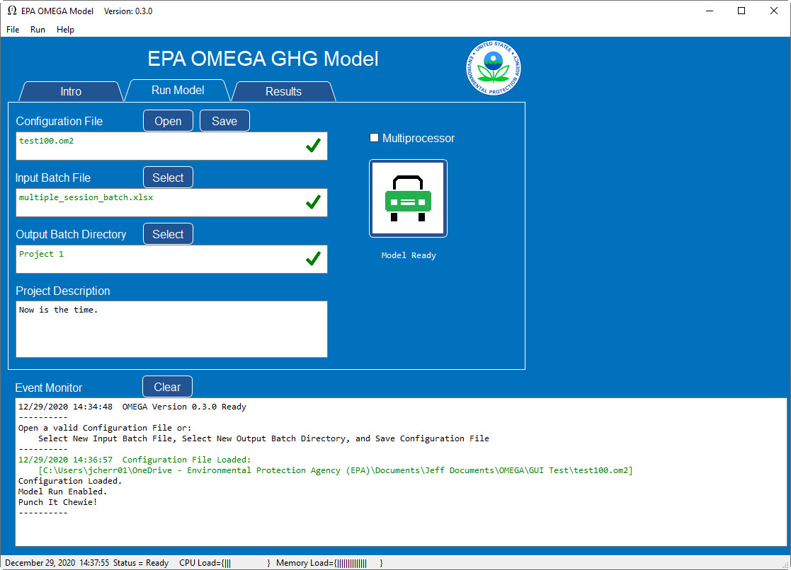
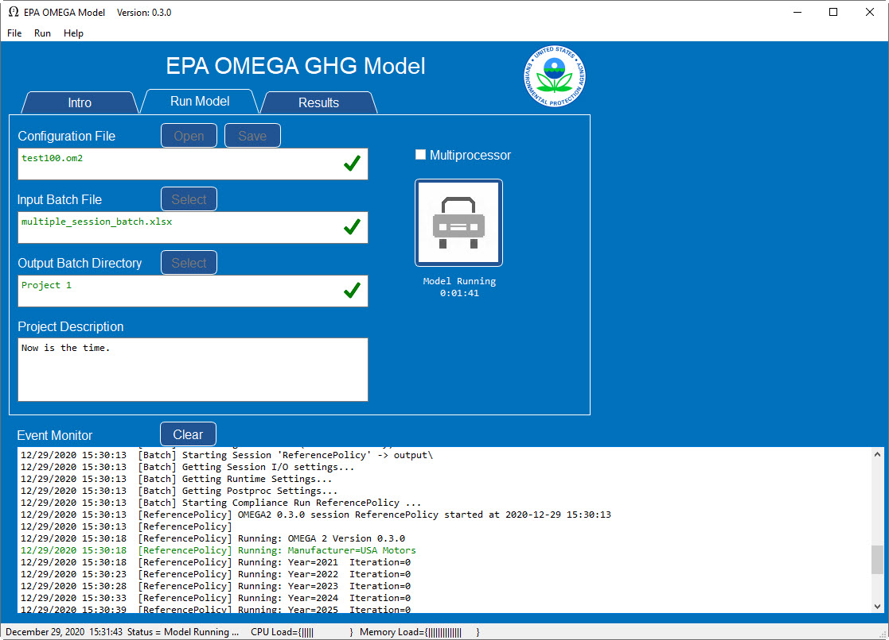
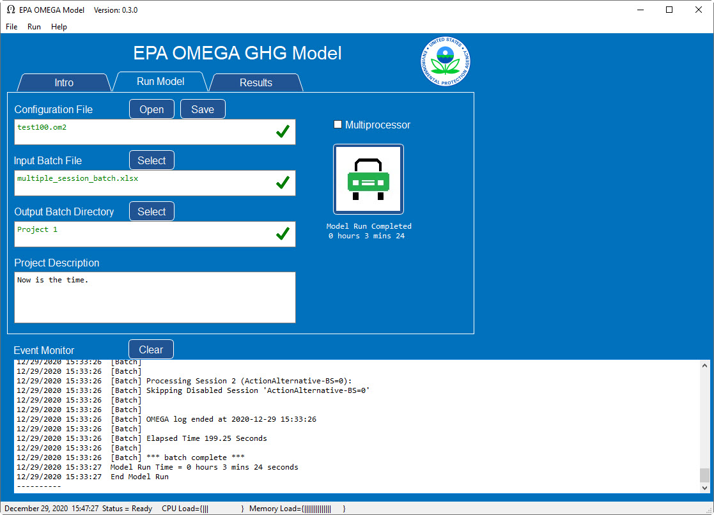

.. image:: _static/epa_logo_1.jpg

User Guide
==========

Default Inputs and Assumptions
^^^^^^^^^^^^^^^^^^^^^^^^^^^^^^
Inputs/Assumptions body text

Tips for preparing inputs
^^^^^^^^^^^^^^^^^^^^^^^^^
Tips body text

.. _graphical_user_interface_label:

Graphical User Interface
^^^^^^^^^^^^^^^^^^^^^^^^
The EPA OMEGA Model is highly modular and can be run using several methods including but not limited to the command line, the Python environment, and the Graphical User Interface (GUI).  The GUI is the best option for new users of OMEGA to reproduce existing model runs and become familiar with the model's input and output structure.

GUI Basics
----------
After launching the GUI, the 'Run Model' page will appear as shown in :numref:`ug_label1`.

.. _ug_label1:
.. figure:: _static/ug_figures/gui_run_model_page.jpg
    :align: center

    GUI 'Run Model' Page

The elements of the GUI 'Run Model' page are shown in :numref:`ug_label2`.

.. _ug_label2:
.. figure:: _static/ug_figures/gui_run_model_page_elements.jpg
    :align: center

    GUI 'Run Model' Page Elements

Description of the 'Run Model' page elements:

::

    Note: Context help is always available by hovering the cursor over an element.

*  Element 1 - Page Selection
    Tabs to select the various pages of the GUI.

*  Element 2 - Configuration File
    Allows the user to open or save a Configuration File.  The Configuration File stores all of the GUI selections for the current OMEGA model run.  When a Configuration File is selected, the base file name will be displayed.  If the complete path to the Configuration File is needed, hover the cursor over the base filename and the entire file path will be displayed.  The red X will be replaced with a green checkmark when a valid Configuration File is selected.

*  Element 3 - Input Batch File
    Allows the user to select an Input Batch File.  The Input Batch File is a standard OMEGA input file that describes the complete parameters for a model run.  When an Input Batch File is selected, the base file name will be displayed.  If the complete path to the Input Batch File is needed, hover the cursor over the base filename and the entire path will be displayed.  The red X will be replaced with a green checkmark when a valid Input Batch File is selected.

*  Element 4 - Output Batch Directory
    Allows the user to select an Output Batch Directory.  The Output Batch Directory instructs OMEGA where to store the results of a model run.  When an Output Batch Directory is selected, the base directory name will be displayed.  If the complete path to the Output Batch Directory is needed, hover the cursor over the base filename and the entire path will be displayed.  The red X will be replaced with a green checkmark when a valid Output Batch Directory is selected.

*  Element 5 - Project Description
    Allows the user to enter any useful text that will be saved in the Configuration File for future reference.  This element is free format text to allow standard functions (such as copy and paste) to be used.  The saved text will be displayed whenever the Configuration File is opened.

*  Element 6 - Event Monitor
    The Event Monitor prompts the user during model run setup (file selection, etc.) and keeps a running record of OMEGA model execution in real time.  This is a standard text field to allow simple copying of text as needed for further study or debugging purposes.

*  Element 7 - Multiprocessor
    The OMEGA model can be configured to utilize multiple system processors for true multitasking that significantly reduces model completion time.  For example, a typical Intel Core I7(R) has 8 processors total and typically 7 available for OMEGA to utilize.  Checking this box instructs OMEGA to use multiprocessor mode.

*  Element 8 - Run Model
    When everything is properly configured, this button will be enabled for initiation of the OMEGA model run.

Loading The Model Requirements
------------------------------
The model requirements are loaded using an existing Configuration File  (:numref:`ug_label6`) or by creating a new Configuration File (:numref:`ug_label7`).

::

    Note: The Event Monitor will provide additional guidance through the model loading process.

.. _ug_label6:

Existing Configuration File
+++++++++++++++++++++++++++
With the 'Run Model' page displayed, press 'Open' to launch a standard File Explorer window to load an existing Configuration File.  When properly loaded, the 'Run Model' page will look similar to :numref:`ug_label3` below.  The green checkmarks in the selection fields indicate valid files and paths.

.. _ug_label7:

Create New Configuration File
+++++++++++++++++++++++++++++
If a Configuration File is not available, create a new one using these steps:

* Press 'Select' to load an existing OMEGA Input Batch File
* Press 'Select' to load a new or existing OMEGA Output Batch Directory
* Add an optional Project Description
* Press 'Save' to store the new Configuration File

The 'Run Model' page should look similar to :numref:`ug_label3` below.

.. _ug_label3:

    GUI Configuration File Loaded

Run The Model
-------------
With all of the model requirements loaded, the 'Model Run' button will be enabled.  Press the 'Model Run' button to start the model run.

As the model is running, the 'Run Model' page will look similar to :numref:`ug_label4` below.

.. _ug_label4:

    Model Running

The GUI provides real time information during the model run:

* The model starting information is detailed in the event monitor.  This includes the time and Input Batch File used.
* The model status and elapsed time from model start is continuously updated below the 'Run Model' button.
* The load on the system CPU and system Memory is monitored in the Windows Status Bar at the bottom of the GUI window.
* The Event Monitor provides a continuous stream of information gathered from the simultaneous OMEGA processes.

When the model run is completed, the 'Run Model' page will look similar to :numref:`ug_label5` below.

.. _ug_label5:

    Model Running

Final GUI Data:

* The model ending information is detailed in the event monitor.  This includes the time and the Output Batch Directory used.
* The model status and final model run time are displayed below the 'Run Model' button.

Model Outputs
^^^^^^^^^^^^^

