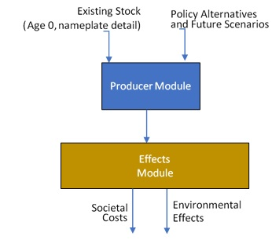
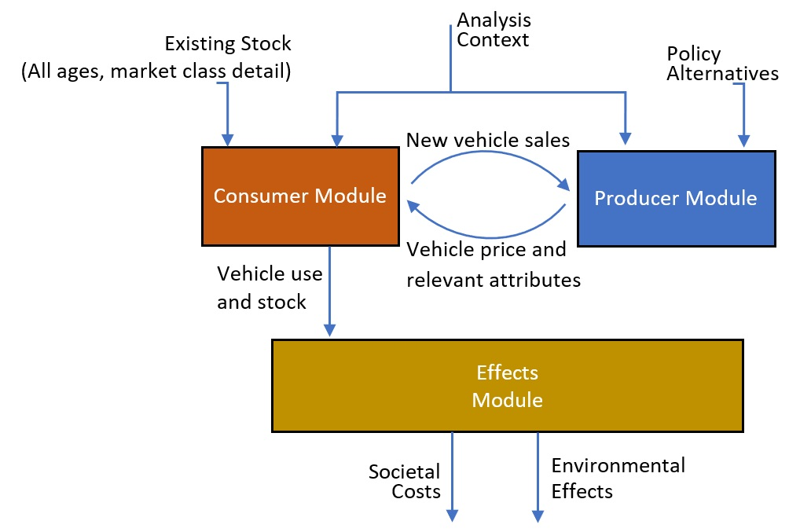

.. image:: _static/epa_logo_1.jpg

Model Overview
==============
OMEGA is a modeling tool that has been developed by EPA to evaluate policies for reducing greenhouse gas emissions (GHG) from light duty vehicles. Like the prior releases, this latest version is a regulatory support tool that provides estimates of the effects and costs of policy alternatives under consideration. These include the costs associated with emissions-reducing technologies themselves and the items normally included in a societal benefit-cost analysis, as well as physical effects that are often reported in emissions inventories. Other potential uses for OMEGA may be valuable to stakeholders elsewhere -- including other parts of EPA, other agencies, NGOs, states, academia, and industry. We have attempted to emphasize modularity, transparency, and flexibility so that these stakeholders might design and develop modules to meet their own needs. 

What's New in This Version 2.0
^^^^^^^^^^^^^^^^^^^^^^^^^^^^^^
EPA created the inital release version of the OMEGA model to analyze new GHG standards for light-duty vehicles proposed in 2011. The 'core' model executable performed the function of identifying a manufacturer's cost-minimizing compliance pathway to meet a footprint-based fleet emissions standard specified by the user. A preprocessing step involved ranking the technology packages to be considered by the model based on cost-effectiveness. Postprocessing of outputs was performed separately using a spreadsheet tool, and later a scripted process which generated table summaries of modeled effects. 

With the release of Version 2.0, we aim to improve usability and flexibility while retaining the primary functions of the original version of OMEGA. :numref:`mo_label_compare` shows the overall model flow and highlights four of the main areas of difference between Versions 1.0 and 2.0. 

.. _mo_label_compare:
.. figure:: _static/mo_figures/model_overview_compare_ver1_ver2.png
    :align: center

    Comparison to prior version of OMEGA

The first difference is the expanded boundaries. All models need a well-defined boundary, and it's unavoidable that users will be asked to make decisions and put effort into preparing inputs and synthesizing outputs. With version 2.0 we have attempted to reduce extraneous user interventions, and the model now has automated some of the pre- and post-processing that had previously been performed manually. When deciding the appropriate boundary, we considered whether parameters are assumed to be independent from policy alternatives, and whether they can be quantified using data for observable characteristics and phenomena. By placing parameters that meet both these criteria outside of the model boundary, we are aiming to achieve transparency of our inputs and assumptions by maintaining the connection to the underlying data. For the assumptions and algorithms within the model boundary, and the endogenous parameters with values that are responsive to policy alternatives, we aim for transparency through well-organized model code and complete documentation.

The second difference is the addition of a consumer response component. 

The third difference is the modeling of strategic producer decisions over the entire analysis period.

The fourth difference is the addition of a feedback loop between the consumer and producer decision modules. This version of OMEGA is structured around modeling the interactions between vehicle producers responding to a policy and consumers who own and use those vehicles. In building upon the earlier version's capability to model producer compliance decisions, OMEGA now has the necessary structure to model not only changes in vehicle emissions rates, but also responses to changes in vehicle attributes that are more directly observable to consumers. 

Finally, the fifth key difference is an independent policy module. The previous version of the OMEGA model was designed to analyze a very specific fleet averaging program structure, in which the emissions targets are assigned based on vehicle footprint and other attributes used to define a 'car' or 'truck' regulatory classes. In the development of OMEGA version 2.0, we could not anticipate in advance all of the program structures that future users might wish to evaluate. The producer decision algorithms in this version have been designed to function on the most general rules of a program defined by fleet emissions averaging or required technology shares. Program details regarding how targets are determined and how compliance credits are treated over time are now confined to an independent policy module and associated policy inputs. This allows the developer to incorporate new policy structures without requiring revisions to other code modules.

2) 

.. _mo_label1:

    Original OMEGA Model Overview

Though the model was used in multiple EPA regulatory analyses between 2010 and 2016, the state of the world has changed dramatically over the years and the model’s assumptions and capabilities have become out of date since it was first created. A major change in the state of the world is an expanded focus beyond the traditional internal combustion engine (ICE) vehicle. Electric vehicle (EV) technology and markets have evolved significantly, and will likely continue to evolve. In addition, there are potential changes in mobility demand and new mobility services, including the use of light duty vehicles (LDVs) for deliver services, shared and autonomous fleets, and the increased focus on micromobility. We are unable to incorporate these changes in the previous OMEGA model. In addition, our model design capabilities and the tools available to us have expanded. Taken together, this has led us to create a new OMEGA model. This new OMEGA model is an open source compliance and effects modeling tool that is transparent, user-friendly, and has the flexibility to evaluate a broad range of transportation policy, technology and market scenarios.

New OMEGA Model
+++++++++++++++
Creating a new OMEGA model has allowed us to improve upon previous efforts in a few ways, including building in pre- and post-processing steps, adding endogenous consumer responses, improving manufacturer decision modeling and adding feedback between consumer and producer decisions. In addition, the model is built to be modular, user friendly, and transparent. Stakeholders will more easily be able to inspect the model and assumptions, as well as revise assumptions and generate results without unusual computing capabilities, extensive training or restrictive licensing. The model itself is available to the public on GitHub.  The model takes context assumptions, existing stock and policy alternatives, iterates on producer choices and consumer responses, and estimates effects, outputting societal costs and environmental effects. A simplistic overview of the updated model is seen in :numref:`mo_label2`, below.

.. _mo_label2:

    OMEGA Model Overview

Inputs and Outputs
^^^^^^^^^^^^^^^^^^
Like any other model, OMEGA relies on the user to specify appropriate inputs and assumptions. Some of these may be provided by direct empirical observations, for example the number of currently registered vehicles. Others might be generated by modeling tools outside of OMEGA, such as physics-based vehicle simulation results produced like the EPA's ALPHA model, or transportation demand forecasts from DOE's NEMS model. OMEGA has adopted data elements and structures that are generic, wherever possible, so that inputs can be provided from whichever sources the user deems most appropriate.

The inputs and assumptions are categorized according to whether they fall inside or outside the policy alternatives under evaluation in a given analysis.

* *Policy Alternative* inputs describe the standards themselves, including the program elements and methodologies for determining compliance as would be defined for an EPA rule in the Federal Register and Code of Federal Regulations.

* *Analysis Context* inputs and assumptions cover the range of factors that the user assumes, for the purpose of analyses, are independent of the policy alternatives. The user may project changes in the context inputs over the analysis timeframe based on other sources, but for a given analysis year the context definition requires that these inputs are common across the policy alternatives being compared. The context inputs may include fuel costs, costs and emissions rates for a particular vehicle technology package, consumer demand parameters, and many more.

A full description of the input files can be found in [Chapter 7].

The primary outputs are the environmental effects and societal costs and benefits for a given policy alternative and analysis context pair. These outputs are expressed in absolute values, so that incremental effects, costs, and benefits can be evaluated by comparing two policy alternatives (for a given context) or the sensitivity to assumptions for two different analysis contexts (for a given policy alternative.) 

Model Structure and Key Modules
^^^^^^^^^^^^^^^^^^^^^^^^^^^^^^^
OMEGA has been set up so that primary components of the model are clearly delineated in such a way that changing one component of the model will not require code changes throughout the model. Four main modules are defined along the lines of their real-world analogs representing consumers, producers, policy, and effects. a policy in a strictly-defined way and provides users the option of interchanging any of OMEGA’s default modules with their own, while preserving the consistency and functionality of the larger model

OMEGA is structured around two key modules; a Consumer Module and a Producer Module, which each contain a decision-model for the respective entities. The Consumer Module’s purpose is to estimate how vehicle ownership and use respond to key vehicle characteristics within a given analysis context. An important feature of the Consumer Module is that it allows different endogenous consumer responses to Electric and Internal Combustion Engine vehicles.

Additional functions of OMEGA related to policy assumptions and environmental/economic effects are also designed as modules 

Iteration and Convergence
^^^^^^^^^^^^^^^^^^^^^^^^^
A compliance solution which only minimizes producer generalized costs without consideration of demand may not satisfy the market requirements at the fleet mix and level of sales preferred by the producer. Since there is no deterministic approach to the general problem of convergence between producers and consumers, OMEGA uses an iterative search approach.

OMEGA’s Producer and Consumer Modules represent distinct decision making entities, which if treated separately and in isolation would not normally arrive at an equilibrium of vehicles supplied and demanded. The identification of an equilibrium solution in OMEGA requires an interactive relationship between the Consumer and Producer Modules. 

Internal to OMEGA, the two primary modules receive and respond to each other’s outputs, iterating until the demands of consumers converge with the vehicles provided by the producers  
Brief intro: Diagram + high level summary

Analysis Resolution 
^^^^^^^^^^^^^^^^^^^
The outcomes of consumer and producer decision-making in OMEGA are expressed via the vehicles modeled in the analysis period, the volumes of vehicles produced, the applied technologies and relevant vehicle attributes, and the re-registration and use over all vehicles’ lifetimes. Because there can be nearly 20 million light-duty vehicles produced for sale each year in the US, and hundreds of millions of vehicles registered for use at any given time, OMEGA must aggregate, as appropriate, while still distinguishing between vehicles when needed. The approach for aggregating vehicles varies based on the different functions and modules within OMEGA, with the general principles applied throughout OMEGA to 1) use the amount of vehicle detail required, but no more than is required, to perform any particular modeling sub-task, and 2) to retain vehicle details that will be needed for subsequent modeling tasks. 

* The modeling of consumer decisions requires that the model retains sufficient detail to distinguish market segments between which the consumer is choosing. The definition of these OMEGA ‘market classes’ depends on the requirements of the particular consumer module being used. For this reason, OMEGA assigns market classes to vehicles internally according the attribute definitions of the market classes (e.g. size, interior volume, frame type, AWD, electric range, etc), rather than being hard-coded in the context inputs for fleet projections.
* The modeling of producer decisions requires that that the model retains sufficient detail to calculate the target and achieved compliance emissions, as well as any details needed to calculate the generalized producer cost.
